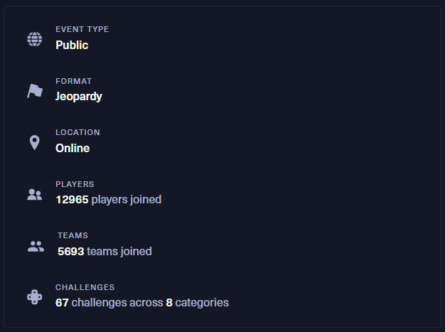

# HackTheBox Cyber Apocalypse 2024: Hacker Royale

- **START DATE:** 09 Mar 2024, 14:00
- **END DATE:** 13 Mar, 13:59

## Event Overview

> "We used to be peaceful and had enough tech to keep us all happy. What do you think about that? 
> 
> 
> These data disks alluded to some "societal golden age." No fighting, no backstabbing, and no factions fighting for some lousy title.
> 
> Good, great for them-
> 
> Because all we get to look forward to is "The Fray."
> 
> 
> alarms blaring
> 
> 
> Oh, look-... it's showtime." (Quote: Luxx, faction leader of the Phreaks)
> 
> 
> 💥 Welcome to "The Fray." A societal gauntlet made of the most cunning, dedicated, and bloodthirsty factions. We are all bound by the same rule–be one of the last factions standing. All brought to your overlords and sponsors at KORP™.
> 
> 
> Our city's lights bring people from far and wide. It's one of the last remaining mega structures left after the Great Division took place. But, as far as we are concerned, KORP™ is all there ever was and will be. 
> 
> 
> They hold The Fray every four years to find the "best and the brightest around." Those who make it through their technological concoction of challenges become the "Legionaries," funded factions who get to sit on easy-street for the time between the next fight.

## Table Of Contents

- [HackTheBox Cyber Apocalypse 2024: Hacker Royale](#hackthebox-cyber-apocalypse-2024-hacker-royale)
  - [Event Overview](#event-overview)
  - [Table Of Contents](#table-of-contents)
  - [Writeups](#writeups)
    - [Crypto](#crypto)
    - [Forensics](#forensics)
    - [Hardware](#hardware)
    - [Misc](#misc)
    - [Pwn](#pwn)
    - [Reversing](#reversing)
    - [Web](#web)

## Writeups

### Crypto
- [Dynastic](crypto/dynastic/)
- [Makeshift](crypto/makeshift/)

### Forensics
- [It Has Begun](forensics/it_has_begun/)
- [Urgent](forensics/urgent/)

### Hardware
- [BunnyPass](hardware/bunnypass/)
- [Maze](hardware/maze/)
- [Rids](hardware/rids/)
- [The PROM](hardware/the_prom/)

### Misc
- [Character](misc/character/)

### Pwn
- [Tutorial](pwn/tutorial/)

### Reversing
- [Crushing](reversing/crushing/)
- [LootStash](reversing/lootstash/)

### Web
- [Flag Command](web/flag_command/)
