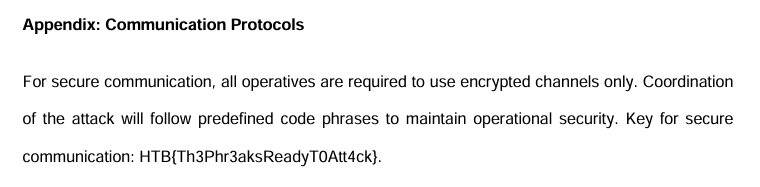

# Phreaky

> In the shadowed realm where the Phreaks hold sway,
> A mole lurks within, leading them astray.
> Sending keys to the Talents, so sly and so slick,
> A network packet capture must reveal the trick.
> Through data and bytes, the sleuth seeks the sign,
> Decrypting messages, crossing the line.
> The traitor unveiled, with nowhere to hide,
> Betrayal confirmed, they'd no longer abide.
>
> Files:
> - `forensics_phreaky.zip`

**Writeup by:** Hein Andre Grønnestad

- [Phreaky](#phreaky)
  - [Files](#files)
  - [Wireshark](#wireshark)
    - [Stream 1](#stream-1)
    - [Stream 3](#stream-3)
    - [Stream 5](#stream-5)
    - [Stream 7](#stream-7)
    - [Stream 9](#stream-9)
    - [Stream 11](#stream-11)
    - [Stream 13](#stream-13)
    - [Stream 15](#stream-15)
    - [Stream 17](#stream-17)
    - [Stream 19](#stream-19)
    - [Stream 21](#stream-21)
    - [Stream 23](#stream-23)
    - [Stream 25](#stream-25)
    - [Stream 27](#stream-27)
    - [Stream 30](#stream-30)
  - [Extracting The Files](#extracting-the-files)
  - [Combine All Parts](#combine-all-parts)
  - [PDF File](#pdf-file)
  - [Flag](#flag)


## Files

```bash
$ mv '/mnt/c/Users/heina/Downloads/forensics_phreaky.zip' .

$ unzip forensics_phreaky.zip
Archive:  forensics_phreaky.zip
  inflating: phreaky.pcap
```

We are given a pcap file, which is a packet capture file. We can open this in Wireshark, and see what we can find.


## Wireshark

In Wireshark we can follow the streams. We see that the most interesting streams contain emails with password protected ZIP-files.


### Stream 1

```
220 The Phreaks Mail Server - We run this
HELO phreak-ubuntu01
250 mailserver-phreak
MAIL FROM:<caleb@thephreaks.com>
250 2.1.0 Ok
RCPT TO:<resources@thetalents.com>
250 2.1.5 Ok
DATA
354 End data with <CR><LF>.<CR><LF>
Date: Wed, 06 Mar 2024 14:59:12 +0000
From: caleb@thephreaks.com(Caleb)
To: resources@thetalents.com
Subject: Secure File Transfer
Message-ID: <20240306145912.3RkED%caleb@thephreaks.com>
User-Agent: s-nail v14.9.23
MIME-Version: 1.0
Content-Type: multipart/mixed;
 boundary="=-=DBZhoU35m_YtHyGmIsZszrXoWQVlI-1y1rd3=-="

This is a multi-part message in MIME format.

--=-=DBZhoU35m_YtHyGmIsZszrXoWQVlI-1y1rd3=-=
Content-Type: text/plain; charset=us-ascii
Content-Disposition: inline
Content-ID: <20240306145912.g2I1r%caleb@thephreaks.com>

Attached is a part of the file. Password: S3W8yzixNoL8

--=-=DBZhoU35m_YtHyGmIsZszrXoWQVlI-1y1rd3=-=
Content-Type: application/zip
Content-Transfer-Encoding: base64
Content-Disposition: attachment; 
 filename*0="caf33472c6e0b2de339c1de893f78e67088cd6b1586a581c6f8e87b5596";
 filename*1="efcfd.zip"
Content-ID: <20240306145912.Emuab%caleb@thephreaks.com>

UEsDBBQACQAIAGZ3ZlhwRyBT2gAAAN0AAAAWABwAcGhyZWFrc19wbGFuLnBkZi5wYXJ0MVVUCQAD
wIToZcCE6GV1eAsAAQToAwAABOgDAAA9mPwEVmy1t/sLJ62NzXeCBFSSSZppyIzvPXL++cJbuCeL
nP4XXiAK9/HZL9xRw4LjlDf5eDd6BgBOKZqSn6qpM6g1WKXriS7k3lx5VkNnqlqQIfYnUdOCnkD/
1vzCyhuGdHPia5lmy0HoG+qdXABlLyNDgxvB9FTOcXK7oDHBOf3kmLSQFdxXsjfooLtBtC+y4gdB
xB4V3bImQ8TB5sPY55dvEKWCJ34CzRJbgIIirkD2GDIoQEHznvJA7zNnOvce1hXGA2+P/XmHe+4K
tL/fmrWMVpQEd+/GQlBLBwhwRyBT2gAAAN0AAABQSwECHgMUAAkACABmd2ZYcEcgU9oAAADdAAAA
FgAYAAAAAAAAAAAAtIEAAAAAcGhyZWFrc19wbGFuLnBkZi5wYXJ0MVVUBQADwIToZXV4CwABBOgD
AAAE6AMAAFBLBQYAAAAAAQABAFwAAAA6AQAAAAA=

--=-=DBZhoU35m_YtHyGmIsZszrXoWQVlI-1y1rd3=-=--
.
250 2.0.0 Ok: queued as 9CB872113
QUIT
221 2.0.0 Bye

```


### Stream 3

```
220 The Phreaks Mail Server - We run this
HELO phreak-ubuntu01
250 mailserver-phreak
MAIL FROM:<caleb@thephreaks.com>
250 2.1.0 Ok
RCPT TO:<resources@thetalents.com>
250 2.1.5 Ok
DATA
354 End data with <CR><LF>.<CR><LF>
Date: Wed, 06 Mar 2024 15:01:12 +0000
From: caleb@thephreaks.com(Caleb)
To: resources@thetalents.com
Subject: Secure File Transfer
Message-ID: <20240306150112.2RCra%caleb@thephreaks.com>
User-Agent: s-nail v14.9.23
MIME-Version: 1.0
Content-Type: multipart/mixed;
 boundary="=-=-glMLM0xJmXdxcl9EZzfzo5O7YV43fOkZlN2=-="

This is a multi-part message in MIME format.

--=-=-glMLM0xJmXdxcl9EZzfzo5O7YV43fOkZlN2=-=
Content-Type: text/plain; charset=us-ascii
Content-Disposition: inline
Content-ID: <20240306150112.l95pI%caleb@thephreaks.com>

Attached is a part of the file. Password: r5Q6YQEcGWEF

--=-=-glMLM0xJmXdxcl9EZzfzo5O7YV43fOkZlN2=-=
Content-Type: application/zip
Content-Transfer-Encoding: base64
Content-Disposition: attachment; 
 filename*0="2c586ccfbbc90a11def0b96da52e593b28c617156a8361f7d8ce0febfc5";
 filename*1="17dbf.zip"
Content-ID: <20240306150112.uR-bS%caleb@thephreaks.com>

UEsDBAoACQAAAGZ3ZljgCHYp6QAAAN0AAAAWABwAcGhyZWFrc19wbGFuLnBkZi5wYXJ0MlVUCQAD
wIToZcCE6GV1eAsAAQToAwAABOgDAABu5iZXFr81bsrANalgCyCYLbnWakpnenTTFtNEgA2DnlWw
ZaWTpsDk81VXCv1hWQgylORABff79cZQT4OYwP1bvjYVOf3xgo24EcTU99Feua+8VNmf4BZ0wZ2B
Mk3OUz4+F3hTJrWztVJSnQGgFD7O5Bgo7dt2l+MUBn8d+ZA0ETzAzdRV8SBSh4TR0awJzNsiFkq+
fWy7uBX+KuQH8UgOeQbWJAWfI6yoznm1KvkNrGoc4XmEjbJlzQw1T6IoAJCVin1PuFepWgNG3iJi
GyLqSwPvW2TMWmbYqCGnBvahxLGmGYxOCaGeLlBLBwjgCHYp6QAAAN0AAABQSwECHgMKAAkAAABm
d2ZY4Ah2KekAAADdAAAAFgAYAAAAAAAAAAAAtIEAAAAAcGhyZWFrc19wbGFuLnBkZi5wYXJ0MlVU
BQADwIToZXV4CwABBOgDAAAE6AMAAFBLBQYAAAAAAQABAFwAAABJAQAAAAA=

--=-=-glMLM0xJmXdxcl9EZzfzo5O7YV43fOkZlN2=-=--
.
250 2.0.0 Ok: queued as C53572113
QUIT
221 2.0.0 Bye

```


### Stream 5

```
220 The Phreaks Mail Server - We run this
HELO phreak-ubuntu01
250 mailserver-phreak
MAIL FROM:<caleb@thephreaks.com>
250 2.1.0 Ok
RCPT TO:<resources@thetalents.com>
250 2.1.5 Ok
DATA
354 End data with <CR><LF>.<CR><LF>
Date: Wed, 06 Mar 2024 15:03:12 +0000
From: caleb@thephreaks.com(Caleb)
To: resources@thetalents.com
Subject: Secure File Transfer
Message-ID: <20240306150312.og_zL%caleb@thephreaks.com>
User-Agent: s-nail v14.9.23
MIME-Version: 1.0
Content-Type: multipart/mixed;
 boundary="=-=St7E4R-P_gfswgD6bmfZ0wucMPFpxyvA4quZ=-="

This is a multi-part message in MIME format.

--=-=St7E4R-P_gfswgD6bmfZ0wucMPFpxyvA4quZ=-=
Content-Type: text/plain; charset=us-ascii
Content-Disposition: inline
Content-ID: <20240306150312.UukdK%caleb@thephreaks.com>

Attached is a part of the file. Password: TVm9aC1UycxF

--=-=St7E4R-P_gfswgD6bmfZ0wucMPFpxyvA4quZ=-=
Content-Type: application/zip
Content-Transfer-Encoding: base64
Content-Disposition: attachment; 
 filename*0="9026fbe65473f451a73c1952abb65e8b32eede754fe9d85eeb01caa8321";
 filename*1="db487.zip"
Content-ID: <20240306150312.c5MW7%caleb@thephreaks.com>

UEsDBAoACQAAAGZ3ZljJKeGm6QAAAN0AAAAWABwAcGhyZWFrc19wbGFuLnBkZi5wYXJ0M1VUCQAD
wIToZcCE6GV1eAsAAQToAwAABOgDAAClpsW/gto1vxt+rZZjVotnhKoaNhhzOz+MdqxCcWHfda7p
XXkbFXwaA/lANMOcS7/LrFRxqTVqGkTbUDIexbC3kO7dyjJVPXkqPqOwHAXA2o/jq2ORUsdeIaNe
ZOG/9PGdtOZmeGQowZCDfCHii576VwQBRAV+1G8Xe1rLphPsBCD9uBQ58EUigH0HEanGU6NW6zgf
H9ZPlEPHg9AXMuLmLxnqyh3wU13xQYNwSgF1OJhdoZgsVaJBbX83/oI8gDjh9jynVpzAKjQXgTM0
3sYhCJjIbW1O43JCisFUi4ShUiYXCbzcmWhxjVBLBwjJKeGm6QAAAN0AAABQSwECHgMKAAkAAABm
d2ZYySnhpukAAADdAAAAFgAYAAAAAAAAAAAAtIEAAAAAcGhyZWFrc19wbGFuLnBkZi5wYXJ0M1VU
BQADwIToZXV4CwABBOgDAAAE6AMAAFBLBQYAAAAAAQABAFwAAABJAQAAAAA=

--=-=St7E4R-P_gfswgD6bmfZ0wucMPFpxyvA4quZ=-=--
.
250 2.0.0 Ok: queued as EABB42113
QUIT
221 2.0.0 Bye

```


### Stream 7

```
220 The Phreaks Mail Server - We run this
HELO phreak-ubuntu01
250 mailserver-phreak
MAIL FROM:<caleb@thephreaks.com>
250 2.1.0 Ok
RCPT TO:<resources@thetalents.com>
250 2.1.5 Ok
DATA
354 End data with <CR><LF>.<CR><LF>
Date: Wed, 06 Mar 2024 15:05:13 +0000
From: caleb@thephreaks.com(Caleb)
To: resources@thetalents.com
Subject: Secure File Transfer
Message-ID: <20240306150513.BIvmH%caleb@thephreaks.com>
User-Agent: s-nail v14.9.23
MIME-Version: 1.0
Content-Type: multipart/mixed;
 boundary="=-=Ec2c7KF6iq9k1QMrRaEf2KaRFzrBWWaN_vbY=-="

This is a multi-part message in MIME format.

--=-=Ec2c7KF6iq9k1QMrRaEf2KaRFzrBWWaN_vbY=-=
Content-Type: text/plain; charset=us-ascii
Content-Disposition: inline
Content-ID: <20240306150513.yjpu_%caleb@thephreaks.com>

Attached is a part of the file. Password: jISlbC8145Ox

--=-=Ec2c7KF6iq9k1QMrRaEf2KaRFzrBWWaN_vbY=-=
Content-Type: application/zip
Content-Transfer-Encoding: base64
Content-Disposition: attachment; 
 filename*0="6c44917c3ae343df55716cb9a611bbad49d310c2215dce59f32c370ba7b";
 filename*1="f66b0.zip"
Content-ID: <20240306150513.utVd5%caleb@thephreaks.com>

UEsDBAoACQAAAGZ3Zli+QTv+6QAAAN0AAAAWABwAcGhyZWFrc19wbGFuLnBkZi5wYXJ0NFVUCQAD
wIToZcCE6GV1eAsAAQToAwAABOgDAAASGvRLBBhSc/guGlGU5sHR93zRJxtXsVmpNt415MT1krF1
B5YPQEIsi3FpQN+Orr7llB/k2ziA5dzioeBZ8ZXuwB61k/TVVI3I3oop9op3Cl6BpTwc99yWesYb
yuad4N2buPTxOCgy43KOuPG9eide3qXHkkt9L8oJ3ZNR+qOU+F5CmE38A0tvWml/XC2/2DSwRI2A
XVQD9TD2WF26V17kUKAImuZPrOfYmB8pp0hrxAI9Ja62mYz+EIjqr51Ms457EiJi4Ia6D0Lm3jcr
PsKeCHUlJNCzj08AWSBfZqvhr3+JIBVXHebiSFBLBwi+QTv+6QAAAN0AAABQSwECHgMKAAkAAABm
d2ZYvkE7/ukAAADdAAAAFgAYAAAAAAAAAAAAtIEAAAAAcGhyZWFrc19wbGFuLnBkZi5wYXJ0NFVU
BQADwIToZXV4CwABBOgDAAAE6AMAAFBLBQYAAAAAAQABAFwAAABJAQAAAAA=

--=-=Ec2c7KF6iq9k1QMrRaEf2KaRFzrBWWaN_vbY=-=--
.
250 2.0.0 Ok: queued as 1AB9F2113
QUIT
221 2.0.0 Bye

```


### Stream 9

```
220 The Phreaks Mail Server - We run this
HELO phreak-ubuntu01
250 mailserver-phreak
MAIL FROM:<caleb@thephreaks.com>
250 2.1.0 Ok
RCPT TO:<resources@thetalents.com>
250 2.1.5 Ok
DATA
354 End data with <CR><LF>.<CR><LF>
Date: Wed, 06 Mar 2024 15:07:13 +0000
From: caleb@thephreaks.com(Caleb)
To: resources@thetalents.com
Subject: Secure File Transfer
Message-ID: <20240306150713.uqhXU%caleb@thephreaks.com>
User-Agent: s-nail v14.9.23
MIME-Version: 1.0
Content-Type: multipart/mixed;
 boundary="=-=PJMhsiMW4GxMH5HQTcPgvJuR3R4576ZygzO3=-="

This is a multi-part message in MIME format.

--=-=PJMhsiMW4GxMH5HQTcPgvJuR3R4576ZygzO3=-=
Content-Type: text/plain; charset=us-ascii
Content-Disposition: inline
Content-ID: <20240306150713.z_oac%caleb@thephreaks.com>

Attached is a part of the file. Password: AdtJYhF4sFgv

--=-=PJMhsiMW4GxMH5HQTcPgvJuR3R4576ZygzO3=-=
Content-Type: application/zip
Content-Transfer-Encoding: base64
Content-Disposition: attachment; 
 filename*0="76b329245795e409d5d9cf1aaa026f8541bb216b4064562bf7684f9b35e";
 filename*1="a2736.zip"
Content-ID: <20240306150713.8ij5_%caleb@thephreaks.com>

UEsDBAoACQAAAGZ3ZlhKc9CT6QAAAN0AAAAWABwAcGhyZWFrc19wbGFuLnBkZi5wYXJ0NVVUCQAD
wIToZcCE6GV1eAsAAQToAwAABOgDAACgXw6/ilp0wNpzWRKketbF/ZStw53n68tQVXonvsbCXld2
+hEU8oOGDJmNqJPxK7b6qScipwQBuaP7aisMHTGpC5otz0y3zSHKPIRjphFkQPHDEU9gCHmSfNTI
c/kWvaDyDWFJY7rfz2QOkQnmY4Wa8uefTXU/0O9X1FCh77dlADxvUoTXwIfMJ/7c6L+cD76gC3BN
h5ajhYC6o+4p3XXCaum4x1ETaNUyc44hPHEr6tykoaBawkqaQ+qU39Z89cJRUeYWTr8sKjGPN+f0
fa72ALXAxdCEzfZV4rvVTgJTq+IjyScxniKdYFBLBwhKc9CT6QAAAN0AAABQSwECHgMKAAkAAABm
d2ZYSnPQk+kAAADdAAAAFgAYAAAAAAAAAAAAtIEAAAAAcGhyZWFrc19wbGFuLnBkZi5wYXJ0NVVU
BQADwIToZXV4CwABBOgDAAAE6AMAAFBLBQYAAAAAAQABAFwAAABJAQAAAAA=

--=-=PJMhsiMW4GxMH5HQTcPgvJuR3R4576ZygzO3=-=--
.
250 2.0.0 Ok: queued as 397892113
QUIT
221 2.0.0 Bye

```


### Stream 11

```
220 The Phreaks Mail Server - We run this
HELO phreak-ubuntu01
250 mailserver-phreak
MAIL FROM:<caleb@thephreaks.com>
250 2.1.0 Ok
RCPT TO:<resources@thetalents.com>
250 2.1.5 Ok
DATA
354 End data with <CR><LF>.<CR><LF>
Date: Wed, 06 Mar 2024 15:09:13 +0000
From: caleb@thephreaks.com(Caleb)
To: resources@thetalents.com
Subject: Secure File Transfer
Message-ID: <20240306150913.Ixa0S%caleb@thephreaks.com>
User-Agent: s-nail v14.9.23
MIME-Version: 1.0
Content-Type: multipart/mixed;
 boundary="=-=Ggoj4hYbMmyHZzRmAbVxMPx3zuCCkW9ZaX8g=-="

This is a multi-part message in MIME format.

--=-=Ggoj4hYbMmyHZzRmAbVxMPx3zuCCkW9ZaX8g=-=
Content-Type: text/plain; charset=us-ascii
Content-Disposition: inline
Content-ID: <20240306150913.FH1YL%caleb@thephreaks.com>

Attached is a part of the file. Password: j2SRRDraIvUZ

--=-=Ggoj4hYbMmyHZzRmAbVxMPx3zuCCkW9ZaX8g=-=
Content-Type: application/zip
Content-Transfer-Encoding: base64
Content-Disposition: attachment; 
 filename*0="5dc7a18136ec2d085dd747e7869859b00418d2073fc2c6946c1cff84ab5";
 filename*1="6b6ef.zip"
Content-ID: <20240306150913.K5Cfk%caleb@thephreaks.com>

UEsDBBQACQAIAGZ3Zlgub1pG0gAAAN0AAAAWABwAcGhyZWFrc19wbGFuLnBkZi5wYXJ0NlVUCQAD
wIToZcCE6GV1eAsAAQToAwAABOgDAAA9siVDz34UldbdpmALh3n3JpC5DSTu5/F8fuitjI/IDhbW
yDabhamKNp1fsz7hThUnyS6ibIdFtg+YKTm+Tg8Xba1jM0AAf7r/dIGjDciCXGpH2IzkV/7qgbK2
5jIufslNzO0T3tCviOj4q5un2zfP+wPxD8cozyoXPmk53btd+Tyt7eGbQ8r9LaLSAxl+LXrUWe9L
rxeNTDehMoP+oYG2Wp/xW4Xe7cVHSyXYFa1C/6Fs/uZZv2d1N7+jDBCOpFNSUfwMLeNQSZ3js6RU
+DjUWARQSwcILm9aRtIAAADdAAAAUEsBAh4DFAAJAAgAZndmWC5vWkbSAAAA3QAAABYAGAAAAAAA
AAAAALSBAAAAAHBocmVha3NfcGxhbi5wZGYucGFydDZVVAUAA8CE6GV1eAsAAQToAwAABOgDAABQ
SwUGAAAAAAEAAQBcAAAAMgEAAAAA

--=-=Ggoj4hYbMmyHZzRmAbVxMPx3zuCCkW9ZaX8g=-=--
.
250 2.0.0 Ok: queued as 61A082113
QUIT
221 2.0.0 Bye

```


### Stream 13

```
220 The Phreaks Mail Server - We run this
HELO phreak-ubuntu01
250 mailserver-phreak
MAIL FROM:<caleb@thephreaks.com>
250 2.1.0 Ok
RCPT TO:<resources@thetalents.com>
250 2.1.5 Ok
DATA
354 End data with <CR><LF>.<CR><LF>
Date: Wed, 06 Mar 2024 15:11:13 +0000
From: caleb@thephreaks.com(Caleb)
To: resources@thetalents.com
Subject: Secure File Transfer
Message-ID: <20240306151113.IsT6k%caleb@thephreaks.com>
User-Agent: s-nail v14.9.23
MIME-Version: 1.0
Content-Type: multipart/mixed;
 boundary="=-=ZrBWpVFKFS6IfHiAPZajs_Y558p5Woux3tTo=-="

This is a multi-part message in MIME format.

--=-=ZrBWpVFKFS6IfHiAPZajs_Y558p5Woux3tTo=-=
Content-Type: text/plain; charset=us-ascii
Content-Disposition: inline
Content-ID: <20240306151113.EMAwN%caleb@thephreaks.com>

Attached is a part of the file. Password: xh161WSXX7tB

--=-=ZrBWpVFKFS6IfHiAPZajs_Y558p5Woux3tTo=-=
Content-Type: application/zip
Content-Transfer-Encoding: base64
Content-Disposition: attachment; 
 filename*0="81cda62e7c511f30eeeeee64f9be399fb867c460ac96bd6a6171468ad0b";
 filename*1="6701d.zip"
Content-ID: <20240306151113.wv6BY%caleb@thephreaks.com>

UEsDBAoACQAAAGZ3ZliZDy8d6QAAAN0AAAAWABwAcGhyZWFrc19wbGFuLnBkZi5wYXJ0N1VUCQAD
wIToZcCE6GV1eAsAAQToAwAABOgDAABXkaLlWGcXvDvGXeqNTsDAfvEc0lKQeoBVqOF5aqn75cy8
eZVLxqVop4NixzQkNL6cin9cay5McTdKjBoMfkwTgaRuOAJu0Q1ZrSUYeBE1fO4Y8kqGIyty81Gt
g2KlMNSc4O+5KAHlPKpimef/g5TaP1Tv4MrmGXEsNeAgjoJqwayDBFXVAW8N6Kr+9wDY4TTBOTsV
MN3ZKVML0bU4ng6Z9kV3wLGPiD3aHUBn1STqWv6y2xWJkQapaQ9UDpgLLszjOe1lbReRMypw6mji
K1sVjNPlXFgvlhs0CBrHtKuXHXw5GVK6KT7ntlBLBwiZDy8d6QAAAN0AAABQSwECHgMKAAkAAABm
d2ZYmQ8vHekAAADdAAAAFgAYAAAAAAAAAAAAtIEAAAAAcGhyZWFrc19wbGFuLnBkZi5wYXJ0N1VU
BQADwIToZXV4CwABBOgDAAAE6AMAAFBLBQYAAAAAAQABAFwAAABJAQAAAAA=

--=-=ZrBWpVFKFS6IfHiAPZajs_Y558p5Woux3tTo=-=--
.
250 2.0.0 Ok: queued as 85C8E2113
QUIT
221 2.0.0 Bye

```


### Stream 15

```
220 The Phreaks Mail Server - We run this
HELO phreak-ubuntu01
250 mailserver-phreak
MAIL FROM:<caleb@thephreaks.com>
250 2.1.0 Ok
RCPT TO:<resources@thetalents.com>
250 2.1.5 Ok
DATA
354 End data with <CR><LF>.<CR><LF>
Date: Wed, 06 Mar 2024 15:13:13 +0000
From: caleb@thephreaks.com(Caleb)
To: resources@thetalents.com
Subject: Secure File Transfer
Message-ID: <20240306151313.ej4mS%caleb@thephreaks.com>
User-Agent: s-nail v14.9.23
MIME-Version: 1.0
Content-Type: multipart/mixed;
 boundary="=-=fbosNwJ3CADT01mLIW0zQjkRCcH2M0WNfVXJ=-="

This is a multi-part message in MIME format.

--=-=fbosNwJ3CADT01mLIW0zQjkRCcH2M0WNfVXJ=-=
Content-Type: text/plain; charset=us-ascii
Content-Disposition: inline
Content-ID: <20240306151313.FPlz0%caleb@thephreaks.com>

Attached is a part of the file. Password: yH5vqnkm7Ixa

--=-=fbosNwJ3CADT01mLIW0zQjkRCcH2M0WNfVXJ=-=
Content-Type: application/zip
Content-Transfer-Encoding: base64
Content-Disposition: attachment; 
 filename*0="882d61be23f7a3679ea0b86e6ea7e106dd1b1c1fd693075ba8a76bdba62";
 filename*1="66706.zip"
Content-ID: <20240306151313.RoykJ%caleb@thephreaks.com>

UEsDBAoACQAAAGZ3Zlhtggyo6QAAAN0AAAAWABwAcGhyZWFrc19wbGFuLnBkZi5wYXJ0OFVUCQAD
wIToZcCE6GV1eAsAAQToAwAABOgDAAAdQnVCaWFrDEjWzqeKKB2AMYPFi420ZNqxM1yPqH5JisD8
HNTACyex0E/ba1jNeoh/EbXy+7QIYZwB8Nw34uwQeXEeY2Fh46RBMBERIqI/jiT7YWorDyD+D+1j
dH/IBP1wDmvqtJbLTBz5dj2S+Om0GcvGpv7sSNa9shl0/FIvW3uOBorbQ8cpTh5D01vRxfFGw6v4
JBlGhwQLTGPS0EGxD6U/Uogrfwy23E7q+HI6cMPCOuVBTyMHiDj5itTTFKNyZYrAMQkX1OL07I3l
geTWK6IqlYlQO3rT4jPnNA+F+nh6fF0pwZCKMlBLBwhtggyo6QAAAN0AAABQSwECHgMKAAkAAABm
d2ZYbYIMqOkAAADdAAAAFgAYAAAAAAAAAAAAtIEAAAAAcGhyZWFrc19wbGFuLnBkZi5wYXJ0OFVU
BQADwIToZXV4CwABBOgDAAAE6AMAAFBLBQYAAAAAAQABAFwAAABJAQAAAAA=

--=-=fbosNwJ3CADT01mLIW0zQjkRCcH2M0WNfVXJ=-=--
.
250 2.0.0 Ok: queued as AB89E2113
QUIT
221 2.0.0 Bye

```


### Stream 17

```
220 The Phreaks Mail Server - We run this
HELO phreak-ubuntu01
250 mailserver-phreak
MAIL FROM:<caleb@thephreaks.com>
250 2.1.0 Ok
RCPT TO:<resources@thetalents.com>
250 2.1.5 Ok
DATA
354 End data with <CR><LF>.<CR><LF>
Date: Wed, 06 Mar 2024 15:15:13 +0000
From: caleb@thephreaks.com(Caleb)
To: resources@thetalents.com
Subject: Secure File Transfer
Message-ID: <20240306151513.TxVxS%caleb@thephreaks.com>
User-Agent: s-nail v14.9.23
MIME-Version: 1.0
Content-Type: multipart/mixed;
 boundary="=-=lJko4DUMi3NKmijeYisRXTzginSUCvWYXdzq=-="

This is a multi-part message in MIME format.

--=-=lJko4DUMi3NKmijeYisRXTzginSUCvWYXdzq=-=
Content-Type: text/plain; charset=us-ascii
Content-Disposition: inline
Content-ID: <20240306151513.uwnZc%caleb@thephreaks.com>

Attached is a part of the file. Password: tJPUTUfceO1P

--=-=lJko4DUMi3NKmijeYisRXTzginSUCvWYXdzq=-=
Content-Type: application/zip
Content-Transfer-Encoding: base64
Content-Disposition: attachment; 
 filename*0="961eafc6dcc77fd776c7081be32f6b9c0c14302475a907e077121ccfe61";
 filename*1="47703.zip"
Content-ID: <20240306151513.al2h0%caleb@thephreaks.com>

UEsDBAoACQAAAGZ3ZlipN5HW6QAAAN0AAAAWABwAcGhyZWFrc19wbGFuLnBkZi5wYXJ0OVVUCQAD
wIToZcCE6GV1eAsAAQToAwAABOgDAAC7ogPIZPn1boqWXs0fYT9Vq2J2SU/WbuEgNKh8cdDmyc2Q
hnk6dfTmyAh0o506e7y90gVhhH2q6ZMIJZ7DGZkC0rJuzB9H9LSKIEaPBChF08Teb2rqQ+wuWh9B
w/wl+7t9nxygjPp7uiiHvZUYVf15u6v9/HkmC5g1wM/6RmUHtez4eidH6Ev/3XfLQr82p6PUWwY+
/OXxFPlNBsif0uqQ/PQLOw8ju/7AfvMJwKI7FR7QHVwGMI/Yg4vJ9PFb21NGU0wmv2HkBtjUvly5
FDQuNIqxyy+bA9W11u83okQnfj8TAQTcv97C9lBLBwipN5HW6QAAAN0AAABQSwECHgMKAAkAAABm
d2ZYqTeR1ukAAADdAAAAFgAYAAAAAAAAAAAAtIEAAAAAcGhyZWFrc19wbGFuLnBkZi5wYXJ0OVVU
BQADwIToZXV4CwABBOgDAAAE6AMAAFBLBQYAAAAAAQABAFwAAABJAQAAAAA=

--=-=lJko4DUMi3NKmijeYisRXTzginSUCvWYXdzq=-=--
.
250 2.0.0 Ok: queued as CF1C02113
QUIT
221 2.0.0 Bye

```


### Stream 19

```
220 The Phreaks Mail Server - We run this
HELO phreak-ubuntu01
250 mailserver-phreak
MAIL FROM:<caleb@thephreaks.com>
250 2.1.0 Ok
RCPT TO:<resources@thetalents.com>
250 2.1.5 Ok
DATA
354 End data with <CR><LF>.<CR><LF>
Date: Wed, 06 Mar 2024 15:17:13 +0000
From: caleb@thephreaks.com(Caleb)
To: resources@thetalents.com
Subject: Secure File Transfer
Message-ID: <20240306151713.agj39%caleb@thephreaks.com>
User-Agent: s-nail v14.9.23
MIME-Version: 1.0
Content-Type: multipart/mixed;
 boundary="=-=0jLO6c4HGtEs86oOa-qcOFHVbBcpibkudNwH=-="

This is a multi-part message in MIME format.

--=-=0jLO6c4HGtEs86oOa-qcOFHVbBcpibkudNwH=-=
Content-Type: text/plain; charset=us-ascii
Content-Disposition: inline
Content-ID: <20240306151713.oaMJq%caleb@thephreaks.com>

Attached is a part of the file. Password: 2qKlZHZlBPQz

--=-=0jLO6c4HGtEs86oOa-qcOFHVbBcpibkudNwH=-=
Content-Type: application/zip
Content-Transfer-Encoding: base64
Content-Disposition: attachment; 
 filename*0="c0c845e52d6480e2f5acd4f3ed28c2fd2cde91d00e56b2af19bec604471";
 filename*1="3a347.zip"
Content-ID: <20240306151713.mTK7M%caleb@thephreaks.com>

UEsDBAoACQAAAGZ3Zlj/Gb5u6QAAAN0AAAAXABwAcGhyZWFrc19wbGFuLnBkZi5wYXJ0MTBVVAkA
A8CE6GXAhOhldXgLAAEE6AMAAAToAwAA22IkVozT4hpv67dNaBas9lborysg+A87Nq9ckagEYzZf
6R881phUvE8tVImHS4p8pdcmlfnz+icS0+CeENKNQFhJMlHl6jxDyKI4LbzJ2+YWZ/zxaQ2/AMR6
GykbDScNlnGtlXOcXe+RDYCrgLgB1iAMLvziMF27db2C9opPLx/x8l+FiQ0Gogn6H4RKjbh9SDOk
qzGENuXmo46TlISrjIFBMPvsYpcKHDknDxgHPZvejQj4DZOe//3Qyvksr5xsNIQCx/ezXJVZKqDk
Um2D9GsQjGcN8kmCQbxpbYq64iOkYj/fgcptZWZQSwcI/xm+bukAAADdAAAAUEsBAh4DCgAJAAAA
ZndmWP8Zvm7pAAAA3QAAABcAGAAAAAAAAAAAALSBAAAAAHBocmVha3NfcGxhbi5wZGYucGFydDEw
VVQFAAPAhOhldXgLAAEE6AMAAAToAwAAUEsFBgAAAAABAAEAXQAAAEoBAAAAAA==

--=-=0jLO6c4HGtEs86oOa-qcOFHVbBcpibkudNwH=-=--
.
250 2.0.0 Ok: queued as EFB712113
QUIT
221 2.0.0 Bye

```


### Stream 21

```
220 The Phreaks Mail Server - We run this
HELO phreak-ubuntu01
250 mailserver-phreak
MAIL FROM:<caleb@thephreaks.com>
250 2.1.0 Ok
RCPT TO:<resources@thetalents.com>
250 2.1.5 Ok
DATA
354 End data with <CR><LF>.<CR><LF>
Date: Wed, 06 Mar 2024 15:19:14 +0000
From: caleb@thephreaks.com(Caleb)
To: resources@thetalents.com
Subject: Secure File Transfer
Message-ID: <20240306151914.qlJ4p%caleb@thephreaks.com>
User-Agent: s-nail v14.9.23
MIME-Version: 1.0
Content-Type: multipart/mixed;
 boundary="=-=mxGbya0oTtjmPPsKKAcLXfAeyGK_r-taUFcw=-="

This is a multi-part message in MIME format.

--=-=mxGbya0oTtjmPPsKKAcLXfAeyGK_r-taUFcw=-=
Content-Type: text/plain; charset=us-ascii
Content-Disposition: inline
Content-ID: <20240306151914.7KAgn%caleb@thephreaks.com>

Attached is a part of the file. Password: mbkUvLZ1koxu

--=-=mxGbya0oTtjmPPsKKAcLXfAeyGK_r-taUFcw=-=
Content-Type: application/zip
Content-Transfer-Encoding: base64
Content-Disposition: attachment; 
 filename*0="0b094d10ee366aca7410f6f712238af920ddf67a1fbf5f300426fa2868f";
 filename*1="4efe7.zip"
Content-ID: <20240306151914.lcDw4%caleb@thephreaks.com>

UEsDBBQACQAIAGZ3Zlg68XpvyAAAAN0AAAAXABwAcGhyZWFrc19wbGFuLnBkZi5wYXJ0MTFVVAkA
A8CE6GXAhOhldXgLAAEE6AMAAAToAwAA1XFxuJqaVlE3BajxvkjKFU1UNArCCd046Zq3hSv3YQq3
5vkNnyX2RgCWLO8+IMONpTPAeu8lrkrLU0dyNmk4qZayus+5yfEi8/YCmAgf0PqAoUZq81/8MJ3q
/zvIPUIKqy+P7V6EUEy3EXIvexGB9r5vI5Vuyx/y00ct3/ooluaHjBRmmHxxotAm9vl+kJWqmJou
9fKDg/RVQX5GUNUZ1XNeBD3HBzZqjZOVkDS1iWI8FCUBtE8reYicAN8vN1+4n9zHYa0FM/lQSwcI
OvF6b8gAAADdAAAAUEsBAh4DFAAJAAgAZndmWDrxem/IAAAA3QAAABcAGAAAAAAAAAAAALSBAAAA
AHBocmVha3NfcGxhbi5wZGYucGFydDExVVQFAAPAhOhldXgLAAEE6AMAAAToAwAAUEsFBgAAAAAB
AAEAXQAAACkBAAAAAA==

--=-=mxGbya0oTtjmPPsKKAcLXfAeyGK_r-taUFcw=-=--
.
250 2.0.0 Ok: queued as 215702113
QUIT
221 2.0.0 Bye

```


### Stream 23

```
220 The Phreaks Mail Server - We run this
HELO phreak-ubuntu01
250 mailserver-phreak
MAIL FROM:<caleb@thephreaks.com>
250 2.1.0 Ok
RCPT TO:<resources@thetalents.com>
250 2.1.5 Ok
DATA
354 End data with <CR><LF>.<CR><LF>
Date: Wed, 06 Mar 2024 15:21:14 +0000
From: caleb@thephreaks.com(Caleb)
To: resources@thetalents.com
Subject: Secure File Transfer
Message-ID: <20240306152114.qocEU%caleb@thephreaks.com>
User-Agent: s-nail v14.9.23
MIME-Version: 1.0
Content-Type: multipart/mixed;
 boundary="=-=taFXlZMThUkW75y_RH5YXL86OjFVSyBjLfHf=-="

This is a multi-part message in MIME format.

--=-=taFXlZMThUkW75y_RH5YXL86OjFVSyBjLfHf=-=
Content-Type: text/plain; charset=us-ascii
Content-Disposition: inline
Content-ID: <20240306152114.FhIRf%caleb@thephreaks.com>

Attached is a part of the file. Password: ZN4yKAYrtf8x

--=-=taFXlZMThUkW75y_RH5YXL86OjFVSyBjLfHf=-=
Content-Type: application/zip
Content-Transfer-Encoding: base64
Content-Disposition: attachment; 
 filename*0="b96e04b11a1f4a0bec9182a7f7fbb47bebcd0c06c1078b10d76780da067";
 filename*1="a20bd.zip"
Content-ID: <20240306152114.-j2im%caleb@thephreaks.com>

UEsDBBQACQAIAGZ3ZliBNT+KdgAAAN0AAAAXABwAcGhyZWFrc19wbGFuLnBkZi5wYXJ0MTJVVAkA
A8CE6GXAhOhldXgLAAEE6AMAAAToAwAAC1oSkzON6LaRSbMM8vLsHs98l9V2fmaQYuimQLQJ0GOK
CJRSbEDrUnGuzivL1Dm1dKvE0iAYhxBrZrBq1Lr91Ctg0SGitmPxBBmdR176EhK/OOyJnf/Ai9Sz
C83F95FwRROsD6bwYiHLusjRH/JvgCdRZAZm/1BLBwiBNT+KdgAAAN0AAABQSwECHgMUAAkACABm
d2ZYgTU/inYAAADdAAAAFwAYAAAAAAABAAAAtIEAAAAAcGhyZWFrc19wbGFuLnBkZi5wYXJ0MTJV
VAUAA8CE6GV1eAsAAQToAwAABOgDAABQSwUGAAAAAAEAAQBdAAAA1wAAAAAA

--=-=taFXlZMThUkW75y_RH5YXL86OjFVSyBjLfHf=-=--
.
250 2.0.0 Ok: queued as 4AE3B2113
QUIT
221 2.0.0 Bye

```


### Stream 25

```
220 The Phreaks Mail Server - We run this
HELO phreak-ubuntu01
250 mailserver-phreak
MAIL FROM:<caleb@thephreaks.com>
250 2.1.0 Ok
RCPT TO:<resources@thetalents.com>
250 2.1.5 Ok
DATA
354 End data with <CR><LF>.<CR><LF>
Date: Wed, 06 Mar 2024 15:23:14 +0000
From: caleb@thephreaks.com(Caleb)
To: resources@thetalents.com
Subject: Secure File Transfer
Message-ID: <20240306152314.ghJQe%caleb@thephreaks.com>
User-Agent: s-nail v14.9.23
MIME-Version: 1.0
Content-Type: multipart/mixed;
 boundary="=-=svmgmHT5xf3b61k1Dr6jK1_k0OnU585jmHTF=-="

This is a multi-part message in MIME format.

--=-=svmgmHT5xf3b61k1Dr6jK1_k0OnU585jmHTF=-=
Content-Type: text/plain; charset=us-ascii
Content-Disposition: inline
Content-ID: <20240306152314.relHU%caleb@thephreaks.com>

Attached is a part of the file. Password: 0eA143t4432M

--=-=svmgmHT5xf3b61k1Dr6jK1_k0OnU585jmHTF=-=
Content-Type: application/zip
Content-Transfer-Encoding: base64
Content-Disposition: attachment; 
 filename*0="7599947e6cbb32ef57c996f5f8b027a88d5c15acfe662c9032cd4f0f173";
 filename*1="c4414.zip"
Content-ID: <20240306152314.3XZPd%caleb@thephreaks.com>

UEsDBBQACQAIAGZ3ZljaTDFBtwAAAN0AAAAXABwAcGhyZWFrc19wbGFuLnBkZi5wYXJ0MTNVVAkA
A8CE6GXAhOhldXgLAAEE6AMAAAToAwAAl+DA7wLy9OkCv23NgbCEuvpekfQ7hu6Se0qee2Byf6bi
55r/fnWy8lJbZw4sNuTUBnenVqY5UlFBdLxxf2a6111UTC9x/af72AA/jpFvXAr5MAG61f/1Dk7u
dSZcep0pKj4IG9/7A8ukd8BmVSfhkJUSlIP3N8lrG4XxaL6z0zmzhNr+ATd2bfI2Dnzb9rb7atrJ
c+2tPkn7BrziI8X3oEniBlCK57cs5Clh4032UNQ4EVx69ty4UEsHCNpMMUG3AAAA3QAAAFBLAQIe
AxQACQAIAGZ3ZljaTDFBtwAAAN0AAAAXABgAAAAAAAEAAAC0gQAAAABwaHJlYWtzX3BsYW4ucGRm
LnBhcnQxM1VUBQADwIToZXV4CwABBOgDAAAE6AMAAFBLBQYAAAAAAQABAF0AAAAYAQAAAAA=

--=-=svmgmHT5xf3b61k1Dr6jK1_k0OnU585jmHTF=-=--
.
250 2.0.0 Ok: queued as 781252113
QUIT
221 2.0.0 Bye

```


### Stream 27

```
220 The Phreaks Mail Server - We run this
HELO phreak-ubuntu01
250 mailserver-phreak
MAIL FROM:<caleb@thephreaks.com>
250 2.1.0 Ok
RCPT TO:<resources@thetalents.com>
250 2.1.5 Ok
DATA
354 End data with <CR><LF>.<CR><LF>
Date: Wed, 06 Mar 2024 15:25:14 +0000
From: caleb@thephreaks.com(Caleb)
To: resources@thetalents.com
Subject: Secure File Transfer
Message-ID: <20240306152514.k12Uj%caleb@thephreaks.com>
User-Agent: s-nail v14.9.23
MIME-Version: 1.0
Content-Type: multipart/mixed;
 boundary="=-=FiIOfc1iI1AjtEy8CtQFZge1t5ELtN9X2eLC=-="

This is a multi-part message in MIME format.

--=-=FiIOfc1iI1AjtEy8CtQFZge1t5ELtN9X2eLC=-=
Content-Type: text/plain; charset=us-ascii
Content-Disposition: inline
Content-ID: <20240306152514.3k6-Y%caleb@thephreaks.com>

Attached is a part of the file. Password: oea41WCJrWwN

--=-=FiIOfc1iI1AjtEy8CtQFZge1t5ELtN9X2eLC=-=
Content-Type: application/zip
Content-Transfer-Encoding: base64
Content-Disposition: attachment; 
 filename*0="6cca033a210d9e8d33cac332ecd49639ddd7432ed031d8889c4d0763142";
 filename*1="381c1.zip"
Content-ID: <20240306152514.dvDLS%caleb@thephreaks.com>

UEsDBBQACQAIAGZ3ZlgEvqDrmwAAAN0AAAAXABwAcGhyZWFrc19wbGFuLnBkZi5wYXJ0MTRVVAkA
A8CE6GXAhOhldXgLAAEE6AMAAAToAwAAKhCv8Ho5I1TZfENnfcarT/3gQrsDqxJ/oAidzEbvaiuJ
DzGdsQShRTZU8OnTwM8z0rpOusv8RovXzLvb099ai+q7J/AHTNDrTK3WxFqaJ1xGSZH1DNQIHkp7
0K8l3JT2Ln1zGJ/GpW2fcFNehGxTlUzyH+cNWThPU1OPWFeDrGEpTtkVUTLO1X9lt14dpG5qD1FR
tC8AbLygCNZQSwcIBL6g65sAAADdAAAAUEsBAh4DFAAJAAgAZndmWAS+oOubAAAA3QAAABcAGAAA
AAAAAQAAALSBAAAAAHBocmVha3NfcGxhbi5wZGYucGFydDE0VVQFAAPAhOhldXgLAAEE6AMAAATo
AwAAUEsFBgAAAAABAAEAXQAAAPwAAAAAAA==

--=-=FiIOfc1iI1AjtEy8CtQFZge1t5ELtN9X2eLC=-=--
.
250 2.0.0 Ok: queued as 9D8AB2113
QUIT
221 2.0.0 Bye

```


### Stream 30

```
220 The Phreaks Mail Server - We run this
HELO phreak-ubuntu01
250 mailserver-phreak
MAIL FROM:<caleb@thephreaks.com>
250 2.1.0 Ok
RCPT TO:<resources@thetalents.com>
250 2.1.5 Ok
DATA
354 End data with <CR><LF>.<CR><LF>
Date: Wed, 06 Mar 2024 15:27:14 +0000
From: caleb@thephreaks.com(Caleb)
To: resources@thetalents.com
Subject: Secure File Transfer
Message-ID: <20240306152714.YfowM%caleb@thephreaks.com>
User-Agent: s-nail v14.9.23
MIME-Version: 1.0
Content-Type: multipart/mixed;
 boundary="=-=6UtbHvjlcNzyLLEDwYwsmmkJL1_c46qwS7sx=-="

This is a multi-part message in MIME format.

--=-=6UtbHvjlcNzyLLEDwYwsmmkJL1_c46qwS7sx=-=
Content-Type: text/plain; charset=us-ascii
Content-Disposition: inline
Content-ID: <20240306152714.p5K23%caleb@thephreaks.com>

Attached is a part of the file. Password: gdOvbPtB0xCK

--=-=6UtbHvjlcNzyLLEDwYwsmmkJL1_c46qwS7sx=-=
Content-Type: application/zip
Content-Transfer-Encoding: base64
Content-Disposition: attachment; 
 filename*0="d0034e52b6d86170fd0a858a0b333d07e37baae2b2086d6176ee6b06020";
 filename*1="5bf85.zip"
Content-ID: <20240306152714.WYOxx%caleb@thephreaks.com>

UEsDBBQACQAIAGZ3ZlglJqgafwAAANAAAAAXABwAcGhyZWFrc19wbGFuLnBkZi5wYXJ0MTVVVAkA
A8CE6GXAhOhldXgLAAEE6AMAAAToAwAAFdeY2PjWsfwq91s17mJp5mZWNDs6FOqHJv5Oj2MEfSdK
nPpoBa4LJ2Fdtg4E//+SEV8EGeCnMwPsVlG872uVrdPglKNX/78RUrsLQOGssFBOexBskItytFA0
ueb9HwsYpD4tmg059QVlsp1JF9ChY03Mj5svIAYT6PWRSqUGXFBLBwglJqgafwAAANAAAABQSwEC
HgMUAAkACABmd2ZYJSaoGn8AAADQAAAAFwAYAAAAAAABAAAAtIEAAAAAcGhyZWFrc19wbGFuLnBk
Zi5wYXJ0MTVVVAUAA8CE6GV1eAsAAQToAwAABOgDAABQSwUGAAAAAAEAAQBdAAAA4AAAAAAA

--=-=6UtbHvjlcNzyLLEDwYwsmmkJL1_c46qwS7sx=-=--
.
250 2.0.0 Ok: queued as CBB0C2113
QUIT
221 2.0.0 Bye

```


## Extracting The Files

We can extract the attachments from the streams and try to extract the files.

```bash
efcfd.zip
S3W8yzixNoL8
UEsDBBQACQAIAGZ3ZlhwRyBT2gAAAN0AAAAWABwAcGhyZWFrc19wbGFuLnBkZi5wYXJ0MVVUCQADwIToZcCE6GV1eAsAAQToAwAABOgDAAA9mPwEVmy1t/sLJ62NzXeCBFSSSZppyIzvPXL++cJbuCeLnP4XXiAK9/HZL9xRw4LjlDf5eDd6BgBOKZqSn6qpM6g1WKXriS7k3lx5VkNnqlqQIfYnUdOCnkD/1vzCyhuGdHPia5lmy0HoG+qdXABlLyNDgxvB9FTOcXK7oDHBOf3kmLSQFdxXsjfooLtBtC+y4gdBxB4V3bImQ8TB5sPY55dvEKWCJ34CzRJbgIIirkD2GDIoQEHznvJA7zNnOvce1hXGA2+P/XmHe+4KtL/fmrWMVpQEd+/GQlBLBwhwRyBT2gAAAN0AAABQSwECHgMUAAkACABmd2ZYcEcgU9oAAADdAAAAFgAYAAAAAAAAAAAAtIEAAAAAcGhyZWFrc19wbGFuLnBkZi5wYXJ0MVVUBQADwIToZXV4CwABBOgDAAAE6AMAAFBLBQYAAAAAAQABAFwAAAA6AQAAAAA=

echo "UEsDBBQACQAIAGZ3ZlhwRyBT2gAAAN0AAAAWABwAcGhyZWFrc19wbGFuLnBkZi5wYXJ0MVVUCQADwIToZcCE6GV1eAsAAQToAwAABOgDAAA9mPwEVmy1t/sLJ62NzXeCBFSSSZppyIzvPXL++cJbuCeLnP4XXiAK9/HZL9xRw4LjlDf5eDd6BgBOKZqSn6qpM6g1WKXriS7k3lx5VkNnqlqQIfYnUdOCnkD/1vzCyhuGdHPia5lmy0HoG+qdXABlLyNDgxvB9FTOcXK7oDHBOf3kmLSQFdxXsjfooLtBtC+y4gdBxB4V3bImQ8TB5sPY55dvEKWCJ34CzRJbgIIirkD2GDIoQEHznvJA7zNnOvce1hXGA2+P/XmHe+4KtL/fmrWMVpQEd+/GQlBLBwhwRyBT2gAAAN0AAABQSwECHgMUAAkACABmd2ZYcEcgU9oAAADdAAAAFgAYAAAAAAAAAAAAtIEAAAAAcGhyZWFrc19wbGFuLnBkZi5wYXJ0MVVUBQADwIToZXV4CwABBOgDAAAE6AMAAFBLBQYAAAAAAQABAFwAAAA6AQAAAAA=" | base64 -d > efcfd.zip && 7z x efcfd.zip -pS3W8yzixNoL8


17dbf.zip
r5Q6YQEcGWEF
UEsDBAoACQAAAGZ3ZljgCHYp6QAAAN0AAAAWABwAcGhyZWFrc19wbGFuLnBkZi5wYXJ0MlVUCQADwIToZcCE6GV1eAsAAQToAwAABOgDAABu5iZXFr81bsrANalgCyCYLbnWakpnenTTFtNEgA2DnlWwZaWTpsDk81VXCv1hWQgylORABff79cZQT4OYwP1bvjYVOf3xgo24EcTU99Feua+8VNmf4BZ0wZ2BMk3OUz4+F3hTJrWztVJSnQGgFD7O5Bgo7dt2l+MUBn8d+ZA0ETzAzdRV8SBSh4TR0awJzNsiFkq+fWy7uBX+KuQH8UgOeQbWJAWfI6yoznm1KvkNrGoc4XmEjbJlzQw1T6IoAJCVin1PuFepWgNG3iJiGyLqSwPvW2TMWmbYqCGnBvahxLGmGYxOCaGeLlBLBwjgCHYp6QAAAN0AAABQSwECHgMKAAkAAABmd2ZY4Ah2KekAAADdAAAAFgAYAAAAAAAAAAAAtIEAAAAAcGhyZWFrc19wbGFuLnBkZi5wYXJ0MlVUBQADwIToZXV4CwABBOgDAAAE6AMAAFBLBQYAAAAAAQABAFwAAABJAQAAAAA=

echo "UEsDBAoACQAAAGZ3ZljgCHYp6QAAAN0AAAAWABwAcGhyZWFrc19wbGFuLnBkZi5wYXJ0MlVUCQADwIToZcCE6GV1eAsAAQToAwAABOgDAABu5iZXFr81bsrANalgCyCYLbnWakpnenTTFtNEgA2DnlWwZaWTpsDk81VXCv1hWQgylORABff79cZQT4OYwP1bvjYVOf3xgo24EcTU99Feua+8VNmf4BZ0wZ2BMk3OUz4+F3hTJrWztVJSnQGgFD7O5Bgo7dt2l+MUBn8d+ZA0ETzAzdRV8SBSh4TR0awJzNsiFkq+fWy7uBX+KuQH8UgOeQbWJAWfI6yoznm1KvkNrGoc4XmEjbJlzQw1T6IoAJCVin1PuFepWgNG3iJiGyLqSwPvW2TMWmbYqCGnBvahxLGmGYxOCaGeLlBLBwjgCHYp6QAAAN0AAABQSwECHgMKAAkAAABmd2ZY4Ah2KekAAADdAAAAFgAYAAAAAAAAAAAAtIEAAAAAcGhyZWFrc19wbGFuLnBkZi5wYXJ0MlVUBQADwIToZXV4CwABBOgDAAAE6AMAAFBLBQYAAAAAAQABAFwAAABJAQAAAAA=" | base64 -d > 17dbf.zip && 7z x 17dbf.zip -pr5Q6YQEcGWEF


db487.zip
TVm9aC1UycxF
UEsDBAoACQAAAGZ3ZljJKeGm6QAAAN0AAAAWABwAcGhyZWFrc19wbGFuLnBkZi5wYXJ0M1VUCQADwIToZcCE6GV1eAsAAQToAwAABOgDAAClpsW/gto1vxt+rZZjVotnhKoaNhhzOz+MdqxCcWHfda7pXXkbFXwaA/lANMOcS7/LrFRxqTVqGkTbUDIexbC3kO7dyjJVPXkqPqOwHAXA2o/jq2ORUsdeIaNeZOG/9PGdtOZmeGQowZCDfCHii576VwQBRAV+1G8Xe1rLphPsBCD9uBQ58EUigH0HEanGU6NW6zgfH9ZPlEPHg9AXMuLmLxnqyh3wU13xQYNwSgF1OJhdoZgsVaJBbX83/oI8gDjh9jynVpzAKjQXgTM03sYhCJjIbW1O43JCisFUi4ShUiYXCbzcmWhxjVBLBwjJKeGm6QAAAN0AAABQSwECHgMKAAkAAABmd2ZYySnhpukAAADdAAAAFgAYAAAAAAAAAAAAtIEAAAAAcGhyZWFrc19wbGFuLnBkZi5wYXJ0M1VUBQADwIToZXV4CwABBOgDAAAE6AMAAFBLBQYAAAAAAQABAFwAAABJAQAAAAA=

echo "UEsDBAoACQAAAGZ3ZljJKeGm6QAAAN0AAAAWABwAcGhyZWFrc19wbGFuLnBkZi5wYXJ0M1VUCQADwIToZcCE6GV1eAsAAQToAwAABOgDAAClpsW/gto1vxt+rZZjVotnhKoaNhhzOz+MdqxCcWHfda7pXXkbFXwaA/lANMOcS7/LrFRxqTVqGkTbUDIexbC3kO7dyjJVPXkqPqOwHAXA2o/jq2ORUsdeIaNeZOG/9PGdtOZmeGQowZCDfCHii576VwQBRAV+1G8Xe1rLphPsBCD9uBQ58EUigH0HEanGU6NW6zgfH9ZPlEPHg9AXMuLmLxnqyh3wU13xQYNwSgF1OJhdoZgsVaJBbX83/oI8gDjh9jynVpzAKjQXgTM03sYhCJjIbW1O43JCisFUi4ShUiYXCbzcmWhxjVBLBwjJKeGm6QAAAN0AAABQSwECHgMKAAkAAABmd2ZYySnhpukAAADdAAAAFgAYAAAAAAAAAAAAtIEAAAAAcGhyZWFrc19wbGFuLnBkZi5wYXJ0M1VUBQADwIToZXV4CwABBOgDAAAE6AMAAFBLBQYAAAAAAQABAFwAAABJAQAAAAA=" | base64 -d > db487.zip && 7z x db487.zip -pTVm9aC1UycxF


f66b0.zip
jISlbC8145Ox
UEsDBAoACQAAAGZ3Zli+QTv+6QAAAN0AAAAWABwAcGhyZWFrc19wbGFuLnBkZi5wYXJ0NFVUCQADwIToZcCE6GV1eAsAAQToAwAABOgDAAASGvRLBBhSc/guGlGU5sHR93zRJxtXsVmpNt415MT1krF1B5YPQEIsi3FpQN+Orr7llB/k2ziA5dzioeBZ8ZXuwB61k/TVVI3I3oop9op3Cl6BpTwc99yWesYbyuad4N2buPTxOCgy43KOuPG9eide3qXHkkt9L8oJ3ZNR+qOU+F5CmE38A0tvWml/XC2/2DSwRI2AXVQD9TD2WF26V17kUKAImuZPrOfYmB8pp0hrxAI9Ja62mYz+EIjqr51Ms457EiJi4Ia6D0Lm3jcrPsKeCHUlJNCzj08AWSBfZqvhr3+JIBVXHebiSFBLBwi+QTv+6QAAAN0AAABQSwECHgMKAAkAAABmd2ZYvkE7/ukAAADdAAAAFgAYAAAAAAAAAAAAtIEAAAAAcGhyZWFrc19wbGFuLnBkZi5wYXJ0NFVUBQADwIToZXV4CwABBOgDAAAE6AMAAFBLBQYAAAAAAQABAFwAAABJAQAAAAA=

echo "UEsDBAoACQAAAGZ3Zli+QTv+6QAAAN0AAAAWABwAcGhyZWFrc19wbGFuLnBkZi5wYXJ0NFVUCQADwIToZcCE6GV1eAsAAQToAwAABOgDAAASGvRLBBhSc/guGlGU5sHR93zRJxtXsVmpNt415MT1krF1B5YPQEIsi3FpQN+Orr7llB/k2ziA5dzioeBZ8ZXuwB61k/TVVI3I3oop9op3Cl6BpTwc99yWesYbyuad4N2buPTxOCgy43KOuPG9eide3qXHkkt9L8oJ3ZNR+qOU+F5CmE38A0tvWml/XC2/2DSwRI2AXVQD9TD2WF26V17kUKAImuZPrOfYmB8pp0hrxAI9Ja62mYz+EIjqr51Ms457EiJi4Ia6D0Lm3jcrPsKeCHUlJNCzj08AWSBfZqvhr3+JIBVXHebiSFBLBwi+QTv+6QAAAN0AAABQSwECHgMKAAkAAABmd2ZYvkE7/ukAAADdAAAAFgAYAAAAAAAAAAAAtIEAAAAAcGhyZWFrc19wbGFuLnBkZi5wYXJ0NFVUBQADwIToZXV4CwABBOgDAAAE6AMAAFBLBQYAAAAAAQABAFwAAABJAQAAAAA=" | base64 -d > f66b0.zip && 7z x f66b0.zip -pjISlbC8145Ox


a2736.zip
AdtJYhF4sFgv
UEsDBAoACQAAAGZ3ZlhKc9CT6QAAAN0AAAAWABwAcGhyZWFrc19wbGFuLnBkZi5wYXJ0NVVUCQADwIToZcCE6GV1eAsAAQToAwAABOgDAACgXw6/ilp0wNpzWRKketbF/ZStw53n68tQVXonvsbCXld2+hEU8oOGDJmNqJPxK7b6qScipwQBuaP7aisMHTGpC5otz0y3zSHKPIRjphFkQPHDEU9gCHmSfNTIc/kWvaDyDWFJY7rfz2QOkQnmY4Wa8uefTXU/0O9X1FCh77dlADxvUoTXwIfMJ/7c6L+cD76gC3BNh5ajhYC6o+4p3XXCaum4x1ETaNUyc44hPHEr6tykoaBawkqaQ+qU39Z89cJRUeYWTr8sKjGPN+f0fa72ALXAxdCEzfZV4rvVTgJTq+IjyScxniKdYFBLBwhKc9CT6QAAAN0AAABQSwECHgMKAAkAAABmd2ZYSnPQk+kAAADdAAAAFgAYAAAAAAAAAAAAtIEAAAAAcGhyZWFrc19wbGFuLnBkZi5wYXJ0NVVUBQADwIToZXV4CwABBOgDAAAE6AMAAFBLBQYAAAAAAQABAFwAAABJAQAAAAA=

echo "UEsDBAoACQAAAGZ3ZlhKc9CT6QAAAN0AAAAWABwAcGhyZWFrc19wbGFuLnBkZi5wYXJ0NVVUCQADwIToZcCE6GV1eAsAAQToAwAABOgDAACgXw6/ilp0wNpzWRKketbF/ZStw53n68tQVXonvsbCXld2+hEU8oOGDJmNqJPxK7b6qScipwQBuaP7aisMHTGpC5otz0y3zSHKPIRjphFkQPHDEU9gCHmSfNTIc/kWvaDyDWFJY7rfz2QOkQnmY4Wa8uefTXU/0O9X1FCh77dlADxvUoTXwIfMJ/7c6L+cD76gC3BNh5ajhYC6o+4p3XXCaum4x1ETaNUyc44hPHEr6tykoaBawkqaQ+qU39Z89cJRUeYWTr8sKjGPN+f0fa72ALXAxdCEzfZV4rvVTgJTq+IjyScxniKdYFBLBwhKc9CT6QAAAN0AAABQSwECHgMKAAkAAABmd2ZYSnPQk+kAAADdAAAAFgAYAAAAAAAAAAAAtIEAAAAAcGhyZWFrc19wbGFuLnBkZi5wYXJ0NVVUBQADwIToZXV4CwABBOgDAAAE6AMAAFBLBQYAAAAAAQABAFwAAABJAQAAAAA=" | base64 -d > a2736.zip && 7z x a2736.zip -pAdtJYhF4sFgv


6b6ef.zip
j2SRRDraIvUZ
UEsDBBQACQAIAGZ3Zlgub1pG0gAAAN0AAAAWABwAcGhyZWFrc19wbGFuLnBkZi5wYXJ0NlVUCQADwIToZcCE6GV1eAsAAQToAwAABOgDAAA9siVDz34UldbdpmALh3n3JpC5DSTu5/F8fuitjI/IDhbWyDabhamKNp1fsz7hThUnyS6ibIdFtg+YKTm+Tg8Xba1jM0AAf7r/dIGjDciCXGpH2IzkV/7qgbK25jIufslNzO0T3tCviOj4q5un2zfP+wPxD8cozyoXPmk53btd+Tyt7eGbQ8r9LaLSAxl+LXrUWe9LrxeNTDehMoP+oYG2Wp/xW4Xe7cVHSyXYFa1C/6Fs/uZZv2d1N7+jDBCOpFNSUfwMLeNQSZ3js6RU+DjUWARQSwcILm9aRtIAAADdAAAAUEsBAh4DFAAJAAgAZndmWC5vWkbSAAAA3QAAABYAGAAAAAAAAAAAALSBAAAAAHBocmVha3NfcGxhbi5wZGYucGFydDZVVAUAA8CE6GV1eAsAAQToAwAABOgDAABQSwUGAAAAAAEAAQBcAAAAMgEAAAAA

echo "UEsDBBQACQAIAGZ3Zlgub1pG0gAAAN0AAAAWABwAcGhyZWFrc19wbGFuLnBkZi5wYXJ0NlVUCQADwIToZcCE6GV1eAsAAQToAwAABOgDAAA9siVDz34UldbdpmALh3n3JpC5DSTu5/F8fuitjI/IDhbWyDabhamKNp1fsz7hThUnyS6ibIdFtg+YKTm+Tg8Xba1jM0AAf7r/dIGjDciCXGpH2IzkV/7qgbK25jIufslNzO0T3tCviOj4q5un2zfP+wPxD8cozyoXPmk53btd+Tyt7eGbQ8r9LaLSAxl+LXrUWe9LrxeNTDehMoP+oYG2Wp/xW4Xe7cVHSyXYFa1C/6Fs/uZZv2d1N7+jDBCOpFNSUfwMLeNQSZ3js6RU+DjUWARQSwcILm9aRtIAAADdAAAAUEsBAh4DFAAJAAgAZndmWC5vWkbSAAAA3QAAABYAGAAAAAAAAAAAALSBAAAAAHBocmVha3NfcGxhbi5wZGYucGFydDZVVAUAA8CE6GV1eAsAAQToAwAABOgDAABQSwUGAAAAAAEAAQBcAAAAMgEAAAAA" | base64 -d > 6b6ef.zip && 7z x 6b6ef.zip -pj2SRRDraIvUZ


6701d.zip
xh161WSXX7tB
UEsDBAoACQAAAGZ3ZliZDy8d6QAAAN0AAAAWABwAcGhyZWFrc19wbGFuLnBkZi5wYXJ0N1VUCQADwIToZcCE6GV1eAsAAQToAwAABOgDAABXkaLlWGcXvDvGXeqNTsDAfvEc0lKQeoBVqOF5aqn75cy8eZVLxqVop4NixzQkNL6cin9cay5McTdKjBoMfkwTgaRuOAJu0Q1ZrSUYeBE1fO4Y8kqGIyty81Gtg2KlMNSc4O+5KAHlPKpimef/g5TaP1Tv4MrmGXEsNeAgjoJqwayDBFXVAW8N6Kr+9wDY4TTBOTsVMN3ZKVML0bU4ng6Z9kV3wLGPiD3aHUBn1STqWv6y2xWJkQapaQ9UDpgLLszjOe1lbReRMypw6mjiK1sVjNPlXFgvlhs0CBrHtKuXHXw5GVK6KT7ntlBLBwiZDy8d6QAAAN0AAABQSwECHgMKAAkAAABmd2ZYmQ8vHekAAADdAAAAFgAYAAAAAAAAAAAAtIEAAAAAcGhyZWFrc19wbGFuLnBkZi5wYXJ0N1VUBQADwIToZXV4CwABBOgDAAAE6AMAAFBLBQYAAAAAAQABAFwAAABJAQAAAAA=

echo "UEsDBAoACQAAAGZ3ZliZDy8d6QAAAN0AAAAWABwAcGhyZWFrc19wbGFuLnBkZi5wYXJ0N1VUCQADwIToZcCE6GV1eAsAAQToAwAABOgDAABXkaLlWGcXvDvGXeqNTsDAfvEc0lKQeoBVqOF5aqn75cy8eZVLxqVop4NixzQkNL6cin9cay5McTdKjBoMfkwTgaRuOAJu0Q1ZrSUYeBE1fO4Y8kqGIyty81Gtg2KlMNSc4O+5KAHlPKpimef/g5TaP1Tv4MrmGXEsNeAgjoJqwayDBFXVAW8N6Kr+9wDY4TTBOTsVMN3ZKVML0bU4ng6Z9kV3wLGPiD3aHUBn1STqWv6y2xWJkQapaQ9UDpgLLszjOe1lbReRMypw6mjiK1sVjNPlXFgvlhs0CBrHtKuXHXw5GVK6KT7ntlBLBwiZDy8d6QAAAN0AAABQSwECHgMKAAkAAABmd2ZYmQ8vHekAAADdAAAAFgAYAAAAAAAAAAAAtIEAAAAAcGhyZWFrc19wbGFuLnBkZi5wYXJ0N1VUBQADwIToZXV4CwABBOgDAAAE6AMAAFBLBQYAAAAAAQABAFwAAABJAQAAAAA=" | base64 -d > 6701d.zip && 7z x 6701d.zip -pxh161WSXX7tB


66706.zip
yH5vqnkm7Ixa
UEsDBAoACQAAAGZ3Zlhtggyo6QAAAN0AAAAWABwAcGhyZWFrc19wbGFuLnBkZi5wYXJ0OFVUCQADwIToZcCE6GV1eAsAAQToAwAABOgDAAAdQnVCaWFrDEjWzqeKKB2AMYPFi420ZNqxM1yPqH5JisD8HNTACyex0E/ba1jNeoh/EbXy+7QIYZwB8Nw34uwQeXEeY2Fh46RBMBERIqI/jiT7YWorDyD+D+1jdH/IBP1wDmvqtJbLTBz5dj2S+Om0GcvGpv7sSNa9shl0/FIvW3uOBorbQ8cpTh5D01vRxfFGw6v4JBlGhwQLTGPS0EGxD6U/Uogrfwy23E7q+HI6cMPCOuVBTyMHiDj5itTTFKNyZYrAMQkX1OL07I3lgeTWK6IqlYlQO3rT4jPnNA+F+nh6fF0pwZCKMlBLBwhtggyo6QAAAN0AAABQSwECHgMKAAkAAABmd2ZYbYIMqOkAAADdAAAAFgAYAAAAAAAAAAAAtIEAAAAAcGhyZWFrc19wbGFuLnBkZi5wYXJ0OFVUBQADwIToZXV4CwABBOgDAAAE6AMAAFBLBQYAAAAAAQABAFwAAABJAQAAAAA=

echo "UEsDBAoACQAAAGZ3Zlhtggyo6QAAAN0AAAAWABwAcGhyZWFrc19wbGFuLnBkZi5wYXJ0OFVUCQADwIToZcCE6GV1eAsAAQToAwAABOgDAAAdQnVCaWFrDEjWzqeKKB2AMYPFi420ZNqxM1yPqH5JisD8HNTACyex0E/ba1jNeoh/EbXy+7QIYZwB8Nw34uwQeXEeY2Fh46RBMBERIqI/jiT7YWorDyD+D+1jdH/IBP1wDmvqtJbLTBz5dj2S+Om0GcvGpv7sSNa9shl0/FIvW3uOBorbQ8cpTh5D01vRxfFGw6v4JBlGhwQLTGPS0EGxD6U/Uogrfwy23E7q+HI6cMPCOuVBTyMHiDj5itTTFKNyZYrAMQkX1OL07I3lgeTWK6IqlYlQO3rT4jPnNA+F+nh6fF0pwZCKMlBLBwhtggyo6QAAAN0AAABQSwECHgMKAAkAAABmd2ZYbYIMqOkAAADdAAAAFgAYAAAAAAAAAAAAtIEAAAAAcGhyZWFrc19wbGFuLnBkZi5wYXJ0OFVUBQADwIToZXV4CwABBOgDAAAE6AMAAFBLBQYAAAAAAQABAFwAAABJAQAAAAA=" | base64 -d > 66706.zip && 7z x 66706.zip -pyH5vqnkm7Ixa


47703.zip
tJPUTUfceO1P
UEsDBAoACQAAAGZ3ZlipN5HW6QAAAN0AAAAWABwAcGhyZWFrc19wbGFuLnBkZi5wYXJ0OVVUCQADwIToZcCE6GV1eAsAAQToAwAABOgDAAC7ogPIZPn1boqWXs0fYT9Vq2J2SU/WbuEgNKh8cdDmyc2Qhnk6dfTmyAh0o506e7y90gVhhH2q6ZMIJZ7DGZkC0rJuzB9H9LSKIEaPBChF08Teb2rqQ+wuWh9Bw/wl+7t9nxygjPp7uiiHvZUYVf15u6v9/HkmC5g1wM/6RmUHtez4eidH6Ev/3XfLQr82p6PUWwY+/OXxFPlNBsif0uqQ/PQLOw8ju/7AfvMJwKI7FR7QHVwGMI/Yg4vJ9PFb21NGU0wmv2HkBtjUvly5FDQuNIqxyy+bA9W11u83okQnfj8TAQTcv97C9lBLBwipN5HW6QAAAN0AAABQSwECHgMKAAkAAABmd2ZYqTeR1ukAAADdAAAAFgAYAAAAAAAAAAAAtIEAAAAAcGhyZWFrc19wbGFuLnBkZi5wYXJ0OVVUBQADwIToZXV4CwABBOgDAAAE6AMAAFBLBQYAAAAAAQABAFwAAABJAQAAAAA=

echo "UEsDBAoACQAAAGZ3ZlipN5HW6QAAAN0AAAAWABwAcGhyZWFrc19wbGFuLnBkZi5wYXJ0OVVUCQADwIToZcCE6GV1eAsAAQToAwAABOgDAAC7ogPIZPn1boqWXs0fYT9Vq2J2SU/WbuEgNKh8cdDmyc2Qhnk6dfTmyAh0o506e7y90gVhhH2q6ZMIJZ7DGZkC0rJuzB9H9LSKIEaPBChF08Teb2rqQ+wuWh9Bw/wl+7t9nxygjPp7uiiHvZUYVf15u6v9/HkmC5g1wM/6RmUHtez4eidH6Ev/3XfLQr82p6PUWwY+/OXxFPlNBsif0uqQ/PQLOw8ju/7AfvMJwKI7FR7QHVwGMI/Yg4vJ9PFb21NGU0wmv2HkBtjUvly5FDQuNIqxyy+bA9W11u83okQnfj8TAQTcv97C9lBLBwipN5HW6QAAAN0AAABQSwECHgMKAAkAAABmd2ZYqTeR1ukAAADdAAAAFgAYAAAAAAAAAAAAtIEAAAAAcGhyZWFrc19wbGFuLnBkZi5wYXJ0OVVUBQADwIToZXV4CwABBOgDAAAE6AMAAFBLBQYAAAAAAQABAFwAAABJAQAAAAA=" | base64 -d > 47703.zip && 7z x 47703.zip -ptJPUTUfceO1P


3a347.zip
2qKlZHZlBPQz
UEsDBAoACQAAAGZ3Zlj/Gb5u6QAAAN0AAAAXABwAcGhyZWFrc19wbGFuLnBkZi5wYXJ0MTBVVAkAA8CE6GXAhOhldXgLAAEE6AMAAAToAwAA22IkVozT4hpv67dNaBas9lborysg+A87Nq9ckagEYzZf6R881phUvE8tVImHS4p8pdcmlfnz+icS0+CeENKNQFhJMlHl6jxDyKI4LbzJ2+YWZ/zxaQ2/AMR6GykbDScNlnGtlXOcXe+RDYCrgLgB1iAMLvziMF27db2C9opPLx/x8l+FiQ0Gogn6H4RKjbh9SDOkqzGENuXmo46TlISrjIFBMPvsYpcKHDknDxgHPZvejQj4DZOe//3Qyvksr5xsNIQCx/ezXJVZKqDkUm2D9GsQjGcN8kmCQbxpbYq64iOkYj/fgcptZWZQSwcI/xm+bukAAADdAAAAUEsBAh4DCgAJAAAAZndmWP8Zvm7pAAAA3QAAABcAGAAAAAAAAAAAALSBAAAAAHBocmVha3NfcGxhbi5wZGYucGFydDEwVVQFAAPAhOhldXgLAAEE6AMAAAToAwAAUEsFBgAAAAABAAEAXQAAAEoBAAAAAA==

echo "UEsDBAoACQAAAGZ3Zlj/Gb5u6QAAAN0AAAAXABwAcGhyZWFrc19wbGFuLnBkZi5wYXJ0MTBVVAkAA8CE6GXAhOhldXgLAAEE6AMAAAToAwAA22IkVozT4hpv67dNaBas9lborysg+A87Nq9ckagEYzZf6R881phUvE8tVImHS4p8pdcmlfnz+icS0+CeENKNQFhJMlHl6jxDyKI4LbzJ2+YWZ/zxaQ2/AMR6GykbDScNlnGtlXOcXe+RDYCrgLgB1iAMLvziMF27db2C9opPLx/x8l+FiQ0Gogn6H4RKjbh9SDOkqzGENuXmo46TlISrjIFBMPvsYpcKHDknDxgHPZvejQj4DZOe//3Qyvksr5xsNIQCx/ezXJVZKqDkUm2D9GsQjGcN8kmCQbxpbYq64iOkYj/fgcptZWZQSwcI/xm+bukAAADdAAAAUEsBAh4DCgAJAAAAZndmWP8Zvm7pAAAA3QAAABcAGAAAAAAAAAAAALSBAAAAAHBocmVha3NfcGxhbi5wZGYucGFydDEwVVQFAAPAhOhldXgLAAEE6AMAAAToAwAAUEsFBgAAAAABAAEAXQAAAEoBAAAAAA==" | base64 -d > 3a347.zip && 7z x 3a347.zip -p2qKlZHZlBPQz


4efe7.zip
mbkUvLZ1koxu
UEsDBBQACQAIAGZ3Zlg68XpvyAAAAN0AAAAXABwAcGhyZWFrc19wbGFuLnBkZi5wYXJ0MTFVVAkAA8CE6GXAhOhldXgLAAEE6AMAAAToAwAA1XFxuJqaVlE3BajxvkjKFU1UNArCCd046Zq3hSv3YQq35vkNnyX2RgCWLO8+IMONpTPAeu8lrkrLU0dyNmk4qZayus+5yfEi8/YCmAgf0PqAoUZq81/8MJ3q/zvIPUIKqy+P7V6EUEy3EXIvexGB9r5vI5Vuyx/y00ct3/ooluaHjBRmmHxxotAm9vl+kJWqmJou9fKDg/RVQX5GUNUZ1XNeBD3HBzZqjZOVkDS1iWI8FCUBtE8reYicAN8vN1+4n9zHYa0FM/lQSwcIOvF6b8gAAADdAAAAUEsBAh4DFAAJAAgAZndmWDrxem/IAAAA3QAAABcAGAAAAAAAAAAAALSBAAAAAHBocmVha3NfcGxhbi5wZGYucGFydDExVVQFAAPAhOhldXgLAAEE6AMAAAToAwAAUEsFBgAAAAABAAEAXQAAACkBAAAAAA==

echo "UEsDBBQACQAIAGZ3Zlg68XpvyAAAAN0AAAAXABwAcGhyZWFrc19wbGFuLnBkZi5wYXJ0MTFVVAkAA8CE6GXAhOhldXgLAAEE6AMAAAToAwAA1XFxuJqaVlE3BajxvkjKFU1UNArCCd046Zq3hSv3YQq35vkNnyX2RgCWLO8+IMONpTPAeu8lrkrLU0dyNmk4qZayus+5yfEi8/YCmAgf0PqAoUZq81/8MJ3q/zvIPUIKqy+P7V6EUEy3EXIvexGB9r5vI5Vuyx/y00ct3/ooluaHjBRmmHxxotAm9vl+kJWqmJou9fKDg/RVQX5GUNUZ1XNeBD3HBzZqjZOVkDS1iWI8FCUBtE8reYicAN8vN1+4n9zHYa0FM/lQSwcIOvF6b8gAAADdAAAAUEsBAh4DFAAJAAgAZndmWDrxem/IAAAA3QAAABcAGAAAAAAAAAAAALSBAAAAAHBocmVha3NfcGxhbi5wZGYucGFydDExVVQFAAPAhOhldXgLAAEE6AMAAAToAwAAUEsFBgAAAAABAAEAXQAAACkBAAAAAA==" | base64 -d > 4efe7.zip && 7z x 4efe7.zip -pmbkUvLZ1koxu


a20bd.zip
ZN4yKAYrtf8x
UEsDBBQACQAIAGZ3ZliBNT+KdgAAAN0AAAAXABwAcGhyZWFrc19wbGFuLnBkZi5wYXJ0MTJVVAkAA8CE6GXAhOhldXgLAAEE6AMAAAToAwAAC1oSkzON6LaRSbMM8vLsHs98l9V2fmaQYuimQLQJ0GOKCJRSbEDrUnGuzivL1Dm1dKvE0iAYhxBrZrBq1Lr91Ctg0SGitmPxBBmdR176EhK/OOyJnf/Ai9SzC83F95FwRROsD6bwYiHLusjRH/JvgCdRZAZm/1BLBwiBNT+KdgAAAN0AAABQSwECHgMUAAkACABmd2ZYgTU/inYAAADdAAAAFwAYAAAAAAABAAAAtIEAAAAAcGhyZWFrc19wbGFuLnBkZi5wYXJ0MTJVVAUAA8CE6GV1eAsAAQToAwAABOgDAABQSwUGAAAAAAEAAQBdAAAA1wAAAAAA

echo "UEsDBBQACQAIAGZ3ZliBNT+KdgAAAN0AAAAXABwAcGhyZWFrc19wbGFuLnBkZi5wYXJ0MTJVVAkAA8CE6GXAhOhldXgLAAEE6AMAAAToAwAAC1oSkzON6LaRSbMM8vLsHs98l9V2fmaQYuimQLQJ0GOKCJRSbEDrUnGuzivL1Dm1dKvE0iAYhxBrZrBq1Lr91Ctg0SGitmPxBBmdR176EhK/OOyJnf/Ai9SzC83F95FwRROsD6bwYiHLusjRH/JvgCdRZAZm/1BLBwiBNT+KdgAAAN0AAABQSwECHgMUAAkACABmd2ZYgTU/inYAAADdAAAAFwAYAAAAAAABAAAAtIEAAAAAcGhyZWFrc19wbGFuLnBkZi5wYXJ0MTJVVAUAA8CE6GV1eAsAAQToAwAABOgDAABQSwUGAAAAAAEAAQBdAAAA1wAAAAAA" | base64 -d > a20bd.zip && 7z x a20bd.zip -pZN4yKAYrtf8x


c4414.zip
0eA143t4432M
UEsDBBQACQAIAGZ3ZljaTDFBtwAAAN0AAAAXABwAcGhyZWFrc19wbGFuLnBkZi5wYXJ0MTNVVAkAA8CE6GXAhOhldXgLAAEE6AMAAAToAwAAl+DA7wLy9OkCv23NgbCEuvpekfQ7hu6Se0qee2Byf6bi55r/fnWy8lJbZw4sNuTUBnenVqY5UlFBdLxxf2a6111UTC9x/af72AA/jpFvXAr5MAG61f/1Dk7udSZcep0pKj4IG9/7A8ukd8BmVSfhkJUSlIP3N8lrG4XxaL6z0zmzhNr+ATd2bfI2Dnzb9rb7atrJc+2tPkn7BrziI8X3oEniBlCK57cs5Clh4032UNQ4EVx69ty4UEsHCNpMMUG3AAAA3QAAAFBLAQIeAxQACQAIAGZ3ZljaTDFBtwAAAN0AAAAXABgAAAAAAAEAAAC0gQAAAABwaHJlYWtzX3BsYW4ucGRmLnBhcnQxM1VUBQADwIToZXV4CwABBOgDAAAE6AMAAFBLBQYAAAAAAQABAF0AAAAYAQAAAAA=

echo "UEsDBBQACQAIAGZ3ZljaTDFBtwAAAN0AAAAXABwAcGhyZWFrc19wbGFuLnBkZi5wYXJ0MTNVVAkAA8CE6GXAhOhldXgLAAEE6AMAAAToAwAAl+DA7wLy9OkCv23NgbCEuvpekfQ7hu6Se0qee2Byf6bi55r/fnWy8lJbZw4sNuTUBnenVqY5UlFBdLxxf2a6111UTC9x/af72AA/jpFvXAr5MAG61f/1Dk7udSZcep0pKj4IG9/7A8ukd8BmVSfhkJUSlIP3N8lrG4XxaL6z0zmzhNr+ATd2bfI2Dnzb9rb7atrJc+2tPkn7BrziI8X3oEniBlCK57cs5Clh4032UNQ4EVx69ty4UEsHCNpMMUG3AAAA3QAAAFBLAQIeAxQACQAIAGZ3ZljaTDFBtwAAAN0AAAAXABgAAAAAAAEAAAC0gQAAAABwaHJlYWtzX3BsYW4ucGRmLnBhcnQxM1VUBQADwIToZXV4CwABBOgDAAAE6AMAAFBLBQYAAAAAAQABAF0AAAAYAQAAAAA=" | base64 -d > c4414.zip && 7z x c4414.zip -p0eA143t4432M


381c1.zip
oea41WCJrWwN
UEsDBBQACQAIAGZ3ZlgEvqDrmwAAAN0AAAAXABwAcGhyZWFrc19wbGFuLnBkZi5wYXJ0MTRVVAkAA8CE6GXAhOhldXgLAAEE6AMAAAToAwAAKhCv8Ho5I1TZfENnfcarT/3gQrsDqxJ/oAidzEbvaiuJDzGdsQShRTZU8OnTwM8z0rpOusv8RovXzLvb099ai+q7J/AHTNDrTK3WxFqaJ1xGSZH1DNQIHkp70K8l3JT2Ln1zGJ/GpW2fcFNehGxTlUzyH+cNWThPU1OPWFeDrGEpTtkVUTLO1X9lt14dpG5qD1FRtC8AbLygCNZQSwcIBL6g65sAAADdAAAAUEsBAh4DFAAJAAgAZndmWAS+oOubAAAA3QAAABcAGAAAAAAAAQAAALSBAAAAAHBocmVha3NfcGxhbi5wZGYucGFydDE0VVQFAAPAhOhldXgLAAEE6AMAAAToAwAAUEsFBgAAAAABAAEAXQAAAPwAAAAAAA==

echo "UEsDBBQACQAIAGZ3ZlgEvqDrmwAAAN0AAAAXABwAcGhyZWFrc19wbGFuLnBkZi5wYXJ0MTRVVAkAA8CE6GXAhOhldXgLAAEE6AMAAAToAwAAKhCv8Ho5I1TZfENnfcarT/3gQrsDqxJ/oAidzEbvaiuJDzGdsQShRTZU8OnTwM8z0rpOusv8RovXzLvb099ai+q7J/AHTNDrTK3WxFqaJ1xGSZH1DNQIHkp70K8l3JT2Ln1zGJ/GpW2fcFNehGxTlUzyH+cNWThPU1OPWFeDrGEpTtkVUTLO1X9lt14dpG5qD1FRtC8AbLygCNZQSwcIBL6g65sAAADdAAAAUEsBAh4DFAAJAAgAZndmWAS+oOubAAAA3QAAABcAGAAAAAAAAQAAALSBAAAAAHBocmVha3NfcGxhbi5wZGYucGFydDE0VVQFAAPAhOhldXgLAAEE6AMAAAToAwAAUEsFBgAAAAABAAEAXQAAAPwAAAAAAA==" | base64 -d > 381c1.zip && 7z x 381c1.zip -poea41WCJrWwN


5bf85.zip
gdOvbPtB0xCK
UEsDBBQACQAIAGZ3ZlglJqgafwAAANAAAAAXABwAcGhyZWFrc19wbGFuLnBkZi5wYXJ0MTVVVAkAA8CE6GXAhOhldXgLAAEE6AMAAAToAwAAFdeY2PjWsfwq91s17mJp5mZWNDs6FOqHJv5Oj2MEfSdKnPpoBa4LJ2Fdtg4E//+SEV8EGeCnMwPsVlG872uVrdPglKNX/78RUrsLQOGssFBOexBskItytFA0ueb9HwsYpD4tmg059QVlsp1JF9ChY03Mj5svIAYT6PWRSqUGXFBLBwglJqgafwAAANAAAABQSwECHgMUAAkACABmd2ZYJSaoGn8AAADQAAAAFwAYAAAAAAABAAAAtIEAAAAAcGhyZWFrc19wbGFuLnBkZi5wYXJ0MTVVVAUAA8CE6GV1eAsAAQToAwAABOgDAABQSwUGAAAAAAEAAQBdAAAA4AAAAAAA

echo "UEsDBBQACQAIAGZ3ZlglJqgafwAAANAAAAAXABwAcGhyZWFrc19wbGFuLnBkZi5wYXJ0MTVVVAkAA8CE6GXAhOhldXgLAAEE6AMAAAToAwAAFdeY2PjWsfwq91s17mJp5mZWNDs6FOqHJv5Oj2MEfSdKnPpoBa4LJ2Fdtg4E//+SEV8EGeCnMwPsVlG872uVrdPglKNX/78RUrsLQOGssFBOexBskItytFA0ueb9HwsYpD4tmg059QVlsp1JF9ChY03Mj5svIAYT6PWRSqUGXFBLBwglJqgafwAAANAAAABQSwECHgMUAAkACABmd2ZYJSaoGn8AAADQAAAAFwAYAAAAAAABAAAAtIEAAAAAcGhyZWFrc19wbGFuLnBkZi5wYXJ0MTVVVAUAA8CE6GV1eAsAAQToAwAABOgDAABQSwUGAAAAAAEAAQBdAAAA4AAAAAAA" | base64 -d > 5bf85.zip && 7z x 5bf85.zip -pgdOvbPtB0xCK

```


## Combine All Parts

Each ZIP-file extracts to part of a PDF file. We combine all parts to a single PDF file:

```bash
$ ll
total 13956
-rw-r--r-- 1 hag hag     443 Mar 13 20:25 17dbf.zip
-rw-r--r-- 1 hag hag     367 Mar 13 20:29 381c1.zip
-rw-r--r-- 1 hag hag     445 Mar 13 20:28 3a347.zip
-rw-r--r-- 1 hag hag     443 Mar 13 20:28 47703.zip
-rw-r--r-- 1 hag hag     412 Mar 13 20:29 4efe7.zip
-rw-r--r-- 1 hag hag     339 Mar 13 20:29 5bf85.zip
-rw-r--r-- 1 hag hag     443 Mar 13 20:28 66706.zip
-rw-r--r-- 1 hag hag     443 Mar 13 20:28 6701d.zip
-rw-r--r-- 1 hag hag     420 Mar 13 20:27 6b6ef.zip
-rw-r--r-- 1 hag hag     330 Mar 13 20:29 a20bd.zip
-rw-r--r-- 1 hag hag     443 Mar 13 20:27 a2736.zip
-rw-r--r-- 1 hag hag     395 Mar 13 20:29 c4414.zip
-rw-r--r-- 1 hag hag     443 Mar 13 20:25 db487.zip
-rw-r--r-- 1 hag hag     428 Mar 13 20:23 efcfd.zip
-rw-r--r-- 1 hag hag     443 Mar 13 20:26 f66b0.zip
-rwxrwxrwx 1 hag hag 6833988 Mar 13 19:58 forensics_phreaky.zip
-rw-r--r-- 1 hag hag     221 Mar  6 15:59 phreaks_plan.pdf.part1
-rw-r--r-- 1 hag hag     221 Mar  6 15:59 phreaks_plan.pdf.part10
-rw-r--r-- 1 hag hag     221 Mar  6 15:59 phreaks_plan.pdf.part11
-rw-r--r-- 1 hag hag     221 Mar  6 15:59 phreaks_plan.pdf.part12
-rw-r--r-- 1 hag hag     221 Mar  6 15:59 phreaks_plan.pdf.part13
-rw-r--r-- 1 hag hag     221 Mar  6 15:59 phreaks_plan.pdf.part14
-rw-r--r-- 1 hag hag     208 Mar  6 15:59 phreaks_plan.pdf.part15
-rw-r--r-- 1 hag hag     221 Mar  6 15:59 phreaks_plan.pdf.part2
-rw-r--r-- 1 hag hag     221 Mar  6 15:59 phreaks_plan.pdf.part3
-rw-r--r-- 1 hag hag     221 Mar  6 15:59 phreaks_plan.pdf.part4
-rw-r--r-- 1 hag hag     221 Mar  6 15:59 phreaks_plan.pdf.part5
-rw-r--r-- 1 hag hag     221 Mar  6 15:59 phreaks_plan.pdf.part6
-rw-r--r-- 1 hag hag     221 Mar  6 15:59 phreaks_plan.pdf.part7
-rw-r--r-- 1 hag hag     221 Mar  6 15:59 phreaks_plan.pdf.part8
-rw-r--r-- 1 hag hag     221 Mar  6 15:59 phreaks_plan.pdf.part9
-rw-r--r-- 1 hag hag 7274144 Mar  8 10:27 phreaky.pcap
-rw-r--r-- 1 hag hag   47680 Mar 13 20:29 README.md

$ ls phreaks_plan.pdf.part* | sort -V | xargs cat > phreaks_plan_combined.pdf

$ ll
# ...abbreviated
-rw-r--r-- 1 hag hag    3302 Mar 13 20:31 phreaks_plan_combined.pdf
# ...abbreviated
```


## PDF File

We open the PDF file and find the flag:




## Flag

```
HTB{Th3Phr3aksReadyT0Att4ck}
```
