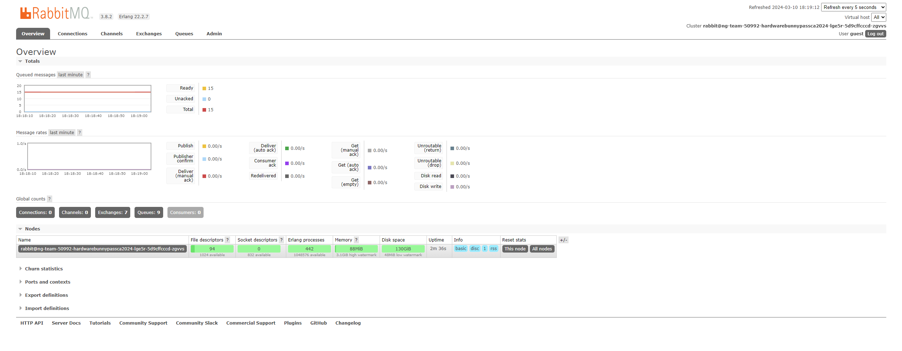
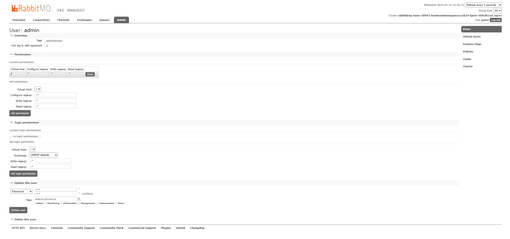
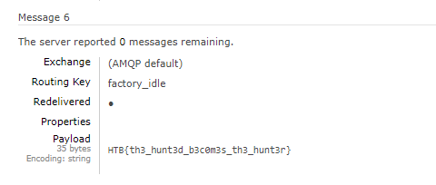

# BunnyPass

> As you discovered in the PDF, the production factory of the game is revealed. This factory manufactures all the hardware devices and custom silicon chips (of common components) that The Fray uses to create sensors, drones, and various other items for the games. Upon arriving at the factory, you scan the networks and come across a RabbitMQ instance. It appears that default credentials will work.
> 
> Files: Continuation of the PDF from the previous challenge.

**Writeup by:** Stig Rune Grønnestad

- [BunnyPass](#bunnypass)
	- [Recon](#recon)
	- [Exploitation](#exploitation)
	- [Flag](#flag)

## Recon

We are given access to a server running RabbitMQ management, the default username and password will work:

Username: `guest`
Password: `guest`

## Exploitation

We can navigate to the `Admin` tab and see that there are two users, `guest` and `admin`. Changing the `admin` password was a breeze, and we are now able to log in as `admin`:

By peeking around the RabbitMQ management interface, we can see that there are some messages in the queues, I went throught them one by one a fetched everything resulting in this under `Queue factory_idle`:

## Flag

`HTB{th3_hunt3d_b3c0m3s_th3_hunt3r}`