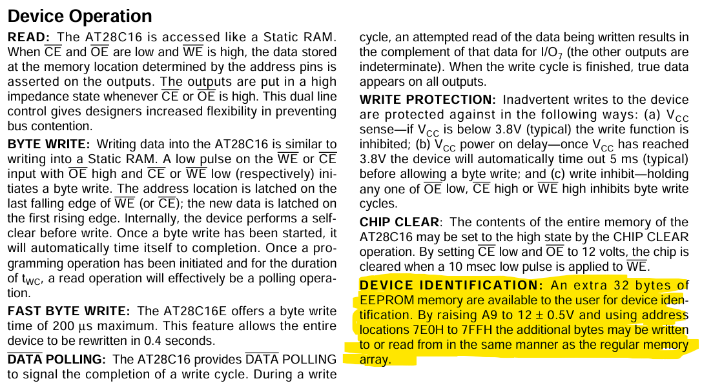

# The PROM

> After entering the door, you navigate through the building, evading guards, and quickly locate the server room in the basement. Despite easy bypassing of security measures and cameras, laser motion sensors pose a challenge. They're controlled by a small 8-bit computer equipped with AT28C16 a well-known EEPROM as its control unit. Can you uncover the EEPROM's secrets?
>
> Docker:
> - `nc 83.136.254.199 46073`

**Writeup by:** Hein Andre Grønnestad


- [The PROM](#the-prom)
  - [Service](#service)
  - [Dumping The EEPROM](#dumping-the-eeprom)
  - [A Deeper Look Into The Datasheet](#a-deeper-look-into-the-datasheet)
  - [Dumping The `DEVICE IDENTIFICATION` Memory](#dumping-the-device-identification-memory)
    - [Solve Script](#solve-script)
    - [Running The New Script](#running-the-new-script)
  - [Flag](#flag)


## Service

```bash
$ nc 83.136.254.199 46073

      AT28C16 EEPROMs
       _____   _____
      |     \_/     |
A7   [| 1        24 |] VCC
A6   [| 2        23 |] A8
A5   [| 3        22 |] A9
A4   [| 4        21 |] !WE
A3   [| 5        20 |] !OE
A2   [| 6        19 |] A10
A1   [| 7        18 |] !CE
A0   [| 8        17 |] I/O7
I/O0 [| 9        16 |] I/O6
I/O1 [| 10       15 |] I/O5
I/O2 [| 11       14 |] I/O4
GND  [| 12       13 |] I/O3
      |_____________|

> help

Usage:
  method_name(argument)

EEPROM COMMANDS:
  set_address_pins(address)  Sets the address pins from A10 to A0 to the specified values.
  set_ce_pin(volts)          Sets the CE (Chip Enable) pin voltage to the specified value.
  set_oe_pin(volts)          Sets the OE (Output Enable) pin voltage to the specified value.
  set_we_pin(volts)          Sets the WE (Write Enable) pin voltage to the specified value.
  set_io_pins(data)          Sets the I/O (Input/Output) pins to the specified data values.
  read_byte()                Reads a byte from the memory at the current address.
  write_byte()               Writes the current data to the memory at the current address.
  help                       Displays this help menu.

Examples:
  set_ce_pin(3.5)
  set_io_pins([0, 5.1, 3, 0, 0, 3.1, 2, 4.2])

>
```

So we're presented with an interface for controlling an `AT28C16` EEPROM.

The interface seems simple enough, we just need make sure to set the correct voltage levels for the chips pins. I've worked with EEPROMs before so it's familiar.

Let's try to dump the entire EEPROM and look at the data.


## Dumping The EEPROM

I wrote a script and made sure to set all the right voltage levels on the pins. A loop read through all `2048` memory locations; `0x000` to `0x7FF`.

```bash
set_address_pins([0,0,0,0,0,0,0,0,0,0,0])
b'> Read 0x0 at address 0x0\n'
set_address_pins([0,0,0,0,0,0,0,0,0,0,5])
b'> Read 0x0 at address 0x1\n'
set_address_pins([0,0,0,0,0,0,0,0,0,5,0])
b'> Read 0x0 at address 0x2\n'
set_address_pins([0,0,0,0,0,0,0,0,0,5,5])
b'> Read 0x0 at address 0x3\n'
set_address_pins([0,0,0,0,0,0,0,0,5,0,0])
b'> Read 0x0 at address 0x4\n'
# ...abbreviated
set_address_pins([5,5,5,5,5,5,5,5,5,0,5])
b'> Read 0x0 at address 0x7fd\n'
set_address_pins([5,5,5,5,5,5,5,5,5,5,0])
b'> Read 0x0 at address 0x7fe\n'
set_address_pins([5,5,5,5,5,5,5,5,5,5,5])
b'> Read 0x0 at address 0x7ff\n'
[*] Closed connection to 83.136.252.32 port 54301
```

That was not expected, seems like the EEPROM is empty!


## A Deeper Look Into The Datasheet

The `AT28C16` has an extra 32 bytes of memory which is only available under a specific situation. The pin `A9` must be set to 12 volts!



This basically overlays the memory range `0x7e0` to `0x7ff` with a special `DEVICE IDENTIFICATION` memory area. This area is also writeable. Can the flag hide inside this area?!


## Dumping The `DEVICE IDENTIFICATION` Memory

### Solve Script

Full script: [`solver.py`](solver.py)

```python
from pwn import *

def set_address(address):
    # Convert to binary string, remove '0b', and pad with zeros
    binary_string = bin(address)[2:].zfill(11)

    # Replace every high bit with a 5 for 5 volts
    binary_string = binary_string.replace('1', '5')

    # Make comma separated list
    binary_string = ','.join(binary_string)

    # Split the list so we can manipulate it
    binary_list = binary_string.split(',')

    # Make sure A9 is always 12 volts
    binary_list[-10] = '12'

    # Rejoin the list
    binary_string = ','.join(binary_list)

    # Create final command
    binary_string = 'set_address_pins([' + binary_string + '])'
    #print(binary_string)
    conn.sendline(binary_string.encode())


remote_ip = '83.136.254.199'
remote_port = 46073

conn = remote(remote_ip, remote_port)

print(conn.recvuntil(b'> ').decode())
print(conn.recvuntil(b'> ').decode())

conn.sendline(b'set_ce_pin(0)') # active low

address = 0x7e0

flag = ''

while (address < 0x800):
    conn.sendline(b'set_oe_pin(5)') # active low
    conn.recvuntil(b'> ')
    conn.sendline(b'set_we_pin(5)') # active low
    conn.recvuntil(b'> ')
    set_address(address)
    conn.recvuntil(b'> ')
    conn.sendline(b'set_oe_pin(0)') # active low
    conn.recvuntil(b'> ')
    conn.sendline(b'read_byte()')
    read_byte_line = conn.recvline()
    print(read_byte_line)

    pattern = r'0x[0-9A-Fa-f]+'
    matches = re.findall(pattern, read_byte_line.decode())
    char = chr(int(matches[0], 16))
    flag += char

    address += 1

print(flag)

# Close the connection
conn.close()

```


### Running The New Script

```bash
$ python solver.py
[+] Opening connection to 83.136.254.199 on port 46073: Done

      AT28C16 EEPROMs
       _____   _____
      |     \_/     |
A7   [| 1        24 |] VCC
A6   [| 2        23 |] A8
A5   [| 3        22 |] A9
A4   [| 4        21 |] !WE
A3   [| 5        20 |] !OE
A2   [| 6        19 |] A10
A1   [| 7        18 |] !CE
A0   [| 8        17 |] I/O7
I/O0 [| 9        16 |] I/O6
I/O1 [| 10       15 |] I/O5
I/O2 [| 11       14 |] I/O4
GND  [| 12       13 |] I/O3
      |_____________|

>
help

Usage:
  method_name(argument)

EEPROM COMMANDS:
  set_address_pins(address)  Sets the address pins from A10 to A0 to the specified values.
  set_ce_pin(volts)          Sets the CE (Chip Enable) pin voltage to the specified value.
  set_oe_pin(volts)          Sets the OE (Output Enable) pin voltage to the specified value.
  set_we_pin(volts)          Sets the WE (Write Enable) pin voltage to the specified value.
  set_io_pins(data)          Sets the I/O (Input/Output) pins to the specified data values.
  read_byte()                Reads a byte from the memory at the current address.
  write_byte()               Writes the current data to the memory at the current address.
  help                       Displays this help menu.

Examples:
  set_ce_pin(3.5)
  set_io_pins([0, 5.1, 3, 0, 0, 3.1, 2, 4.2])

>
b'> Read 0x48 at address 0x7e0\n'
b'> Read 0x54 at address 0x7e1\n'
b'> Read 0x42 at address 0x7e2\n'
b'> Read 0x7b at address 0x7e3\n'
b'> Read 0x41 at address 0x7e4\n'
b'> Read 0x54 at address 0x7e5\n'
b'> Read 0x32 at address 0x7e6\n'
b'> Read 0x38 at address 0x7e7\n'
b'> Read 0x43 at address 0x7e8\n'
b'> Read 0x31 at address 0x7e9\n'
b'> Read 0x36 at address 0x7ea\n'
b'> Read 0x5f at address 0x7eb\n'
b'> Read 0x45 at address 0x7ec\n'
b'> Read 0x45 at address 0x7ed\n'
b'> Read 0x50 at address 0x7ee\n'
b'> Read 0x52 at address 0x7ef\n'
b'> Read 0x4f at address 0x7f0\n'
b'> Read 0x4d at address 0x7f1\n'
b'> Read 0x5f at address 0x7f2\n'
b'> Read 0x73 at address 0x7f3\n'
b'> Read 0x33 at address 0x7f4\n'
b'> Read 0x63 at address 0x7f5\n'
b'> Read 0x32 at address 0x7f6\n'
b'> Read 0x33 at address 0x7f7\n'
b'> Read 0x74 at address 0x7f8\n'
b'> Read 0x5f at address 0x7f9\n'
b'> Read 0x31 at address 0x7fa\n'
b'> Read 0x64 at address 0x7fb\n'
b'> Read 0x21 at address 0x7fc\n'
b'> Read 0x21 at address 0x7fd\n'
b'> Read 0x21 at address 0x7fe\n'
b'> Read 0x7d at address 0x7ff\n'
HTB{AT28C16_EEPROM_s3c23t_1d!!!}
[*] Closed connection to 83.136.254.199 port 46073
```

Yay! 🥳🎉


## Flag

`HTB{AT28C16_EEPROM_s3c23t_1d!!!}`
