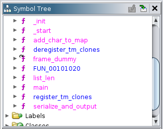
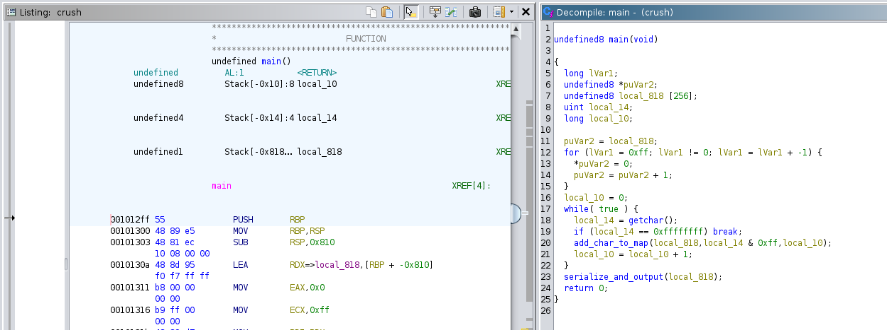
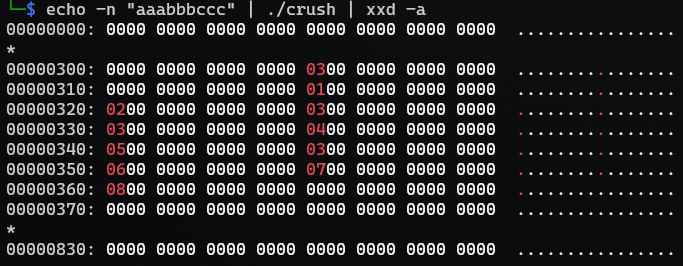
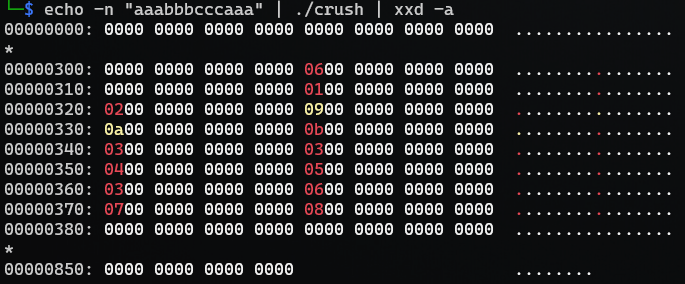
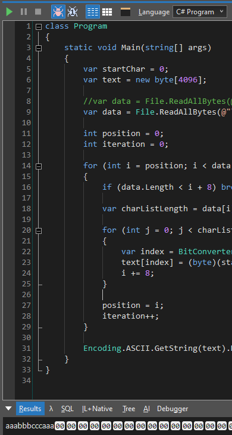
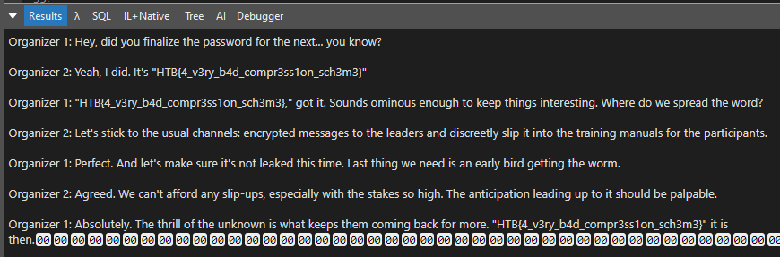

# Crushing

> You managed to intercept a message between two event organizers. Unfortunately, it's been compressed with their proprietary message transfer format. Luckily, they're gamemakers first and programmers second - can you break their encoding?
> 
> Files:
> - [rev_crushing.zip](rev_crushing.zip)

**Writeup by:** Hein Andre Grønnestad

- [Crushing](#crushing)
  - [Checking Provided Files](#checking-provided-files)
  - [Dynamic Analysis](#dynamic-analysis)
    - [Running `crush`](#running-crush)
    - [`strace`](#strace)
  - [Static Analysis](#static-analysis)
    - [Using `r2`](#using-r2)
    - [Ghidra](#ghidra)
  - [Creating Files With Known Input](#creating-files-with-known-input)
  - [Solve Program](#solve-program)
  - [Resulting Text](#resulting-text)
  - [Flag:](#flag)


## Checking Provided Files

```bash
$ unzip rev_crushing.zip
$ cd rev_crushing

$ file crush
crush: ELF 64-bit LSB pie executable, x86-64, version 1 (SYSV), dynamically linked, interpreter /lib64/ld-linux-x86-64.so.2, BuildID[sha1]=fdbeaffc5798388ef49c3f3716903d37a53e8e03, for GNU/Linux 3.2.0, not stripped

$ file message.txt.cz
message.txt.cz: data
```

I guess `message.txt.cz` was created using the `crush` program. Let's try to figure out what it does.


## Dynamic Analysis

### Running `crush`

```bash
$ ./crush


d


^C
```

The program is waiting for input.


### `strace`

```bash
$ strace ./crush
execve("./crush", ["./crush"], 0x7ffda3248e90 /* 31 vars */) = 0
brk(NULL)                               = 0x55649079c000
# ...abbreviated
getrandom("\x17\x86\x57\x6c\x45\x22\x17\xbc", 8, GRND_NONBLOCK) = 8
brk(NULL)                               = 0x55649079c000
brk(0x5564907bd000)                     = 0x5564907bd000
read(0,
```

`strace` confirms this as well. We're stuck at `read`.


## Static Analysis

### Using `r2`

```bash
$ r2 crush
Warning: run r2 with -e bin.cache=true to fix relocations in disassembly
[0x00001070]> aaaaaa
[x] Analyze all flags starting with sym. and entry0 (aa)
[x] Analyze function calls (aac)
[x] Analyze len bytes of instructions for references (aar)
[x] Finding and parsing C++ vtables (avrr)
[x] Type matching analysis for all functions (aaft)
[x] Propagate noreturn information (aanr)
[x] Finding function preludes
[x] Enable constraint types analysis for variables
[0x00001070]> pdf@main
            ; DATA XREF from entry0 @ 0x108d
┌ 112: int main (int argc, char **argv, char **envp);
│           ; var int64_t var_810h @ rbp-0x810
│           ; var uint32_t var_ch @ rbp-0xc
│           ; var int64_t var_8h @ rbp-0x8
│           0x000012ff      55             push rbp
│           0x00001300      4889e5         mov rbp, rsp
│           0x00001303      4881ec100800.  sub rsp, 0x810
│           0x0000130a      488d95f0f7ff.  lea rdx, [var_810h]
│           0x00001311      b800000000     mov eax, 0
│           0x00001316      b9ff000000     mov ecx, 0xff
│           0x0000131b      4889d7         mov rdi, rdx
│           0x0000131e      f348ab         rep stosq qword [rdi], rax
│           0x00001321      48c745f80000.  mov qword [var_8h], 0
│       ┌─< 0x00001329      eb20           jmp 0x134b
│       │   ; CODE XREF from main @ 0x1357
│      ┌──> 0x0000132b      8b45f4         mov eax, dword [var_ch]
│      ╎│   0x0000132e      0fb6c8         movzx ecx, al
│      ╎│   0x00001331      488b55f8       mov rdx, qword [var_8h]     ; int64_t arg3
│      ╎│   0x00001335      488d85f0f7ff.  lea rax, [var_810h]
│      ╎│   0x0000133c      89ce           mov esi, ecx                ; int64_t arg2
│      ╎│   0x0000133e      4889c7         mov rdi, rax                ; int64_t arg1
│      ╎│   0x00001341      e80ffeffff     call sym.add_char_to_map
│      ╎│   0x00001346      488345f801     add qword [var_8h], 1
│      ╎│   ; CODE XREF from main @ 0x1329
│      ╎└─> 0x0000134b      e8e0fcffff     call sym.imp.getchar        ; int getchar(void)
│      ╎    0x00001350      8945f4         mov dword [var_ch], eax
│      ╎    0x00001353      837df4ff       cmp dword [var_ch], 0xffffffff
│      └──< 0x00001357      75d2           jne 0x132b
│           0x00001359      488d85f0f7ff.  lea rax, [var_810h]
│           0x00001360      4889c7         mov rdi, rax                ; int64_t arg1
│           0x00001363      e8e2feffff     call sym.serialize_and_output
│           0x00001368      b800000000     mov eax, 0
│           0x0000136d      c9             leave
└           0x0000136e      c3             ret
[0x00001070]>

[0x00001070]> afl
0x00001070    1 43           entry0
0x000010a0    4 41   -> 34   sym.deregister_tm_clones
0x000010d0    4 57   -> 51   sym.register_tm_clones
0x00001110    5 57   -> 50   sym.__do_global_dtors_aux
0x00001060    1 6            sym.imp.__cxa_finalize
0x00001150    1 5            entry.init0
0x00001000    3 23           sym._init
0x000013d0    1 1            sym.__libc_csu_fini
0x00001155    7 161          sym.add_char_to_map
0x0000124a    7 181          sym.serialize_and_output
0x000013d4    1 9            sym._fini
0x00001370    4 93           sym.__libc_csu_init
0x000012ff    4 112          main
0x000011f6    7 84           sym.list_len
0x00001030    1 6            sym.imp.getchar
0x00001040    1 6            sym.imp.malloc
0x00001050    1 6            sym.imp.fwrite
[0x00001070]>
```

We can see some interesting function symbols.


### Ghidra

We can see the same symbols.



`main` seems to call `getchar()` until it returns `0xffffffff` which is the same as `EOF`.



```c
undefined8 main(void)
{
  long lVar1;
  undefined8 *puVar2;
  undefined8 local_818 [256];
  uint local_14;
  long local_10;
  
  puVar2 = local_818;
  for (lVar1 = 0xff; lVar1 != 0; lVar1 = lVar1 + -1) {
    *puVar2 = 0;
    puVar2 = puVar2 + 1;
  }
  local_10 = 0;
  while( true ) {
    local_14 = getchar();
    if (local_14 == 0xffffffff) break;
    add_char_to_map(local_818,local_14 & 0xff,local_10);
    local_10 = local_10 + 1;
  }
  serialize_and_output(local_818);
  return 0;
}


```

For every `char`, `add_char_to_map` is called.

```c
void add_char_to_map(long param_1,byte param_2,undefined8 param_3)
{
  undefined8 *puVar1;
  long local_10;
  
  local_10 = *(long *)(param_1 + (ulong)param_2 * 8);
  puVar1 = (undefined8 *)malloc(0x10);
  *puVar1 = param_3;
  puVar1[1] = 0;
  if (local_10 == 0) {
    *(undefined8 **)((ulong)param_2 * 8 + param_1) = puVar1;
  }
  else {
    for (; *(long *)(local_10 + 8) != 0; local_10 = *(long *)(local_10 + 8)) {
    }
    *(undefined8 **)(local_10 + 8) = puVar1;
  }
  return;
}
```

And finally; `serialize_and_output` is called.

```c
void serialize_and_output(long param_1)
{
  undefined8 local_28;
  void **local_20;
  void *local_18;
  int local_c;
  
  for (local_c = 0; local_c < 0xff; local_c = local_c + 1) {
    local_20 = (void **)(param_1 + (long)local_c * 8);
    local_28 = list_len(local_20);
    fwrite(&local_28,8,1,stdout);
    for (local_18 = *local_20; local_18 != (void *)0x0; local_18 = *(void **)((long)local_18 + 8)) {
      fwrite(local_18,8,1,stdout);
    }
  }
  return;
}
```

I tried to go through the code and rename variables to make it more clear, but I found all the pointer arithmetics hard to follow. It did help me somewhat obviouvsly, but I found it hard to visualize the data in my head before and after running it through the program.


## Creating Files With Known Input

I shifted my attention to the file format and started analysing how my known input would look after running it through `crush`.

```bash
$ echo -n "test" | ./crush | xxd -a
00000000: 0000 0000 0000 0000 0000 0000 0000 0000  ................
*
00000320: 0000 0000 0000 0000 0100 0000 0000 0000  ................
00000330: 0100 0000 0000 0000 0000 0000 0000 0000  ................
00000340: 0000 0000 0000 0000 0000 0000 0000 0000  ................
*
000003a0: 0100 0000 0000 0000 0200 0000 0000 0000  ................
000003b0: 0200 0000 0000 0000 0000 0000 0000 0000  ................
000003c0: 0300 0000 0000 0000 0000 0000 0000 0000  ................
000003d0: 0000 0000 0000 0000 0000 0000 0000 0000  ................
*
00000810: 0000 0000 0000 0000                      ........
```

Not very helpful, but a start.

```bash
$ echo -n "abc" | ./crush | xxd -a
00000000: 0000 0000 0000 0000 0000 0000 0000 0000  ................
*
00000300: 0000 0000 0000 0000 0100 0000 0000 0000  ................
00000310: 0000 0000 0000 0000 0100 0000 0000 0000  ................
00000320: 0100 0000 0000 0000 0100 0000 0000 0000  ................
00000330: 0200 0000 0000 0000 0000 0000 0000 0000  ................
00000340: 0000 0000 0000 0000 0000 0000 0000 0000  ................
*
00000800: 0000 0000 0000 0000 0000 0000 0000 0000  ................
```

```bash
$ echo -n "aaabbbccc" | ./crush | xxd -a
00000000: 0000 0000 0000 0000 0000 0000 0000 0000  ................
*
00000300: 0000 0000 0000 0000 0300 0000 0000 0000  ................
00000310: 0000 0000 0000 0000 0100 0000 0000 0000  ................
00000320: 0200 0000 0000 0000 0300 0000 0000 0000  ................
00000330: 0300 0000 0000 0000 0400 0000 0000 0000  ................
00000340: 0500 0000 0000 0000 0300 0000 0000 0000  ................
00000350: 0600 0000 0000 0000 0700 0000 0000 0000  ................
00000360: 0800 0000 0000 0000 0000 0000 0000 0000  ................
00000370: 0000 0000 0000 0000 0000 0000 0000 0000  ................
*
00000830: 0000 0000 0000 0000 0000 0000 0000 0000  ................
```



Ok, I'm starting to see a pattern. I can see `0x03` three times, one for each group of letters; `aaa`, `bbb` and `ccc`. I also see that after `0x03` the following numbers; `0x00`, `0x01` and `0x02` matches the index of my characters in the onput string. This is true for all three groups. It seems like we have a count and then indexes following the count.

The input data `aaabbbcccaaa` seems to confirm the previous results:



Now we have six (`6`) `a`'s and the indexes; `0x0, 0x1, 0x2, 0x9, 0xa, 0xb` matches the `a`'s in `aaabbbcccaaa`.

I see how this could be used to rebuild a string, but how do we know which characters to use? Since we have a lot of empty space in the file before our data, maybe the offset; `0x308` is used to identify the character somehow.

But the offsets aren't fixed since the index count is variable. I guess the program just starts at an `ASCII` value and increments it for each group.

Another observation is that each value in the file format seems to be encoded as 8 bytes; 64 bits.

Let's attempt to make a program and see if we can rebuild the input data based on `message.txt.cz`.

But first test to see if we can rebuild the `aaabbbcccaaa` string. Let's write the output to a file:

```bash
$ echo -n "aaabbbcccaaa" | ./crush > test.cz

$ ll test.cz
-rw-r--r-- 1 hag hag 2136 Mar 10 03:02 test.cz
```



Success! I did mess around a bit with what character each group belonged to. I thought it might start at `0x20`, which is the first printable ASCII character (` `; space). But it turned out to just start at `0`, which explains all the `NULL` bytes at the start of the file.

My first attempt running my program on the `message.txt.cz` file resulted in `trnmowzmrspreisytnorwryyubirrgl{zzvtrytpeswwsrstissgtoiznrxus}alytuisntwsnanrtrypzordmesyeslsptuptheestesirsly{wivisyreettyossrssstonntohtme}ttiirpntiznruelsinor{thvoryttshouontsessarpaslzer3}rganrzert1:Sousosutslyoushsuturittsonotpltunnnswnntstwsttnkestst`. Which at least seemed promising and then I remembered I forgot to read all count and index values as 64 bit integers.

```c#
// Changing:
var index = data[i + 8];
// To:
var index = BitConverter.ToInt64(data, i + 8);
```

Fixed it!




## Solve Program

[solver.linq](rev_crushing/solver.linq)
```c#
class Program
{	
    static void Main(string[] args)
    {
        var startChar = 0;
        var text = new byte[4096];
        
        var data = File.ReadAllBytes(@"message.txt.cz");
        //var data = File.ReadAllBytes(@"test.cz");
    
        int position = 0;
        int iteration = 0;
        
        for (int i = position; i < data.Length; i += 8)
        {
            if (data.Length < i + 8) break;
            
            var charListLength = data[i];

            for (int j = 0; j < charListLength * 8; j += 8)
            {
                var index = BitConverter.ToInt64(data, i + 8);
                text[index] = (byte)(startChar + iteration);
                i += 8;
            }
            
            position = i;
            iteration++;
        }

        Encoding.ASCII.GetString(text).Dump();
    }
}

```

## Resulting Text

```txt
Organizer 1: Hey, did you finalize the password for the next... you know?

Organizer 2: Yeah, I did. It's "HTB{4_v3ry_b4d_compr3ss1on_sch3m3}"

Organizer 1: "HTB{4_v3ry_b4d_compr3ss1on_sch3m3}," got it. Sounds ominous enough to keep things interesting. Where do we spread the word?

Organizer 2: Let's stick to the usual channels: encrypted messages to the leaders and discreetly slip it into the training manuals for the participants.

Organizer 1: Perfect. And let's make sure it's not leaked this time. Last thing we need is an early bird getting the worm.

Organizer 2: Agreed. We can't afford any slip-ups, especially with the stakes so high. The anticipation leading up to it should be palpable.

Organizer 1: Absolutely. The thrill of the unknown is what keeps them coming back for more. "HTB{4_v3ry_b4d_compr3ss1on_sch3m3}" it is then.
```


## Flag:

`HTB{4_v3ry_b4d_compr3ss1on_sch3m3}`
